# simple-plot

A simple, pgfplots-like function plotting library for Typst. Create beautiful mathematical plots with minimal code.

> **Note:** This package is built on top of [CeTZ](https://github.com/cetz-package/cetz) v0.5.2.

## Manual

A full manual is available in [docs/manual.pdf](https://github.com/nathan-ed/typst-package-simple-plot/blob/8289d754b723139d5d9e708cba01e9cc599c630c/docs/manual.pdf).

## Gallery

Click on an image to see the source code.

| | | |
|:---:|:---:|:---:|
| [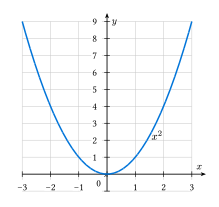](gallery/parabola.typ) | [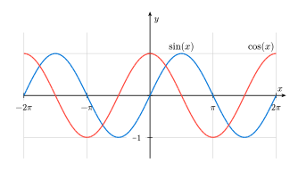](gallery/trig-functions.typ) | [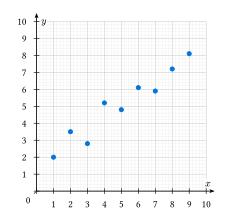](gallery/scatter.typ) |
| Parabola | Trigonometric Functions | Scatter Plot |
| [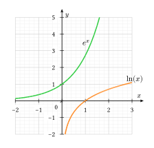](gallery/exponential.typ) | [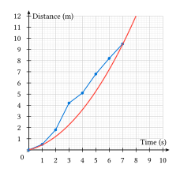](gallery/data-fit.typ) | [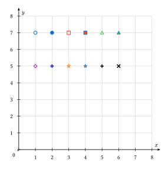](gallery/markers.typ) |
| Exponential & Logarithmic | Data with Model Fit | Marker Types |
| [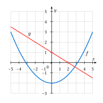](gallery/extended-axes.typ) | [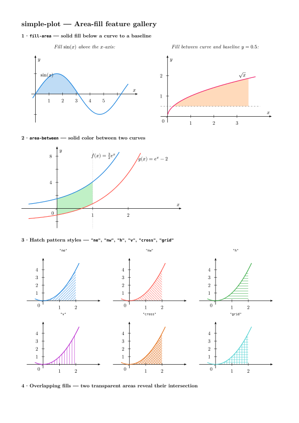](gallery/area-features.typ) | [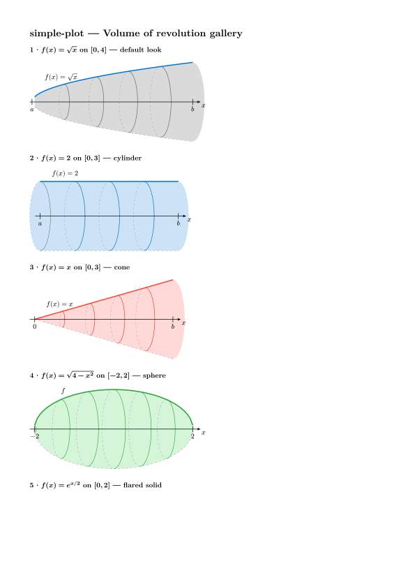](gallery/revolution.typ) |
| Extended Axes | Area Fills & Riemann Sums | Volume of Revolution |
| [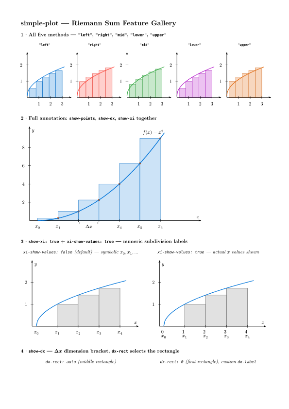](gallery/riemann-features.typ) | [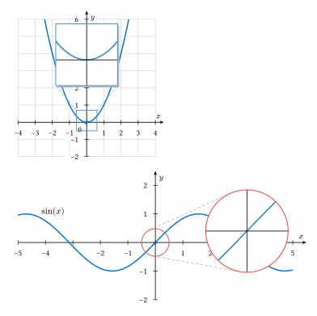](gallery/zoom-spy.typ) | |
| Riemann Sum Features | Zoom / Spy Insets | |

## Features

- **Simple API** — Plot functions with just a few lines of code
- **Multiple plot types** — Functions, scatter plots, line plots with markers
- **Customizable axes** — Position, labels, ticks, and tick labels; default $x$/$y$ labels at arrow tips (tkz-fct style)
- **Stealth arrows** — Elegant axis arrowheads matching LaTeX/pgfplots style
- **Axis extension** — Extend axes beyond plot area for cleaner appearance
- **Grid support** — Major and minor grids with custom styling
- **14 marker types** — Circles, squares, triangles, diamonds, stars, and more
- **Origin label control** — Toggle origin '0' label display
- **Global defaults** — Set defaults for all plots in your document
- **Riemann sums** — Left/right/midpoint/lower/upper rectangles; endpoint dots with labels and arrows; Δx bracket; $x_i$ subdivision labels
- **Volume of revolution** — 3D-style solids: arbitrary axis (horizontal, shifted, or oblique), end caps, disk cross-sections, optional coordinate axes
- **Zoom / spy insets** — Magnified sub-views with rectangular or circular spy glass, connector lines, and customizable accent colors
- **Automatic label placement** — function labels avoid overlapping curves, tick labels, and axes automatically
- **Smart tick density** — auto-selects nice tick spacing for large ranges; crossed labels hidden automatically
- **Full styling** — Customize colors, strokes, backgrounds, and more

## Quick Start

```typst
#import "@preview/simple-plot:0.9.1": plot

#plot(
  xmin: -3, xmax: 3,
  ymin: -1, ymax: 9,
  show-grid: true,
  (fn: x => calc.pow(x, 2), stroke: blue + 1.5pt),
)
```

Axis labels default to $x$ and $y$ — no need to set them explicitly.

## Basic Usage

### Plotting Functions

```typst
#import "@preview/simple-plot:0.9.1": plot

// Single function
#plot(
  xmin: -5, xmax: 5,
  ymin: -5, ymax: 5,
  show-grid: "major",
  (fn: x => calc.sin(x), stroke: blue + 1.5pt),
)

// Multiple functions
#plot(
  xmin: -2 * calc.pi, xmax: 2 * calc.pi,
  ymin: -1.5, ymax: 1.5,
  (fn: x => calc.sin(x), stroke: blue + 1.2pt, label: $sin(x)$),
  (fn: x => calc.cos(x), stroke: red + 1.2pt, label: $cos(x)$),
)
```

### Scatter Plots

```typst
#import "@preview/simple-plot:0.9.1": plot, data

#plot(
  xmin: 0, xmax: 10,
  ymin: 0, ymax: 10,
  show-grid: true,
  data(
    ((1, 2), (2, 3.5), (3, 2.8), (4, 5.2), (5, 4.8)),
    mark: "*",
    mark-fill: blue,
  ),
)
```

### Line Plots with Markers

```typst
#import "@preview/simple-plot:0.9.1": plot, line-plot

#plot(
  xmin: 0, xmax: 10,
  ymin: 0, ymax: 12,
  axis-x-pos: "bottom",
  axis-y-pos: "left",
  line-plot(
    ((0, 0), (1, 0.5), (2, 1.8), (3, 4.2), (4, 5.1)),
    stroke: blue + 1.2pt,
    mark: "*",
    mark-fill: blue,
  ),
)
```

### Function Labels with Positioning

Control the placement of function labels using `label-pos` and `label-side`:

```typst
#plot(
  xmin: -5, xmax: 5,
  ymin: -3, ymax: 5,
  show-grid: true,
  (fn: x => 0.2 * calc.pow(x, 2) - 2,
   stroke: blue + 1.5pt,
   label: $f(x)$,
   label-pos: 0.9,           // position along curve (0–1)
   label-side: "below-right" // placement relative to point
  ),
  (fn: x => -0.5 * x + 1,
   stroke: red + 1.5pt,
   label: $g(x)$,
   label-pos: 0.2,
   label-side: "above-right"
  ),
)
```

**Available `label-side` options:** `"above"`, `"below"`, `"left"`, `"right"`, `"above-left"`, `"above-right"`, `"below-left"`, `"below-right"`

## Mathematical Functions

| Function | Typst syntax |
|----------|--------------|
| Power $x^n$ | `calc.pow(x, n)` |
| Square root | `calc.sqrt(x)` |
| Absolute value | `calc.abs(x)` |
| Sine, Cosine, Tangent | `calc.sin(x)`, `calc.cos(x)`, `calc.tan(x)` |
| Exponential $e^x$ | `calc.exp(x)` |
| Natural log | `calc.ln(x)` |
| Log base b | `calc.log(x, base: b)` |

> **Important:** Use decimal notation (e.g. `2.0` not `2`) inside lambda functions to avoid type errors.

## Pedagogical Plot Helpers

### Rational Function Wrapper

`plot-rational` is a thin wrapper around `plot` with defaults suited to rational-function exercises: centered axes, a visible grid, and one main function curve. Extra positional arguments are forwarded as additional series, so asymptotes and points can be added normally.

```typst
#import "@preview/simple-plot:0.9.1": plot-rational, hline

#plot-rational(
  x => (x + 1) / (x - 2),
  xmin: -5, xmax: 5,
  ymin: -6, ymax: 6,
  vertical-asymptotes: (2,),
  hline(1, stroke: stroke(paint: red, thickness: 0.7pt, dash: "dashed")),
)
```

### Local Limit Schemas

`limit-schema` draws compact schematic behavior near a point `a`. Use finite numbers for one-sided limits, `"+oo"` / `"-oo"` for vertical asymptotic behavior, and `val` for the defined value at the point. `schema-lim` is available as an alias.

```typst
#import "@preview/simple-plot:0.9.1": limit-schema

#limit-schema(a: 1, left: 4, right: 4)              // removable hole
#limit-schema(a: 2, left: "+oo", right: "-oo")      // vertical asymptote
#limit-schema(a: 0, left: -1, right: 1, val: 0)     // jump with defined value
```

## Parameters Reference

### Plot Parameters

| Parameter | Type | Default | Description |
|-----------|------|---------|-------------|
| `xmin`, `xmax` | float | -5, 5 | X-axis range |
| `ymin`, `ymax` | float | -5, 5 | Y-axis range |
| `width`, `height` | float | 6, 6 | Plot size in cm |
| `scale` | float | 1 | Scale factor for the entire plot |
| `xlabel`, `ylabel` | content | `$x$`, `$y$` | Axis labels (tkz-fct style: tucked beside the arrow tips) |
| `show-grid` | bool/str | false | `true`, `false`, `"major"`, `"minor"`, `"both"` |
| `minor-grid-step` | int | 5 | Minor grid subdivisions per major tick |
| `grid-label-break` | bool | true | Gap in grid lines around tick labels |
| `axis-x-pos` | float/str | 0 | X-axis position: value, `"bottom"`, `"center"` |
| `axis-y-pos` | float/str | 0 | Y-axis position: value, `"left"`, `"center"` |
| `axis-x-extend` | float/array | (0, 0.5) | Extend X-axis beyond grid: value or `(left, right)` |
| `axis-y-extend` | float/array | (0, 0.5) | Extend Y-axis beyond grid: value or `(bottom, top)` |
| `show-origin` | bool | true | Show "0" label at origin |
| `unit-label-only` | bool | false | Show only "1" on axes for minimal style |
| `show-end-ticks` | bool | true | Keep the tick/label at `xmax`/`ymax` when it lands on a tick (e.g. show "5"), pushing the axis slightly past it so the arrow clears the label |
| `font` | str/array | document font | Font applied to all generated text (tick labels, axis labels, origin, annotations) |

### Axis Label Placement

Labels default to tkz-fct style: $x$ sits just above the axis a little left of the
right arrow, $y$ sits just left of the axis a little below the top arrow. This keeps
them clear of the tick numbers (which sit below / left of the axis).

| Parameter | Type | Default | Description |
|-----------|------|---------|-------------|
| `xlabel-pos` | str/array | `"end"` | `"end"`, `"center"`, or `(x, y)` in data coords |
| `ylabel-pos` | str/array | `"end"` | same |
| `xlabel-anchor` | str/auto | `auto` | CeTZ anchor; `auto` → `"south-east"` at the right arrow tip |
| `ylabel-anchor` | str/auto | `auto` | CeTZ anchor; `auto` → `"north-east"` at the top arrow tip |
| `xlabel-offset` | array | `(-0.05, 0.08)` | Offset `(x, y)` in cm from arrow tip |
| `ylabel-offset` | array | `(-0.08, -0.05)` | Offset `(x, y)` in cm from arrow tip |

### Tick Configuration

| Parameter | Type | Default | Description |
|-----------|------|---------|-------------|
| `xtick`, `ytick` | auto/none/array | auto | Tick positions |
| `xtick-step`, `ytick-step` | auto/float | 1 | Step between ticks |
| `xtick-label-step`, `ytick-label-step` | int | 1 | Show label every N ticks |
| `xtick-labels`, `ytick-labels` | auto/array | auto | Custom tick labels |

### Function Specification

```typst
(
  fn: x => ...,           // Required: the function
  stroke: blue + 1.2pt,   // Line style
  domain: (min, max),     // Restrict domain
  samples: 100,           // Sample points
  label: $f(x)$,          // Label content
  label-pos: 0.8,         // Position along curve (0–1)
  label-side: "above",    // "above", "below", "left", "right", "above-left", …
  mark: "o",              // Marker type
  mark-size: 0.1,
  mark-fill: white,
  mark-stroke: blue,
  mark-interval: 10,      // Show marker every N points
)
```

## Riemann Sums

```typst
#import "@preview/simple-plot:0.9.1": plot, riemann-sum

#plot(
  xmin: 0, xmax: 3, ymin: 0, ymax: 5,
  riemann-sum(
    x => calc.pow(x, 2),
    domain: (0.0, 3.0),
    n: 6,
    method: "left",
    color: blue.lighten(75%),
    show-points: true,       // dots at evaluation points with arrows
    show-dx: true,           // Δx bracket under one rectangle
    show-xi: true,           // x₀, x₁, …, x₆ labels along axis
  ),
  (fn: x => calc.pow(x, 2), stroke: blue + 1.5pt),
)
```

### `riemann-sum` Parameters

| Parameter | Type | Default | Description |
|-----------|------|---------|-------------|
| `fn` | function | — | Function to integrate |
| `domain` | array | plot range | `(a, b)` |
| `n` | int | 4 | Number of rectangles |
| `method` | str | `"right"` | `"left"`, `"right"`, `"mid"`, `"lower"`, `"upper"` |
| `baseline` | float | 0 | Y-level of rectangle bases |
| `color` | color | `luma(220)` | Rectangle fill |
| `stroke` | stroke | `luma(80) + 0.6pt` | Rectangle border |
| `hatch` | str/none | none | Hatch pattern: `"ne"`, `"nw"`, `"h"`, `"v"`, `"cross"`, `"grid"` |
| `hatch-spacing` | length | `5pt` | Spacing between hatch lines |
| `hatch-stroke` | stroke | `luma(80) + 0.5pt` | Stroke for hatch lines |
| `samples` | int | 20 | Samples per subinterval for `"lower"`/`"upper"` |
| `show-points` | bool | false | Draw dot at each evaluation point |
| `point-color` | color | `rgb("#c94a00")` | Dot fill color |
| `point-size` | float | 0.07 | Dot radius in cm |
| `point-label` | content/auto/none | `auto` | Label with arrows to dots; `auto` = method name |
| `point-label-pos` | array/auto | `auto` | `(x, y)` in data coords; `auto` = upper-right of dots |
| `show-dx` | bool | false | Draw Δx dimension bracket under one rectangle |
| `dx-rect` | int/auto | `auto` | Rectangle index to annotate (0-based); `auto` = middle |
| `dx-label` | content | `$Delta x$` | Bracket label |
| `show-xi` | bool | false | Draw $x_0, x_1, \ldots, x_n$ at subdivision points |
| `xi-labels` | array/auto | `auto` | Custom labels array; `auto` = subscripted $x_i$ |
| `xi-show-values` | bool | false | Show numeric x-values instead of $x_i$ notation |

**Methods:**
- `"left"` / `"right"` / `"mid"` — evaluation at left endpoint, right endpoint, or midpoint
- `"lower"` / `"upper"` — true infimum/supremum (sampled within each subinterval); works for any function shape including U-curves

## Volume of Revolution

```typst
#import "@preview/simple-plot:0.9.1": volume-of-revolution

#volume-of-revolution(
  x => calc.sqrt(x),
  domain: (0.0, 4.0),
  n-disks: 5,
  width: 8.0,
  height: 4.0,
  show-yaxis: true,
  label-a: $0$,
  label-b: $4$,
  label-f: $f(x)=sqrt(x)$,
)
```

`solid-of-revolution` is an alias for backward compatibility.

### `volume-of-revolution` Parameters

| Parameter | Type | Default | Description |
|-----------|------|---------|-------------|
| `fn` | function | — | Profile function $y = f(x) > 0$ |
| `domain` | array | `(0, 4)` | `(a, b)` — interval of revolution |
| `n-disks` | int | 4 | Intermediate disk cross-sections to show |
| `width`, `height` | float | 5, 3.5 | Canvas size in cm |
| `samples` | int | 60 | Profile sampling points |
| `axis-y` | float | 0 | Y-value of revolution axis (default: x-axis) |
| `axis-slope` | float | 0 | Slope $m$ of revolution axis: $y = mx + \text{axis\_y}$ |
| `show-axis` | bool | true | Draw the revolution axis arrow |
| `show-yaxis` | bool | false | Draw a coordinate y-axis (`show-y-axis` is the canonical spelling) |
| `y-axis-x` / `yaxis-x` | auto/float | `auto` | X position for the y-axis; `auto` = left of volume |
| `y-axis-offset` | float | 0.45 | Gap between the y-axis and the volume when `y-axis-x: auto` |
| `y-axis-extend` | array | `(0.35, 0.45)` | Y-axis padding `(below, above)` the volume |
| `show-radius-marker` | bool | false | Draw a vertical radius dimension marker at `yaxis-x` |
| `show-back` | bool | true | Draw the back face and bottom profile |
| `show-labels` | bool | true | Show $a$, $b$, $f$ labels |
| `profile-stroke` | stroke | `blue + 1.5pt` | Top profile curve |
| `disk-color` | color | `luma(218)` | Solid body fill |
| `disk-stroke` | stroke | `luma(90) + 0.6pt` | Disk edge stroke |
| `axis-stroke` | stroke | `black + 0.7pt` | Revolution axis stroke |
| `label-a`, `label-b` | content | `$a$`, `$b$` | Domain endpoint labels |
| `label-f` | content | `$f$` | Function label |
| `label-y` | content | `$y$` | Y-axis label |

## Marker Types

| Type | Description | Type | Description |
|------|-------------|------|-------------|
| `"o"` | Hollow circle | `"*"` | Filled circle |
| `"square"` | Hollow square | `"square*"` | Filled square |
| `"triangle"` | Hollow triangle | `"triangle*"` | Filled triangle |
| `"diamond"` | Hollow diamond | `"diamond*"` | Filled diamond |
| `"star"` | Hollow star | `"star*"` | Filled star |
| `"+"` | Plus sign | `"x"` | Cross |
| `"|"` | Vertical bar | `"-"` | Horizontal bar |
| `"none"` | No marker | | |

## Custom Styling

```typst
#plot(
  style: (
    background: (
      fill: rgb("#202124"),
    ),
    axis: (
      stroke: white + 1pt,
      arrow: (symbol: "stealth", fill: white, scale: 0.55),
    ),
    grid: (
      major: (stroke: luma(120) + 0.5pt),
      minor: (stroke: luma(80) + 0.3pt),
    ),
    ticks: (
      length: 0.1,
      stroke: white + 0.6pt,
      label-offset: 0.15,
      label-size: 10pt,
      label-fill: white,
    ),
    labels: (
      fill: white,
    ),
  ),
  // ...
)
```

## Setting Global Defaults

```typst
#import "@preview/simple-plot:0.9.1": set-plot-defaults, reset-plot-defaults

#set-plot-defaults(width: 6, height: 4, show-grid: "major")

// All subsequent plots use these defaults
#plot(xmin: -2, xmax: 2, ymin: 0, ymax: 4,
  (fn: x => calc.pow(x, 2)))

#reset-plot-defaults()
```

## Comparison with Other Plotting Libraries

**simple-plot** is designed for mathematical function plotting with a focus on simplicity and ease of use. Choose simple-plot when you need to:

- **Plot mathematical functions** quickly with minimal boilerplate code
- **Create publication-quality plots** for math, physics, or engineering documents
- **Use a familiar API** similar to pgfplots/matplotlib for straightforward plotting tasks

**Alternatives:**
- **[cetz-plot](https://typst.app/universe/package/cetz-plot/)**: Better for business charts and general data visualization (pie, bar, pyramid charts).
- **[lilaq](https://typst.app/universe/package/lilaq/)**: More powerful for complex scientific visualizations (colormesh, contour, quiver) but steeper learning curve.

## Dependencies

- [CeTZ](https://github.com/cetz-package/cetz) (v0.5.2+)

## License

MIT License — see LICENSE file for details.

## Changelog

### [0.9.1] - 2026-07-03

#### Added
- **Automatic function-label placement** — labels now find a clear spot along the curve automatically, avoiding overlaps with other curves, tick labels, axes, and previously placed labels; `label-anchor`/`label-side` override when explicit placement is needed
- **`min-tick-spacing`** — auto-widens tick step to the next "nice" value (1, 2, 5, 10…) when the axis range would crowd labels below the threshold; keeps large-range plots legible without manual `xtick-step`
- **`hide-crossed-tick-labels`** — hides individual tick labels that a plotted curve crosses, so digits stay readable even when curves pass through the label band
- **White label backgrounds** — tick labels and axis-name labels are drawn over a white background so curves behind them don't bleed through

#### Fixed
- `ylabel-offset` default corrected: was `(-0.08, -0.05)`, now `(0.08, -0.05)` — the $y$ axis label was shifted left instead of right
- **Area specs are now clipped to the plot rectangle** — `fill-area`, `area-between`, `fill-closed` and `riemann-sum` rectangles no longer overflow the axes area when the function or the given `domain` exceeds the axis range; they are clipped exactly like curves
- **Riemann annotations flip for negative functions** — the `Δx` bracket and `x_i` labels move above the baseline when the rectangles extend below it, instead of printing through the fill
- **`x_i` labels no longer collide with x tick labels** — tick labels under `show-xi`/`show-dx` annotations near the baseline are hidden automatically
- **`show-points` dots are clipped** — evaluation dots (and their label arrows) outside the plot area are dropped
- **Circular zoom lens is a true circle** — the spy glass and its inset are drawn as circles with uniform canvas-space magnification (shapes are preserved); previously both were ellipses derived from the region's bounding box
- **Zoom connector lines follow external tangents** — for circular lenses the dashed connectors touch both circle borders exactly and never cross the shapes; the inset size is capped at 80% of the plot and auto placement keeps it on canvas
- Guard against division by zero in `volume-of-revolution` for degenerate domains

### [0.9.0] - 2026-06-15

#### Added
- **Complete parameter reference for all public functions** — `scatter`, `data`, `line-plot`, `func-plot`, `plot-fn`, `parametric`, and `series` now have full parameter tables in the manual
- **New manual sections** — dedicated sections for `fill-area`, `area-between`, `fill-closed`, `note`, `vline`, `hline`, and parametric plots
- **`origin-*` parameters** — `origin-x`, `origin-y`, `origin-label`, `origin-size` documented in axis configuration table
- **Discontinuity handling** — added note on returning `none` from plot functions to create gaps

#### Fixed
- Wrong defaults corrected in axis configuration table (`xlabel-anchor`, `ylabel-anchor`, offsets)
- Removed non-existent marker aliases (`s`, `^`, `d`) from marker reference table
- Incorrect `label-pos` description and removed fake `label-at` field from function spec table
- Minor grid added to Grid Modes gallery preview

### [0.8.0] - 2026-05-21

#### Added
- **`riemann-sum`: complete feature documentation** — full API table with all 23 parameters: `method` (`"left"`, `"right"`, `"mid"`, `"lower"`, `"upper"`), hatch controls (`hatch`, `hatch-spacing`, `hatch-stroke`), annotation flags (`show-points`, `point-color`, `point-size`, `point-label`, `point-label-pos`, `show-dx`, `dx-rect`, `dx-label`, `show-xi`, `xi-labels`, `xi-show-values`), and `samples`
- **`volume-of-revolution`: complete feature documentation** — full API table with all parameters including `axis-y`, `axis-slope`, `show-y-axis`, `yaxis-x`, `y-axis-offset`, `y-axis-extend`, `show-radius-marker`, `show-back`, `show-labels`, label params; `solid-of-revolution` alias documented
- **Gallery: `riemann-features.typ`** — 8-demo showcase of all Riemann sum features side by side

### [0.7.0] - 2026-05-21

#### Fixed
- Riemann sum xi-label x-shift on y-axis increased from 0.18 to 0.35 to prevent overlap with axis line

### [0.6.0] - 2026-05-21

#### Added
- **`volume-of-revolution`** — renamed from `solid-of-revolution` (alias kept); supports arbitrary revolution axis via `axis-y` and `axis-slope`; new `show-yaxis`, `show-back`, `label-y` parameters; ellipses rendered via polygon points for smoother output
- **Riemann sum: `"lower"`/`"upper"` methods** — true infimum/supremum by sampling within each subinterval; works for U-curves and any shape
- **Riemann sum: endpoint dots** — `show-points`, `point-color`, `point-size`, `point-label`, `point-label-pos`; draws dots at evaluation points with a text label and stealth arrows
- **Riemann sum: Δx bracket** — `show-dx`, `dx-rect`, `dx-label`; dimension bracket with tick marks under a chosen rectangle
- **Riemann sum: subdivision labels** — `show-xi`, `xi-labels`; draws $x_0, x_1, \ldots, x_n$ at subdivision points
- **Default axis labels** — `xlabel` and `ylabel` now default to `$x$` and `$y$` (tkz-fct style)
- **Axis label placement** — new defaults: `x` below-right of arrowhead (`"north-west"` anchor), `y` to the left (`"east"` anchor); matches standard math textbook style

#### Fixed
- Axis arrow style changed from bare `"stealth"` string (inherited large global scale) to explicit `(symbol: "stealth", fill: black, scale: 0.55)` — arrows are now elegantly sized
- Global mark scale removed from canvas `set-style` to avoid oversizing user-defined marks

### [0.3.0] - 2026-02-18

#### Changed
- **Grid label break**: gap-based grid drawing replaces white-box overlay; works on any background color

#### Fixed
- Origin label no longer duplicates when `show-origin: true` and axes cross at origin

### [0.2.6] - 2026-02-04

#### Added
- Grid label breaks, integer tick defaults, `xtick-label-step`/`ytick-label-step`, `unit-label-only`, axis arrows extending beyond grid

### [0.2.5] - 2026-01-27

#### Fixed
- `label-pos` now respects explicit function domains

### [0.2.0] - 2026-01-15

#### Added
- `axis-x-extend`, `axis-y-extend`, `show-origin`, `label-side`, Liang-Barsky clipping

### [0.1.0] - 2026-01-13

#### Added
- Initial release: function plotting, scatter/line plots, 14 marker types, customizable axes, grid, ticks, labels, global defaults
