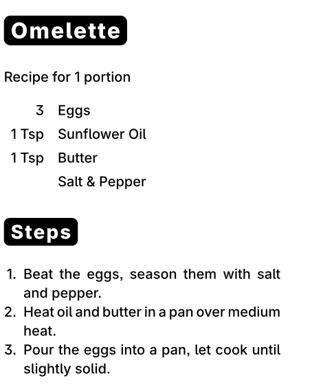

# Simple Receipt Printer - Print on your favorite thermal printer


## Features

* Print to a thermal receipt printer
* Print recipes on a thermal receipt printer

## Usage

To write a regular document

```typst
#import "@preview/simple-receipt-printer:X.X.X": receipt

#set document(title: "A document")

#show: receipt

#title()

Funny how it goes, isn't it?
```


Or print a recipe, like so:

```typst
#import "@preview/simple-receipt-printer:X.X.X": recipe

#set document(title: "Omelette")

#show: recipe.with(
  portions: 1,
  ingredients: (
    [3], [Eggs],
    [1 Tsp], [Sunflower Oil],
    [1 Tsp], [Butter],
    [], [Salt & Pepper],
  )
)

= Steps

1. Beat the eggs, season them with salt and pepper.
2. Heat the oil in a pan over medium heat.
3. Pour the eggs into a pan, let cook until slightly solid.


```


