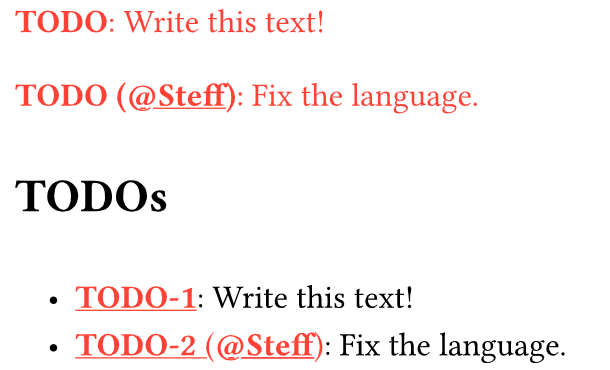

# simple-todo

A simple TODO package providing TODO inline tags and a list of TODOs.

``` typ
#import "@preview/simple-todo:0.1.0": todo, list-todos

#todo[Write this text!]

#todo(assignee: "Steff")[Fix the language.]

#set heading(numbering: false)

== TODOs

#list-todos()
```


