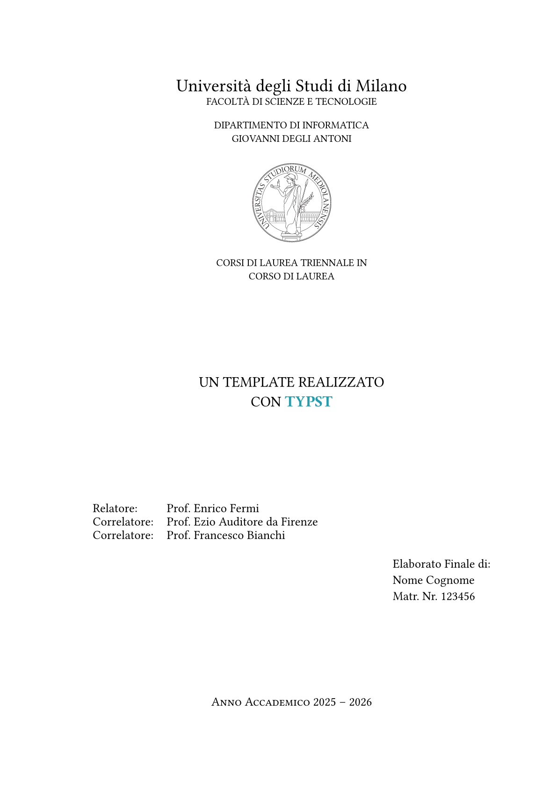

# simple-unimi-thesis 🎓

A simple [Typst](https://typst.app) thesis template for Università Statale degli Studi di Milano. There are many templates available; this packaged has been built upon the [LIM LaTeX template](https://www.overleaf.com/project/641879675262cde2a670826b) (in Italian).

Due to the license issues, the package shipped to the Typst universe cannot contain logos:

- For the frontispiece, you can it [here](https://work.unimi.it/servizi/comunicare/37094.htm)
- For the laboratories, you can get them in the [Github repository](https://github.com/VictuarVi/Template-Tesi-UniMi)

# Preview ✨

<p align="center">
  
</p>

See the [instructions](docs/instructions.pdf) for more information about the template (in Italian).

# Usage 🚀

Compile with:

```shell
typst c main.typ --pdf-standard a-3b
```

The following excerpt is the canonical example of how the template can be structured:

```typ
#import "@preview/simple-unimi-thesis:0.1.1": *

#show: project.with(
  language: "en",
)

#show: frontmatter

// dedication

#show: acknowledgements

// acknowledgements

#toc // table of contents

#show: mainmatter

// main section of the thesis

#show: appendix

// appendix

#show: backmatter

// bibliography

// associated laboratory
#closingpage("associated_lab")

```

The default monospace font is [`JetBrainsMono NF`](https://fonts.google.com/specimen/JetBrains+Mono).
