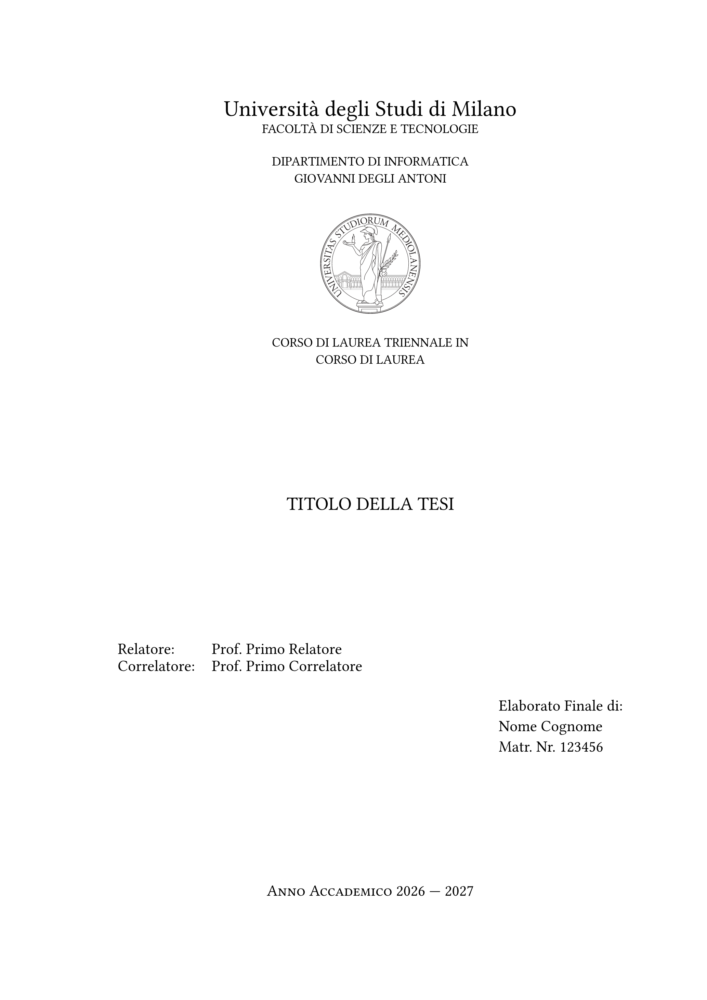
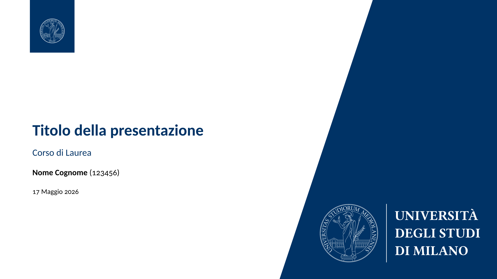

# simple-unimi-thesis 🎓


[](https://github.com/VictuarVi/Template-Tesi-UniMi)

[](docs/manual.pdf?raw=true)
[](docs/presentation-manual-en.pdf?raw=true)
[](docs/presentation-manual.pdf?raw=true)

A simple [Typst](https://typst.app) thesis template for the University of Milan (UniMi). There are many templates available: this package has been built upon the [LIM LaTeX template](https://www.overleaf.com/project/641879675262cde2a670826b) (in Italian); while the the presentation is based on [this](https://www.overleaf.com/latex/templates/la-statale-universita-degli-studi-di-milano-unimi-presentation/ykkwvfdbqydr) LaTeX template. Both are licensed under the CC BY 4.0 license.

See the [this](docs/manual.pdf) for more information about the thesis (in Italian; the template supports English as well) and [this](docs/presentation-manual-en.pdf) for the presentation.

All the logos and images provided are property of the University of Milan (see [more](https://www.unimi.it/en/university/la-statale/communication/visual-identity)). To download other logos, see [this](https://work.unimi.it/servizi/comunicare/12902.htm) and [this](https://work.unimi.it/servizi/comunicare/37094.htm).

You'll have to download on your own the [Carlito](https://fonts.google.com/specimen/Carlito) font, which is the default for the presentation.

## Preview ✨

<p align="center">
  
  <br>
  <div align="center"><em>Frontispiece of the thesis</em></div>
</p>
<p align="center">
  
  <br>
  <div align="center"><em>Title page of presentation</em></div>
</p>

## Usage 🚀

Compile with:

```shell
typst c main.typ --pdf-standard a-3u
```

Quick start:

```typ
#import "@preview/simple-unimi-thesis:0.2.0": *

#show: unimi-thesis.with(
  title: "Thesis title",
  author: "Name Surname",
  serial-number: "123456",
  supervisors: (
    "Prof. First Supervisor",
  ),
  cosupervisors: (
    "Prof. First Cosupervisor",
  ),
  thesis-type: "Elaborato Finale",
  academic-year: [2026 --- 2027],
)

#show: frontmatter

// dedication

#show: dedication

// acknowledgements

#show: acknowledgements

= Acknowledgements

#lorem(100)

#toc // table of contents

#show: mainmatter

// main section of the thesis

= First chapter

#lorem(100)

= Second chapter

#lorem(100)

// appendix

#show: appendix

= First appendix

#lorem(100)

#show: backmatter

// bibliography

// associated laboratory
#closingpage()

```

### Presentation

Built on [Touying](https://typst.app/universe/package/touying/), the structure is quite standard:

```typ
#import "@preview/simple-unimi-thesis:0.2.0": *
#import "@preview/touying:0.8.0": *

#show: unimi-presentation.with(
  config-info(
    title: [Title of the presentation],
    course: [Degree course],
    author: [Name Surname],
    serial-number: [123456],
    date: datetime.today(),
  ),
)

#title-slide()

= First section

== First slide

#lorem(20)

#lorem(20)

== Second slide

#lorem(20)

#lorem(20)

= Second section

== First slide

#lorem(20)

#lorem(20)

#focus-slide("Thanks for listening.")
```
