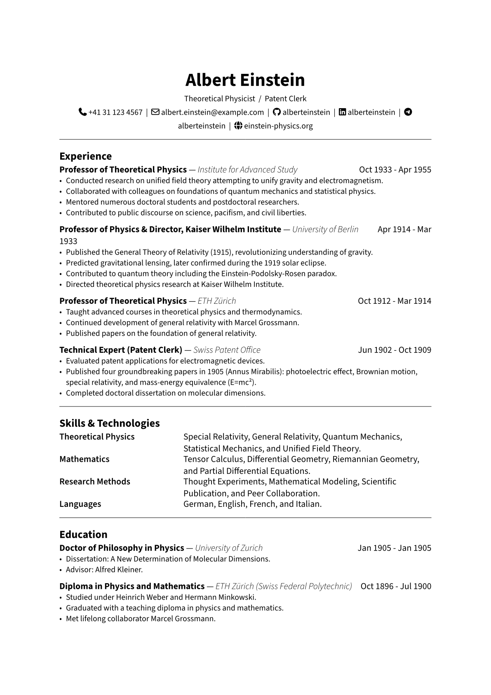
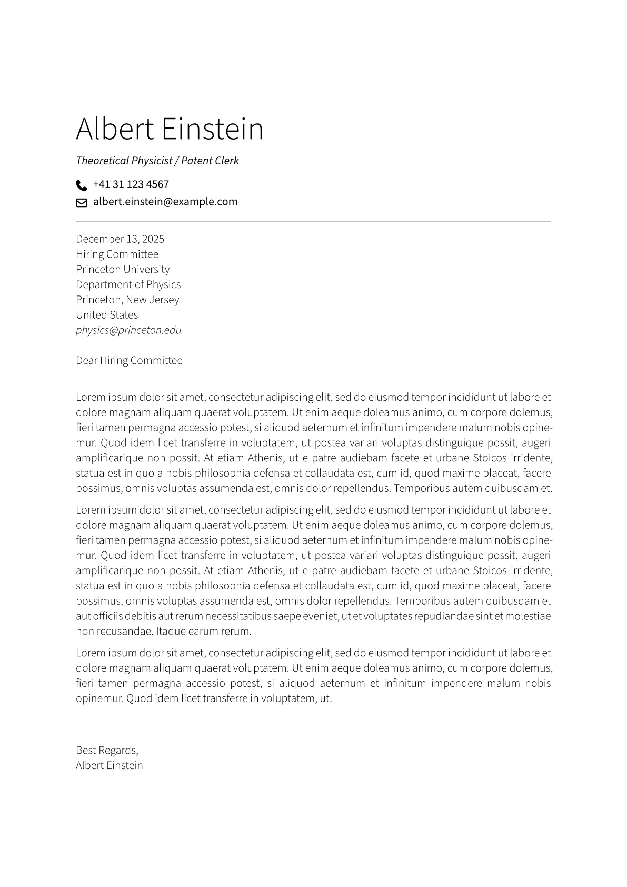

# Simple XD Resume

A simple and clean resume and cover letter design, minimal layout to enhance ATS compatibility.

## Usage

Follow the templates:

- [resume](./template/resume-example.typ).
- [cover-letter](./template/cover-letter-example.typ).

## Fonts

You may need to install the following fonts for best rendering:

1. font-awesome
2. source-sans

## Change logs

- v0.1.0:
  - Initial release
