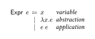
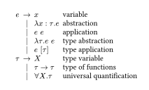

# simplebnf.typ

simplebnf is a simple package to format Backus-Naur form. The package provides a simple way to format Backus-Naur form (BNF). It provides constructs to denote BNF expressions, possibly with annotations.

This is a sister package of [simplebnf](https://github.com/Zeta611/simplebnf), a LaTeX package under the same name by the author.

## Usage

Import simplebnf via

```typst
#import "@preview/simplebnf:0.1.0": *
```

Use the `bnf` function to display the BNF production rules. Each production rule can be created using the `Prod` constructor function, which accepts the (left-hand side) metavariable, an optional annotation for it, an optional delimiter (which defaults to ⩴), and a list of (right-hand side) alternatives. Each alternative should be created using the `Or` constructor, which accepts a syntactic form and an annotation.

Below are some examples using simplebnf.

```typst
#bnf(
  Prod(
    $e$,
    annot: $sans("Expr")$,
    {
      Or[$x$][_variable_]
      Or[$λ x. e$][_abstraction_]
      Or[$e$ $e$][_application_]
    },
  ),
)
```



```typst
#bnf(
  Prod(
    $e$,
    delim: $→$,
    {
      Or[$x$][variable]
      Or[$λ x: τ.e$][abstraction]
      Or[$e space e$][application]
      Or[$λ τ.e space e$][type abstraction]
      Or[$e space [τ]$][type application]
    },
  ),
  Prod(
    $τ$,
    delim: $→$,
    {
      Or[$X$][type variable]
      Or[$τ → τ$][type of functions]
      Or[$∀X.τ$][universal quantification]
    },
  ),
)
```



## Authors

- Jay Lee <jaeho.lee@snu.ac.kr>

## License

simplebnf.typ is available under the MIT license. See the [LICENSE](https://github.com/Zeta611/simplebnf.typ/blob/master/LICENSE) file for more info.
