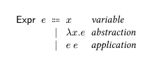
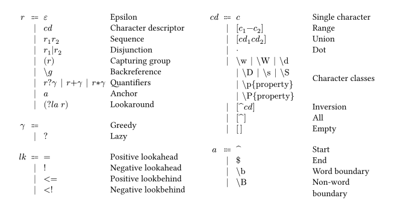

# simplebnf.typ

simplebnf is a simple package to format Backus-Naur form. The package provides a simple way to format Backus-Naur form (BNF). It provides constructs to denote BNF expressions, possibly with annotations.

This is a sister package of [simplebnf](https://github.com/Zeta611/simplebnf), a LaTeX package under the same name by the author.

## Usage

Import simplebnf via

```typst
#import "@preview/simplebnf:0.1.2": *
```

Use the `bnf` function to display the BNF production rules. Each production rule can be created using the `Prod` constructor function, which accepts the (left-hand side) metavariable, an optional annotation for it, an optional delimiter (which defaults to $\Coloneqq$), and a list of (right-hand side) alternatives. Each alternative should be created using the `Or` constructor, which accepts syntactic forms and an annotation.

Below are some examples using simplebnf.

```typst
#bnf(
  Prod(
    $e$,
    annot: $sans("Expr")$,
    {
      Or[$x$][_variable_]
      Or[$λ x. e$][_abstraction_]
      Or[$e$ $e$][_application_]
    },
  ),
)
```



```typst
#bnf(
  Prod(
    $e$,
    delim: $→$,
    {
      Or[$x$][variable]
      Or[$λ x: τ.e$][abstraction]
      Or[$e space e$][application]
      Or[$λ τ.e space e$][type abstraction]
      Or[$e space [τ]$][type application]
    },
  ),
  Prod(
    $τ$,
    delim: $→$,
    {
      Or[$X$][type variable]
      Or[$τ → τ$][type of functions]
      Or[$∀X.τ$][universal quantification]
    },
  ),
)
```


```typst
#let esc(e) = $\\ #h(0pt) #e$

#grid(
  columns: (auto, auto),
  gutter: 4%,
  bnf(
    Prod($r$, {
      Or[$epsilon$][Epsilon]
      Or[$c d$][Character descriptor]
      Or[$r_1 r_2$][Sequence]
      Or[$r_1|r_2$][Disjunction]
      Or[$(r)$][Capturing group]
      Or(esc($g$))[Backreference]
      Or[$r? #h(0pt) gamma$][$r #h(0pt) + #h(0pt) gamma$][$r #h(0pt) * #h(0pt) gamma$][Quantifiers]
      Or[$a$][Anchor]
      Or[$(? #h(0pt) l a thick r)$][Lookaround]
    }),
    Prod($gamma$, {
      Or[$$][Greedy]
      Or[$?$][Lazy]
    }),
    Prod($l k$, {
      Or[$=$][Positive lookahead]
      Or[$!$][Negative lookahead]
      Or[$\<=$][Positive lookbehind]
      Or[$< #h(0pt) !$][Negative lookbehind]
    }),
  ),
  bnf(
    Prod($c d$, {
      Or[$c$][Single character]
      Or[$[c_1 #h(0pt) - #h(0pt) c_2]$][Range]
      Or[$[c d_1 c d_2]$][Union]
      Or[$dot$][Dot]
      Or[$esc("w")$][$esc("W")$][$esc("d")$][$esc("D")$][$esc("s")$][$esc("S")$][$esc("p"){"property"}$][$esc("P"){"property"}$][Character classes]
      Or[$[\^c d]$][Inversion]
      Or[$[\^]$][All]
      Or[$[thin]$][Empty]
    }),
    Prod($a$, {
      Or[$\^$][Start]
      Or[$\$$][End]
      Or[$esc("b")$][Word boundary]
      Or[$esc("B")$][Non-word boundary]
    }),
  ),
)
```



## Authors

- Jay Lee <jaeho.lee@snu.ac.kr>

## License

simplebnf.typ is available under the MIT license. See the [LICENSE](https://github.com/Zeta611/simplebnf.typ/blob/master/LICENSE) file for more info.
