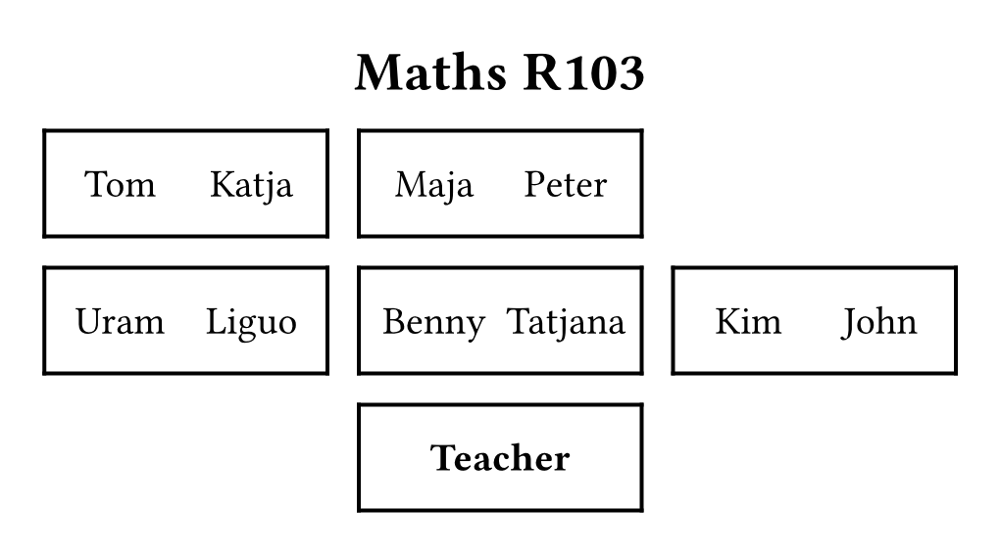
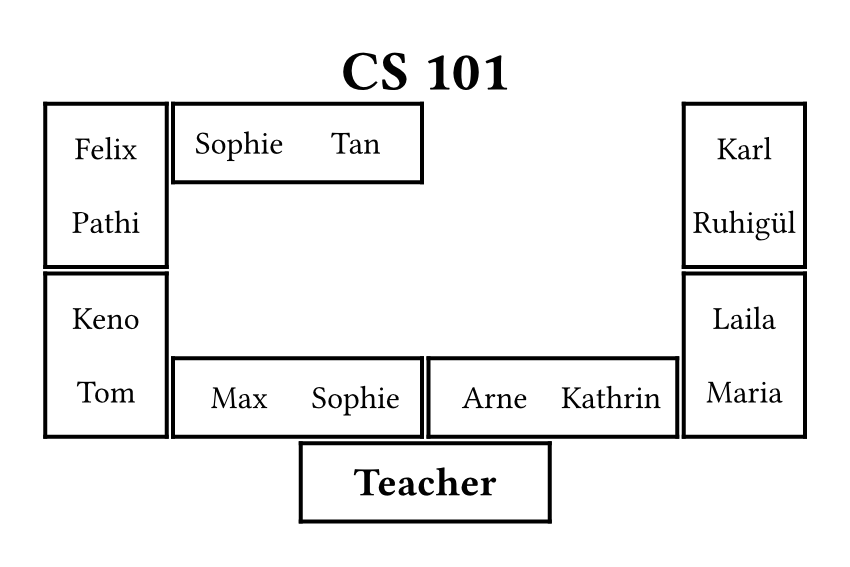
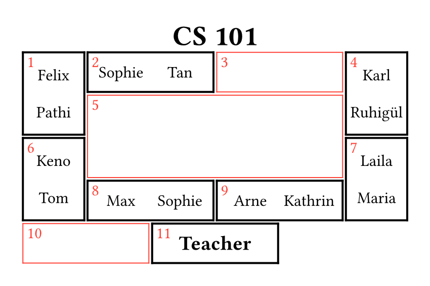

# Sitdown
Easily draw and style seating charts.

## Example
```typst
#import "@preview/sitdown:1.0.0": *
#seating-chart(columns: 3, rows: 3, title: "Maths R103",
    [Tom, Katja], [Maja, Peter], [],
    [Uram, Liguo], [Benny, Tatjana], [Kim, John],
    [], [*Teacher*], []
)
```



## Quick overview
- Import via `#import "@preview/sitdown:1.0.0"`.
- Draw simple seating charts with `#seating-chart()`:
    - Set the number of table rows with `columns`.
    - Use `title` to set a heading for the chart.
    - Write out tables with contents like in a `grid`.
    - Comma-separated names are drawn nicely laid out automatically.
- For more complex arrangements, use `#free-seating-chart()`:
    - Place tables from top-left to bottom-right like in a `grid`.
    - Use `htable[name][name]` for horizontal tables.
        - Each content parameter takes up one "seat".
    - Use `vtable[name][name]` for vertically placed tables.
        - Successive names are placed in seats "below" preceding ones.
    - Use `empty(num)` to skip seats / leave them empty horizontally.
        - `empty(2, 3)` takes up six total seats: two horizontally in three
          adjacent rows.
    - If a table has less occupants than seats, use the `span` parameter to
      override the length.
    - _Note: Just like with `grid`, occupied seats are skipped in order._

### Example for complex charts
```typst
#free-seating-chart(columns: 6, rows: 5, title: "CS 101", font-size: 16pt,
    vtable[Felix][Pathi], htable[Sophie][Tan], empty(2), vtable[Karl][Ruhigül],
    empty(4, 2), vtable[Keno][Tom], vtable[Laila][Maria], htable[Max][Sophie],
    htable[Arne][Kathrin], empty(2), htable(span: 2, text(size: 20pt)[*Teacher*]),
)
```



## Usage
### Import
`#import "@preview/sitzplan:1.0.0": *`

### Functionality
The package makes available two key functions. `seating-chart()` makes it easy
to draw simple seating charts where tables are all in uniform rows in the room.
`free-seating-chart()` can draw more complex table arrangements with a bit more
effort when defining them.

It's recommended to always define the charts so that the point of view is at
the bottom edge (placing e.g. the teacher in the bottom row).

#### seating-chart()
Draws a seating chart for simple row layouts that takes up all available space
on the page by default (specify `width` and/or `height` to constrain size).

Names are entered as one piece of content per table, separating names with
commas. This means the chart is input like any other grid.

Main function parameters:

- `columns` (default `3`): Number of table columns the seating arrangement has.
- `rows` (default `4`): Number of table rows the seating arrangement has.
- `title` (default `none`): Optional title to draw above the chart.
- `vertical-rows` (default `()`): Which rows of the arrangement should have
  names separated vertically instead of horizontally.
    - Specified as an array of row numbers, starting at `1`.
    - If not all tables are oriented the same way, use this to easily draw some
      as being oriented straight on from the viewer's perspective.
- `vertical-cols` (default `()`): Same as `vertical-rows` but for the columns
  of the arrangement.

Styling parameters:

- `font` (default `auto`): What font to use in the chart.
    - If not specified, uses the font set in the document before.
- `font-size` (default `20pt`): The font size to use for names on tables.
- `title-font-size` (default `28pt`): The font size for the chart title.
- `stroke` (default `2pt`): The stroke to use for the table borders.
- `fill` (default `none`): The fill to use for the table color.
- `gutter` (default `0.8em`): The spacing between tables.
- `border` (default `none`): The border to draw around the whole chart
  (specified as a stroke).
- `margin` (default `0pt`): How much margin to add inside the chart confines.
- `background` (default `none`): Background color for the whole chart.
- `width` (default `auto`): The width of the whole chart (given as a length).
    - Note `auto` in this case means filling all available space.
- `height` (default `auto`): The height of the whole chart (given as a length).

#### free-seating-chart()
Draws a seating chart that allows for a more complex layout. Also takes up all
available space if not constrained.

Instead of directly entering names, tables are instead specified to be standing
either horizontally or vertically from the viewer's perspective, while gaps in
the layout are set as empty.

For this, the function `htable[]`, `vtable[]` and `empty()` are used inside the
`free-seating-chart()` call. `htable` and `vtable` are given any number of
names inside content brackets which create tables spanning an equal number of
"seats" in the layout. `empty()` is given either one or two numbers. With one
parameter, that many seats are set as empty horizontally. With two numbers, the
first specifies the horizontal dimension of the empty space, with the second
denoting the vertical one.

To draw a layout, go through it from top-left to bottom-right creating the
necessary tables and empty spaces as you go. Each successive element starts at
the next free slot in the underlying grid. Since this can be hard to visualize,
there a `debug` parameter that can be set as `true` to show where each element
ends up and how much space it occupies.

To leave seats empty on a table either put empty content brackets after a table
definition for the empty spot or use the `span` parameter on the table
functions to specify that the table should not have its' size dictated by the
number of names given.



Main function parameters:

- `columns` (default `6`): Number of table columns the seating arrangement has.
- `rows` (default `4`): Number of table rows the seating arrangement has.
- `title` (default `none`): Optional title to draw above the chart.

Styling parameters:

- `font` (default `auto`): What font to use in the chart.
    - If not specified, uses the font set in the document before.
- `font-size` (default `20pt`): The font size to use for names on tables.
- `title-font-size` (default `28pt`): The font size for the chart title.
- `stroke` (default `2pt`): The stroke to use for the table borders.
- `fill` (default `none`): The fill to use for the table color.
- `gutter` (default `0.8em`): The spacing between tables.
- `border` (default `none`): The border to draw around the whole chart
  (specified as a stroke).
- `margin` (default `0pt`): How much margin to add inside the chart confines.
- `background` (default `none`): Background color for the whole chart.
- `width` (default `auto`): The width of the whole chart (given as a length).
    - Note `auto` in this case means filling all available space.
- `height` (default `auto`): The height of the whole chart (given as a length).
- `debug` (default `false`): Whether or not to draw debugging numbers and
  borders to clarify where all the input elements end up.

#### Helper functions for free-seating-chart()
`htable[]`, `vtable[]` and `empty()` are the functions used inside a call of
`free-seating-chart()` to specify the layout. These all simply return
dictionaries containing the necessary data to construct the chart, meaning they
don't provide any use outside of the call to create the chart.

By default, a table is set up to cover as many seats as names are given as
content arguments to the call, e.g. `htable[Tic][Tac][Toe]` will create a
horizontal table three seats wide. If you wish to set the table length
manually, specify the `span` parameter: `vtable(span: 2)[Abraham]`.

`empty()` creates a single empty space. `empty(num)` will create a horizontal
empty space of the specified number of seats. `empty(num, other-num)` will
create an empty space covering an area of seats `num` wide and `other-num`
tall.

#### Alternative function names
Alternative function names in German are available:

- `sitzplan()` instead of `seating-chart()`.
- `freier-sitzplan()` instead of `free-seating-chart()`.
- `htisch[]`, `vtisch[]` and `leer()` instead of `htable[]`, `vtable[]` and
  `empty()`.

## Local package
If you want to use the package locally, you have two options:

1. Download and extract the package folder to your chosen package namespace.
   Check the
   [official documentation](https://github.com/typst/packages?tab=readme-ov-file#local-packages)
   for where to find and create a namespace. Then simply import the package
   from that namespace. The following example assumes a namespace named `local`
   to be used: `#import "@local/sitdown:1.0.0": *`

   This makes the package available anywhere on your system via the namespace
   import.
2. Download only the single file named `sitdown.typ` and place it next to
   the typst file you wish to use the package in. Then simply import the file
   as follows: `#import "sitdown.typ": *`
   
   This method will make the package available only to files that you directly
   copy the source file next to.
