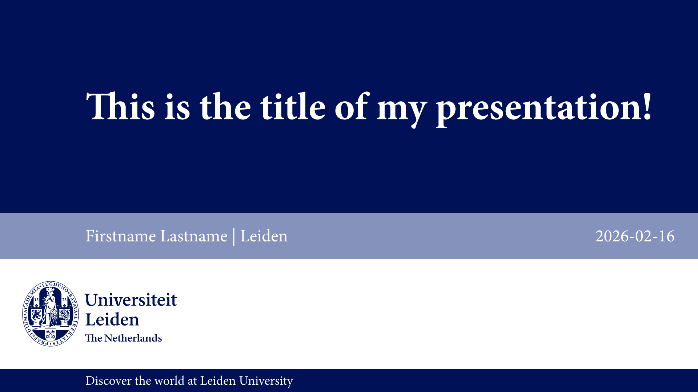
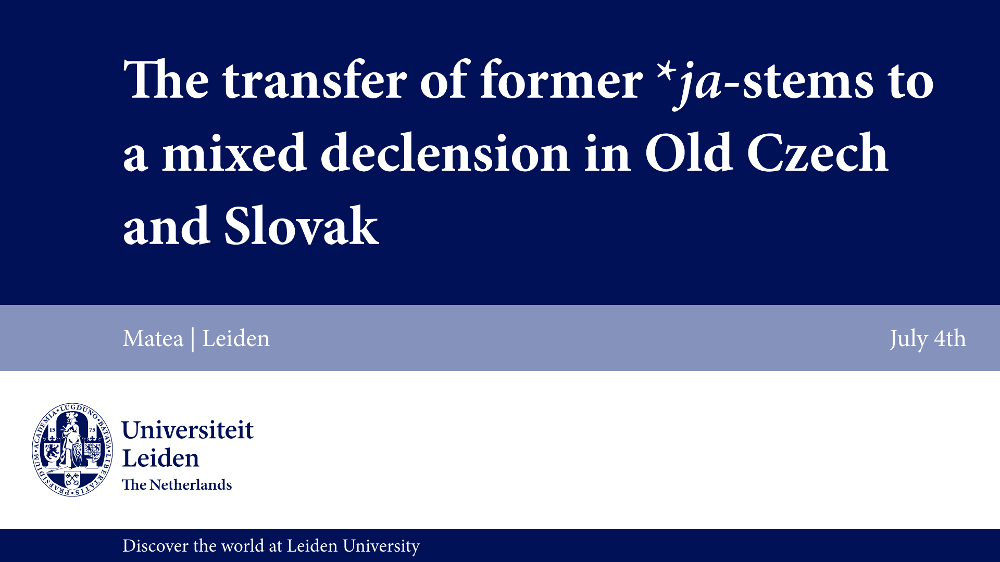
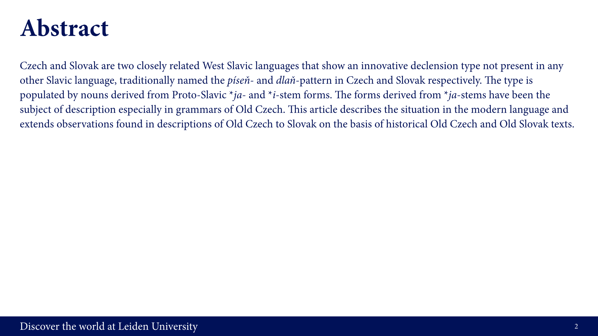

# Sleiden

This package provides a Typst recreation of the house style presentation template of Leiden University (LEI).

Currently the template of the old house style is available (before the August 2025 style change). The new template will be added soon.



## Usage

To use the presentation template, import `slides` and the necessary slide templates. Use `slides` in a show rule over the whole document, and slide templates to lay out content:

```typ
#import "@preview/sleiden-lei:1.0.0": *

#show: slides.with(lang: "en")
// lang: "nl" will change the logo variant used, as well as changing the text language

// use slide templates to typeset your content
#title-presentation(
  title: [The transfer of former \*_ja_-stems to a mixed declension in Old Czech and Slovak],
  name: [Matea],
  place: [Leiden],
  date: [July 4th],
)

#only-text(
  title: [Abstract],
  body: [
    Czech and Slovak are two closely related West Slavic languages that show an innovative declension type not present in any other Slavic language, traditionally named the _píseň_- and _dlaň_-pattern in Czech and Slovak respectively. The type is populated by nouns derived from Proto-Slavic \*_ja_- and \*_i_-stem forms. The forms derived from \*_ja_-stems have been the subject of description especially in grammars of Old Czech. This article describes the situation in the modern language and extends observations found in descriptions of Old Czech to Slovak on the basis of historical Old Czech and Old Slovak texts.
  ],
)
```




## License

The software in this package is released under the Unlicense license. The logo of Leiden University is included with the package and is available under a CC BY-SA 3.0 license.[^1]

[^1]: See confirmation for example at [Wikimedia Commons](https://commons.wikimedia.org/wiki/File:UniversiteitLeidenLogo.svg#Summary).
