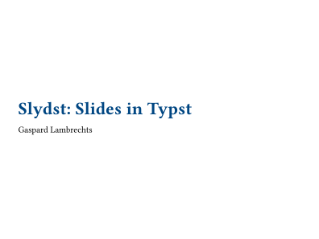
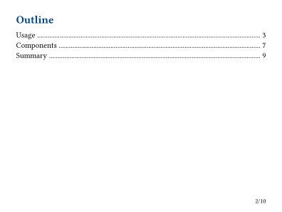
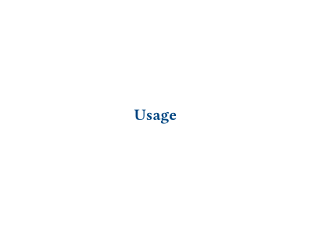
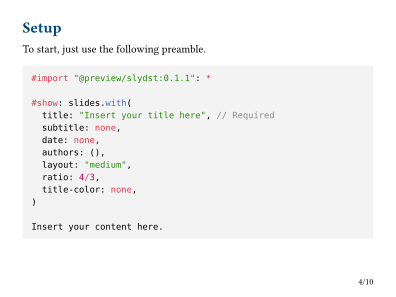
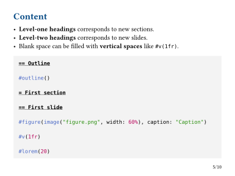
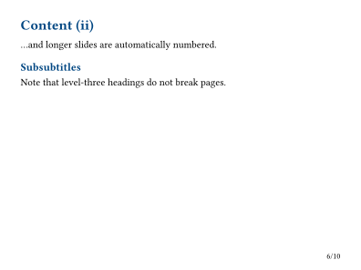
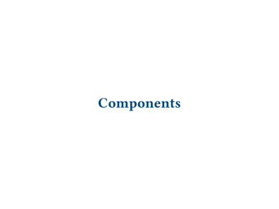
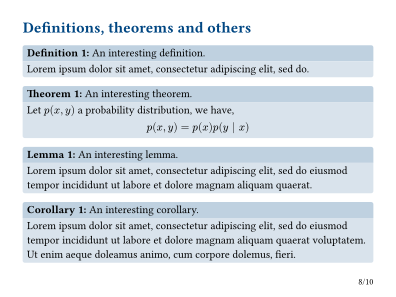
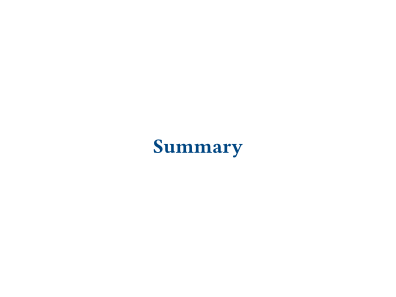
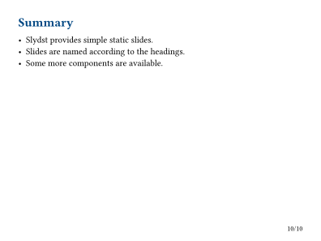

# Slydst

Create simple static slides with Typst.

Slydst allows the creation of slides using Typst headings.
This simplicity comes at the expense of dynamic content such as subslide animations.
For more complete and complex slides functionalities, see other tools such as Polylux.

## Usage

To start, just use the following preamble (only the title is required).

```typst
#import "@preview/slydst:0.1.1": *

#show: slides.with(
  title: "Insert your title here", // Required
  subtitle: none,
  date: none,
  authors: (),
  layout: "medium",
  ratio: 4/3,
  title-color: none,
)

Insert your content here.
```

Then, insert your content.
- **Level-one headings** corresponds to new sections.
- **Level-two headings** corresponds to new slides.
- Blank space can be filled with **vertical spaces** like `#v(1fr)`.

```typst
== Outline

#outline()

= First section

== First slide

#figure(image("figure.png", width: 60%), caption: "Caption")

#v(1fr)

#lorem(20)
```

## Components

Definitions, theorems, lemmas, corollaries and algorithms boxes are also available.

```typst
#definition(title: "An interesting definition")[
  #lorem(20)
]
```

## Documentation

### `slides`

- `content`: `content` - content of the presentation
- `title`: `str` - title (required)
- `subtitle`: `str` - subtitle
- `date`: `str` - date
- `authors`: `array` of `content` or `content` - list of authors or author content
- `layout`: `str in ("small", "medium", "large")` - layout selection
- `ratio`: `float` or `ratio` or `int` - width to height ratio
- `title-color`: `color` or `gradient` - color of title and headings

### `definition`, `theorem`, `lemma`, `corollary`, `algorithm`

- `content`: `content` - content of the block
- `title`: `str` - title of the block

## Example

<kbd></kbd> <kbd></kbd> <kbd></kbd> <kbd></kbd> <kbd></kbd> <kbd></kbd> <kbd></kbd> <kbd></kbd> <kbd></kbd> <kbd></kbd>
