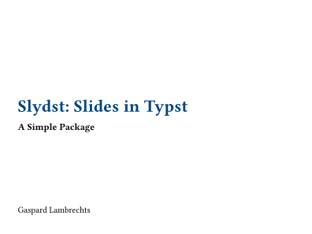
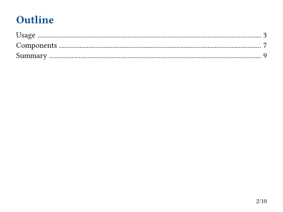
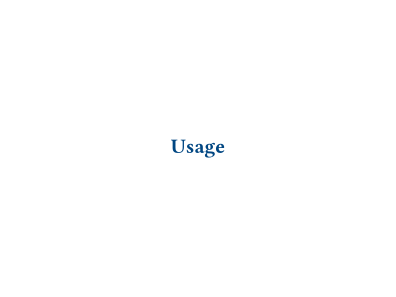
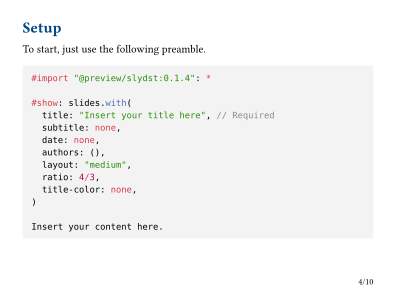
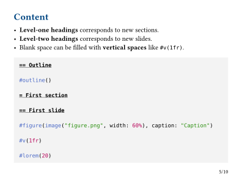
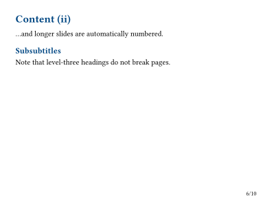
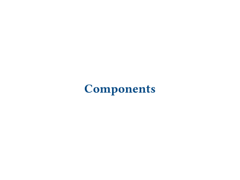
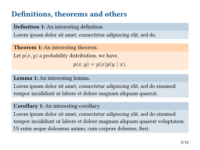
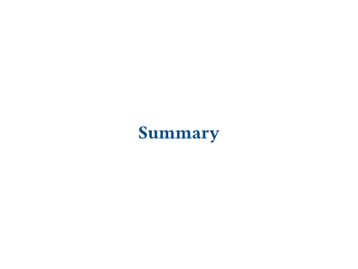
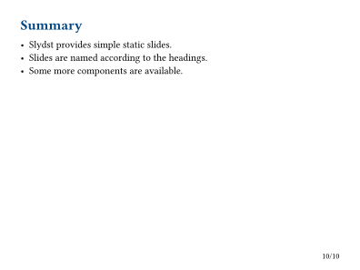

# Slydst

Create simple static slides with Typst.

Slydst allows the creation of slides using Typst headings.
This simplicity comes at the expense of dynamic content such as subslide animations.
For more complete and complex slides functionalities, see other tools such as Polylux.

See the [preview](#example) below.

## Quick start

Just use the following command.

```bash
typst init @preview/slydst directory
```

Or [select the Slydst template](https://typst.app/universe/package/slydst) in the Typst app.

## Usage

To start, just use the following preamble (only the title is required).

```typst
#import "@preview/slydst:0.1.4": *

#show: slides.with(
  title: "Slydst: Slides with Typst",
  subtitle: none,
  date: none,
  authors: ("Gaspard Lambrechts",),
  layout: "medium",
  ratio: 4/3,
  title-color: none,
)

Insert your content here.
```

Then, insert your content.
- **Level-one headings** corresponds to new sections.
- **Level-two headings** corresponds to new slides.
- Blank space can be filled with **vertical spaces** like `#v(1fr)`.

```typst
== Outline

#outline()

= First section

== First slide

#figure(image("figure.png", width: 60%), caption: "Caption")

#v(1fr)

#lorem(20)
```

## Title page

Alternatively, you can omit the title argument and write your own title page.
Note that the subtitle, date and authors arguments will be ignored in that case.

```typst
#show: slides.with(
  layout: "medium",
)

#align(center + horizon)[
  #text(2em, default-color)[*Slydst: Slides in Typst*]
]

Insert your content here.
```

We advise the use of the `title-slide` function that ensures a proper centering and no page numbering.

```typst
#show: slides

#title-slide[
  #text(2em, default-color)[*Slydst: Slides in Typst*]
]

Insert your content here.
```

## Components

Definitions, theorems, lemmas, corollaries and algorithms boxes are also available.

```typst
#definition(title: "An interesting definition")[
  #lorem(20)
]
```

## Documentation

### `slides`

- `content`: `content` - content of the presentation
- `title`: `str` - title (required)
- `subtitle`: `str` - subtitle
- `date`: `str` - date
- `authors`: `array` of `content` or `content` - list of authors or author content
- `layout`: `str in ("small", "medium", "large")` - layout selection
- `ratio`: `float` or `ratio` or `int` - width to height ratio
- `title-color`: `color` or `gradient` - color of title and headings

### `title-slide`

- `content`: `content` - content of the slide

### `definition`, `theorem`, `lemma`, `corollary`, `algorithm`

- `content`: `content` - content of the block
- `title`: `str` - title of the block
- `fill-header`: `color` - color of the header (inferred if only `fill-body` is specified)
- `fill-body`: `color` - color of the body (inferred if only `fill-header` is specified)
- `radius`: `length` - radius of the corners of the block

## Example

<kbd></kbd> <kbd></kbd> <kbd></kbd> <kbd></kbd> <kbd></kbd> <kbd></kbd> <kbd></kbd> <kbd></kbd> <kbd></kbd> <kbd></kbd>
