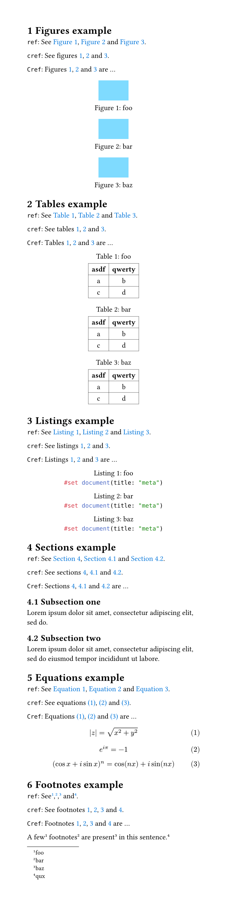
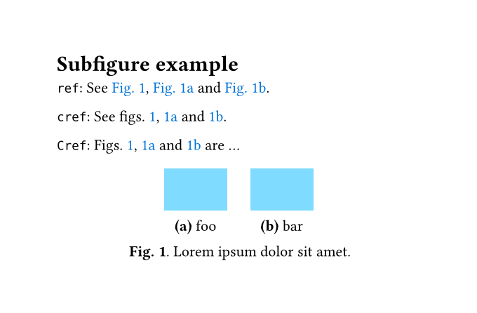
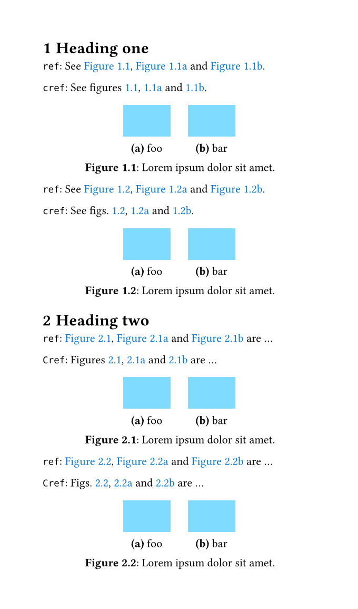
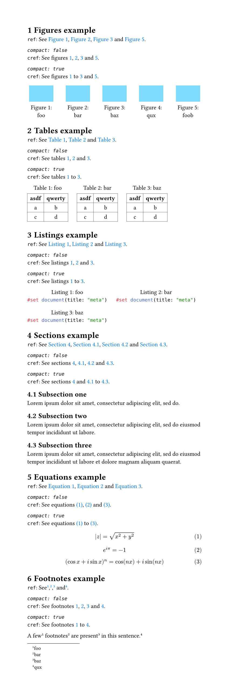
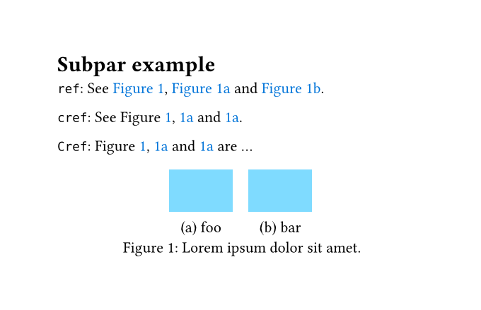

# Clever references for Typst

Smart handling of consecutive references (i.e. `cleveref` for Typst).

## Figures, tables, listings, sections, equations and footnotes example

See [example/example.typ](example/example.typ).

## Subfigures example

See [example/example-subfig.typ](example/example-subfig.typ).

## Heading-dependent numbering of subfigures

See [example/example-subfig-headings.typ](example/example-subfig-headings.typ).

## Compact consecutive references

See [example/example-compact.typ](example/example-compact.typ).

## Subpar example

See [example/example-subpar.typ](example/example-subpar.typ).

