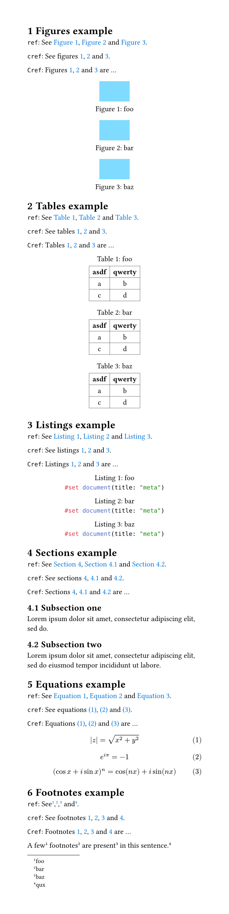
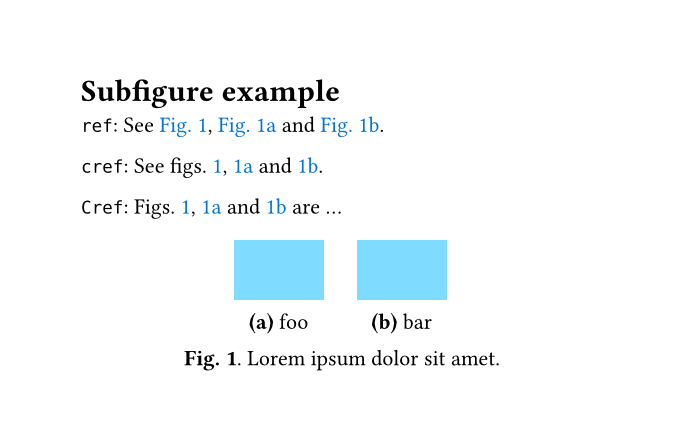
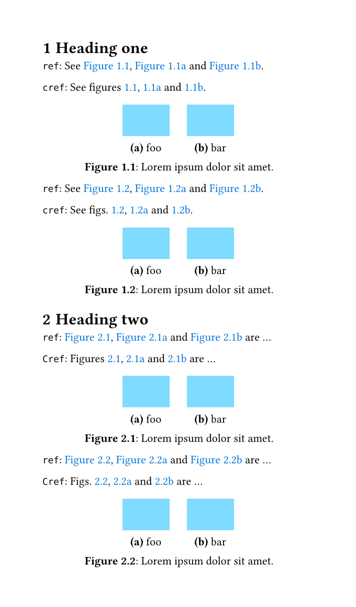
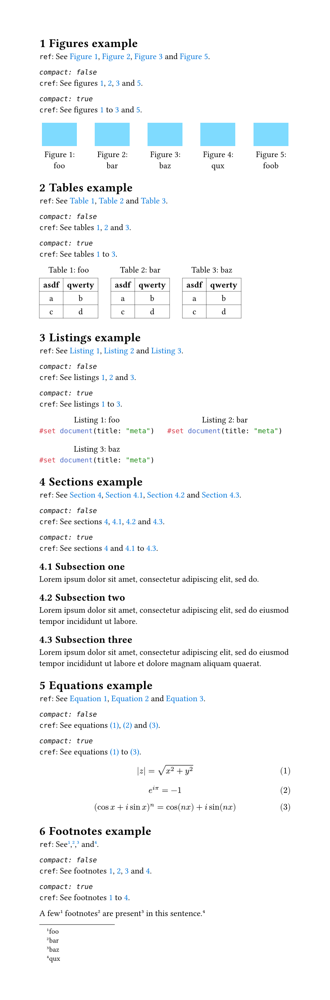
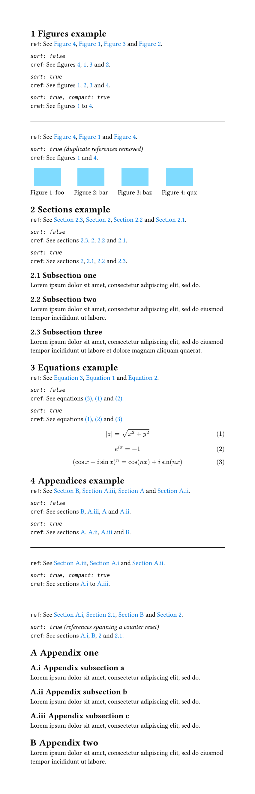
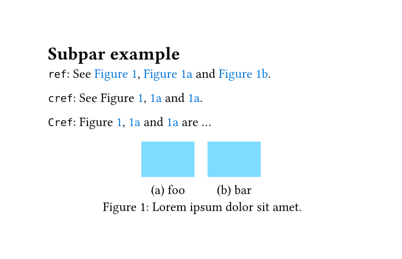

# Clever references for Typst

Smart handling of consecutive references (i.e. `cleveref` for Typst).

## Figures, tables, listings, sections, equations and footnotes example

See [example/example.typ](example/example.typ).

## Subfigures example

See [example/example-subfig.typ](example/example-subfig.typ).

## Heading-dependent numbering of subfigures

See [example/example-subfig-headings.typ](example/example-subfig-headings.typ).

## Compact consecutive references

See [example/example-compact.typ](example/example-compact.typ).

## Sort references in numerical order

References are sorted by counter value, so alphabetic ("A", "B", "C") and roman
("i", "ii", "iii") numbering sort in the same order as decimal numbering.
Duplicate references are removed when sorting.

See [example/example-sort.typ](example/example-sort.typ).

## Subpar example

See [example/example-subpar.typ](example/example-subpar.typ).

