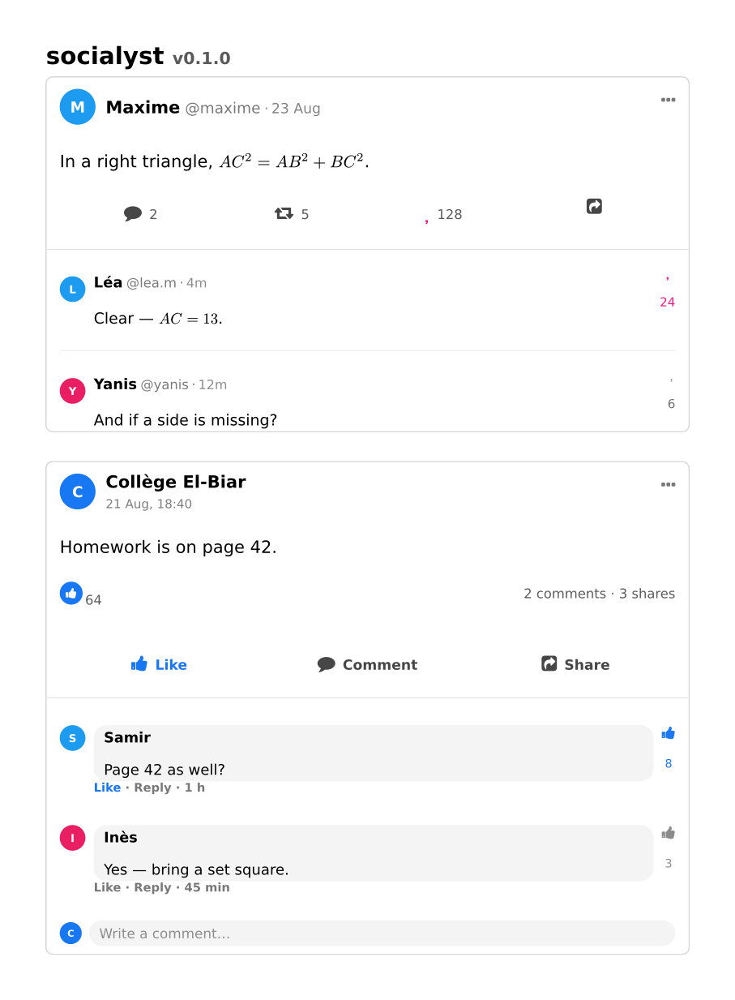

# socialyst

Social-network **post boxes** for **Typst 0.15.x**. Twitter / X, Facebook,
Instagram, Snapchat and Mastodon — after ProfCollege’s `PfCReseauxSociaux`.
Version **0.1.0**.



This archive does **not** ship fonts.

```typst
#import "socialyst/lib.typ": *

#tweetbox(
  author: "Maxime", handle: [maxime],
  published: true, likes: 128, liked: true,
  thread: (
    (author: "Léa", handle: [lea.m], time: [4m],
      likes: 24, liked: true, body: [Nice proof.]),
  ),
)[In a right triangle, $A C^2 = A B^2 + B C^2$.]
```

## Install

Unzip next to your document so the folder is called `socialyst/`.

```
your-project/
  doc.typ
  socialyst/
    lib.typ
    typst.toml
    …
```

Needs `@preview/fontawesome:0.6.2` (Typst downloads it on first compile)
and the **Font Awesome 7** desktop fonts on the system:

- *Font Awesome 7 Free Regular*
- *Font Awesome 7 Free Solid*
- *Font Awesome 7 Brands*

Download: https://fontawesome.com/download (Free desktop zip).  
If they are not installed globally:

```bash
typst compile doc.typ --root . --font-path /path/to/fontawesome/otfs
```

## What is in the box

| Function | Look |
|---|---|
| `#tweetbox` / `#twitterbox` | X / Twitter post + `thread:` |
| `#facebookbox` | Facebook post, comments, composer |
| `#instabox` / `#instagrambox` | Photo, caption, comments |
| `#snapbox` / `#snapchatbox` | Snap with camera / send |
| `#mastodonbox` / `#tootbox` | Toot |
| `#socialbox(kind: "tweet" \| …)` | same boxes, one entry point |

Each reply in `thread:` accepts `author`, `handle`, `body`, `likes`,
`liked`, `time`, `avatar`. Labels follow `text.lang` (`en` / `fr` / `ar`).

```bash
typst compile examples/quickstart.typ --root . --font-path /path/to/fa/otfs
```

## Licence

MIT — see [`LICENSE`](LICENSE). Layouts follow ProfCollege
(Christophe Poulain). Icons via `@preview/fontawesome`.

FERGOUS Abdelhak.
