# Sorbonne Presentation Theme

A non-official structured presentation theme for **Sorbonne University**, built on top of the [presentate](https://typst.app/universe/package/presentate) and [navigator](https://typst.app/universe/package/navigator) packages.

---

## Overview

The theme provides academic and institutional slide decks that respect the visual identity of Sorbonne University while offering powerful dynamic features.

- **Faculty Presets**: Built-in colors and logos for Health, Science, Humanities, and University-wide presentations.
- **Smart Navigation**: Automatic breadcrumbs, transition slides with roadmaps, and flexible hierarchy mapping.
- **Dynamic Content**: Seamless integration of `pause`, `uncover`, and `only` for step-by-step reveals.
- **Scientific Ready**: Specialized slides for equations, figures, and algorithms.

### 🎨 Faculty Presets
Switch visual identities instantly using the `faculty` parameter:

| Univ | Sante | Sciences | Lettres |
|:---:|:---:|:---:|:---:|
|  | 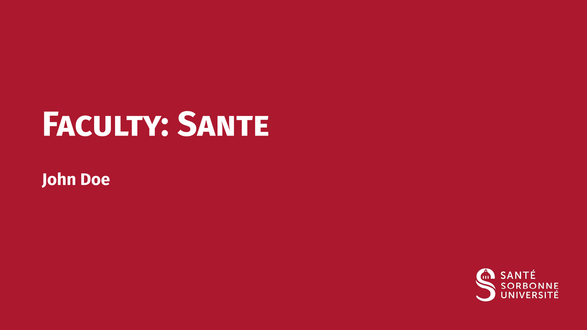 |  |  |

- `univ`: Sorbonne Blue (University-wide)
- `sante`: Sorbonne Red (Faculty of Health)
- `sciences`: Sorbonne Light Blue (Faculty of Science & Engineering)
- `lettres`: Sorbonne Yellow/Ocre (Faculty of Humanities)

## Documentation

For a comprehensive visual tour of all components and features, please refer to the pre-compiled PDF documentation:

- **[Main Demo Guide](examples/demo.typ)** (⇒ [pdf results](https://github.com/eusebe/typst-sorbonne-presentation/blob/0.1.0/examples/demo.pdf)): All components, boxes, and slide types.
- **[2-Levels Mapping Guide](examples/demo-mapping-2levels.typ)** (⇒ [pdf results](https://github.com/eusebe/typst-sorbonne-presentation/blob/0.1.0/examples/demo-mapping-2levels.pdf)): Using Section/Subsection hierarchy.
- **[3-Levels Mapping Guide](examples/demo-mapping-3levels.typ)** (⇒ [pdf results](https://github.com/eusebe/typst-sorbonne-presentation/blob/0.1.0/examples/demo-mapping-3levels.pdf)): Using Part/Section/Subsection hierarchy.

## Quick Start

```typ
#import "@preview/sorbonne-presentation:0.1.0": *

#show: template.with(
  title: [Scientific Discovery],
  author: [John Doe],
  faculty: "sciences",
  show-outline: true,
)

= Introduction
#slide[
  - High performance
  - Intuitive syntax
  #show: pause
  - *Dynamic* animations
]

#ending-slide()
```

## Configuration Reference

### The `template` function

| Parameter | Type | Default | Description |
|-----------|------|---------|-------------|
| `title` | content | `none` | Main presentation title |
| `short-title` | content | `none` | Short version of title for footer |
| `subtitle` | content | `none` | Optional subtitle |
| `author` | content | `none` | Presenter's name |
| `short-author` | content | `none` | Short version of author for footer |
| `affiliation` | content | `none` | Department or Laboratory |
| `date` | content | `datetime...` | Custom date display |
| `faculty` | string | `"sante"` | Preset: `"sante"`, `"sciences"`, `"lettres"`, `"univ"` |
| `primary-color` | color | `none` | Manual override for theme color |
| `alert-color` | color | `none` | Manual override for alert text color |
| `logo-slide` | string | `none` | Path to custom logo for content slides |
| `logo-transition` | string | `none` | Path to custom logo for transition slides |
| `text-font` | string | `"Fira Sans"` | Main font family |
| `text-size` | length | `20pt` | Base text size |
| `aspect-ratio` | string | `"16-9"` | `"16-9"` or `"4-3"` |
| `show-outline` | bool | `false` | Toggle summary slide |
| `outline-title` | content | `[Sommaire]` | Title of the summary slide |
| `outline-depth` | int | `2` | Levels shown in summary |
| `outline-columns` | int | `1` | Number of columns for summary |
| `mapping` | dict | `(sec: 1, sub: 2)` | Logic mapping for headings |
| `auto-title` | bool | `true` | Use section name as slide title if none provided |
| `show-header-numbering` | bool | `true` | Toggle all heading numbers |
| `numbering-format` | string | `"1.1"` | Format for sections and subsections |
| `part-numbering-format` | string | `"I"` | Format for parts |
| `annex-title` | content | `[Annexe]` | Prefix for single appendix |
| `annex-main-title` | content | `[Annexes]` | Focus slide text for appendix start |
| `annex-numbering-format` | string | `"I"` | Numbering style for appendices |
| `bib-style` | string | `"apa"` | Bibliography and citation style |
| `progress-bar` | string | `"none"` | Position: `"none"`, `"top"`, or `"bottom"` |
| `slide-break-suffix` | content | `[ (cont.)]` | Suffix appended to titles on broken slides |
| `footer-author` | bool | `true` | Toggle author display in footer |
| `footer-title` | bool | `true` | Toggle title display in footer |
| `max-length` | int \| dict | `none` | Max length for breadcrumb titles before truncation |

## Component Reference

### Slide Types
- `#slide(title: none, subtitle: none, allow-slide-breaks: false, background: none, body)`: Standard content slide.
  - `allow-slide-breaks`: If `true`, allows content to overflow onto multiple slides. A suffix (defined by `slide-break-suffix`) is automatically appended to the title from the second page. *Note: This feature is incompatible with dynamic animations like `#pause`.*
  - `background`: Optional content (e.g., an image) to display behind the slide content.
  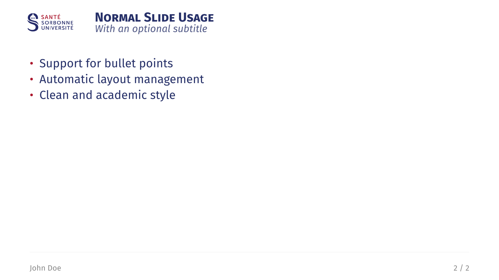
- `#slide-break()`: Manually forces a page break within a slide. *Note: Only works when `allow-slide-breaks: true` is set on the `#slide()`.*
- `#focus-slide(body, subtitle: none)`: Highlight slide on solid theme background.
  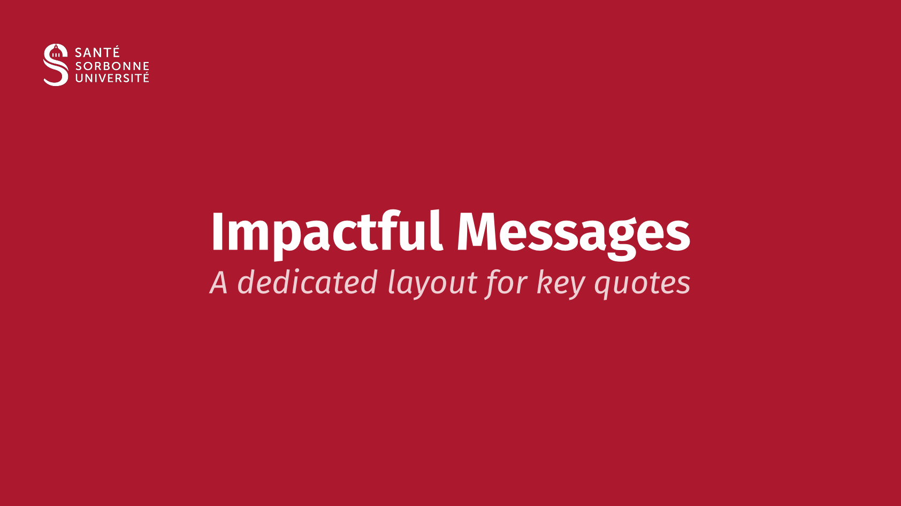
- `#figure-slide(fig, title: none, subtitle: none, caption: none, ..)`: Centered figure slide.
  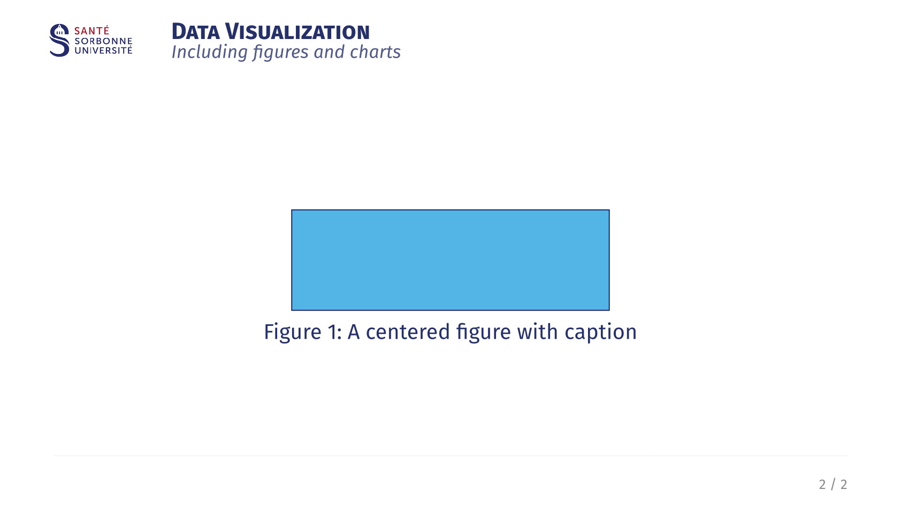
- `#equation-slide(equation, title: none, subtitle: none, definitions: none, citation: none, ..)`: Large equation with "signature" citation.
  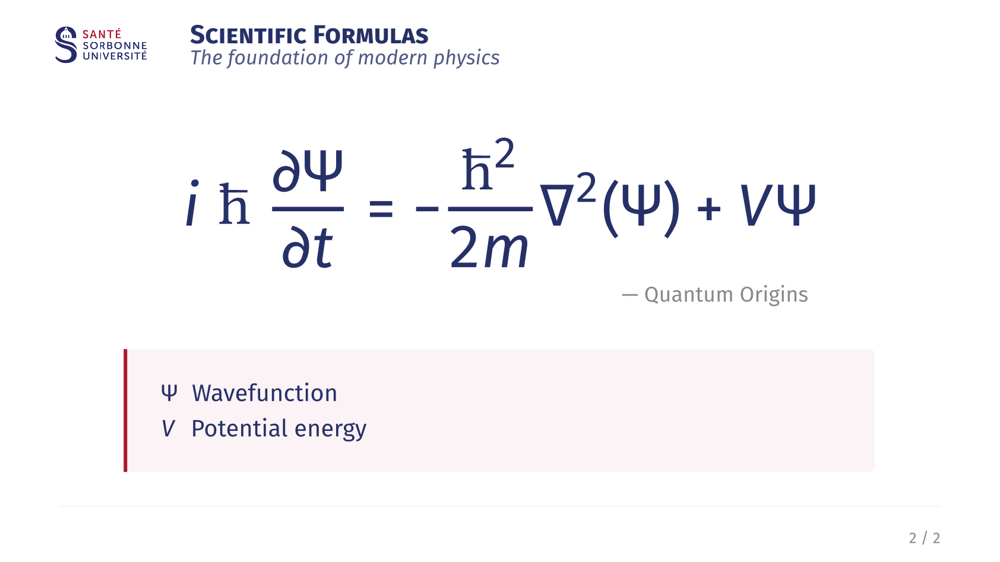
- `#acknowledgement-slide(title: none, subtitle: none, people: (), institutions: (), ..)`: Thank-you slide.
  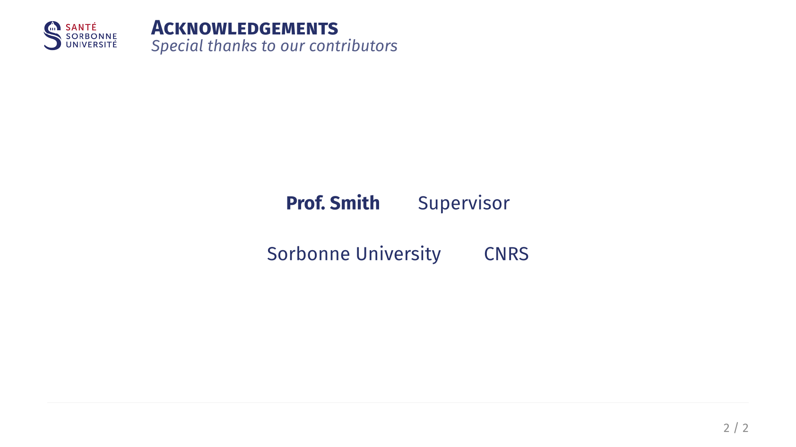
- `#ending-slide(title: none, subtitle: none, contact: ())`: Closing slide with contact information.
  

### Text Helpers
- `#alert[text]`: Highlighted bold text.
- `#muted[text]`: Gray secondary text.
- `#subtle[text]`: Light gray tertiary text.

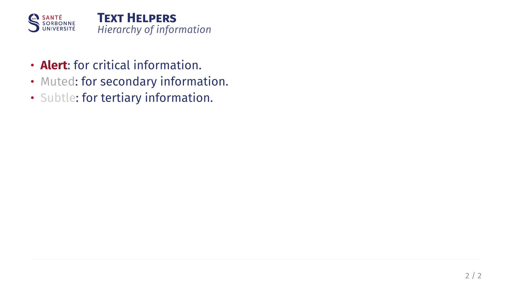

### Citations & References
- Inline and corner citations.
  `#cite-box("smith2023", position: "bottom-right")`
  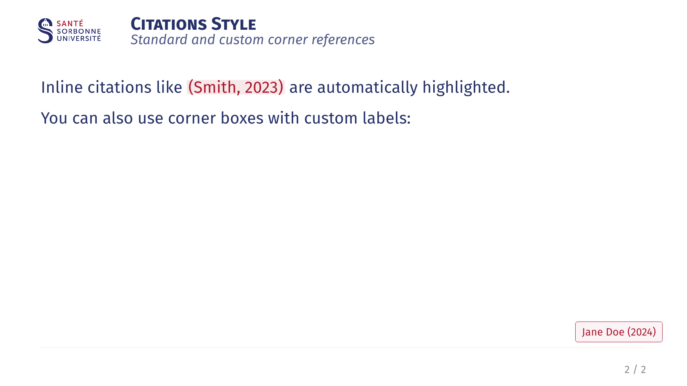

### Layout & Boxes
- `#two-col(left, right, columns: (1fr, 1fr), gutter: 2em)`: Balanced columns.
  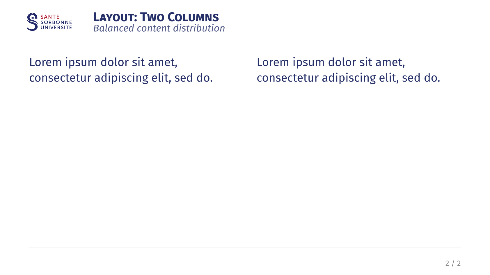
- `#three-col(left, center, right, ..)`: Three column layout.
  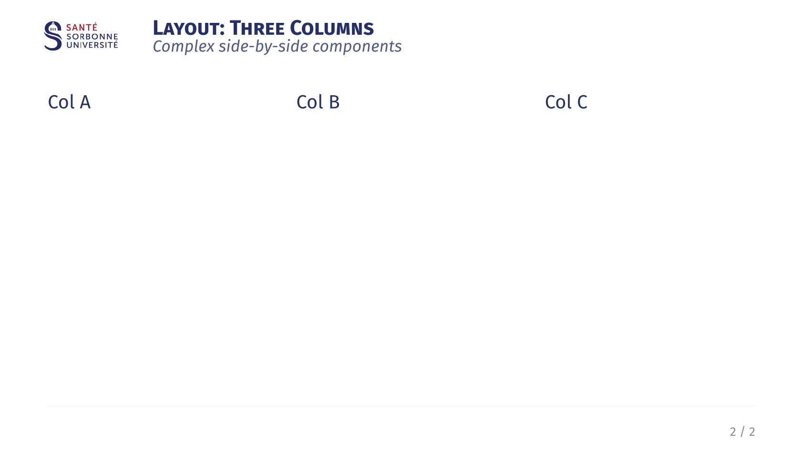
- `#grid-2x2(tl, tr, bl, br, ..)`: Four-quadrant grid layout.
  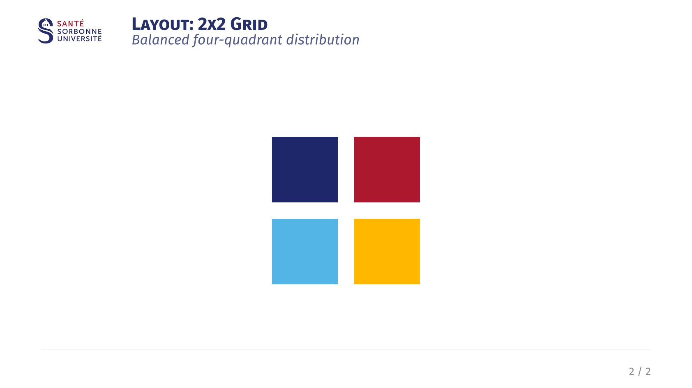
- **Boxes**: All boxes support the `fill-mode` parameter (`"outline"`, `"fill"`, `"full"`, or `"transparent"`).
  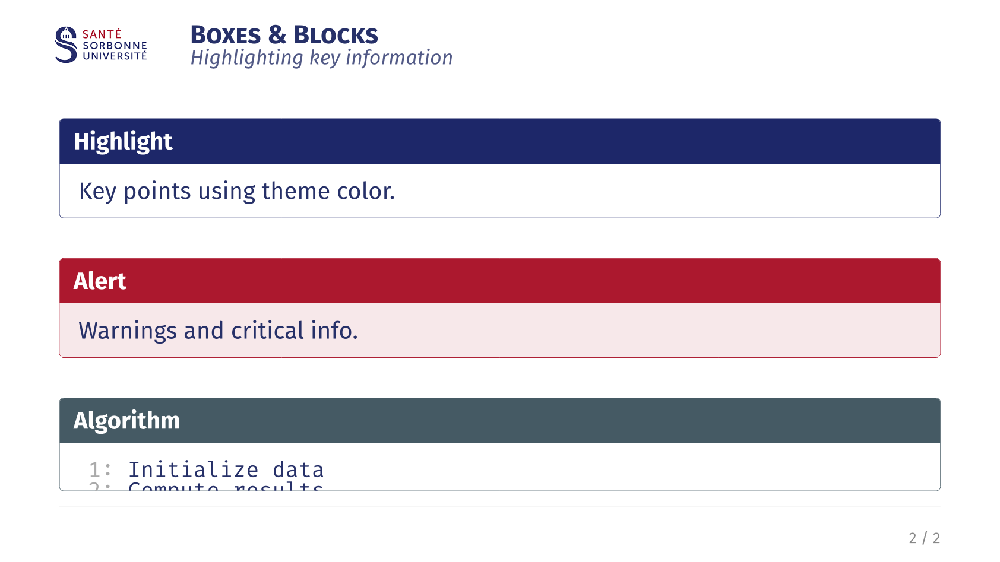
  - `#highlight-box(title, body)`: Blue university-styled box for key points.
  - `#alert-box(title, body)`: Red cautionary box for warnings.
  - `#example-box(title, body)`: Green academic box for examples.
  - `#algorithm-box(title, body)`: Monospace box for algorithmic logic.
  - `#themed-block(title, body)`: Box automatically matching the faculty color.

## Credits

- **Underlying Packages**: Built with [presentate](https://typst.app/universe/package/presentate) and [navigator](https://typst.app/universe/package/navigator).
- **Inspiration**: Layout features and component designs were inspired by the [calmly-touying](https://typst.app/universe/package/calmly-touying) theme. A special thanks to its author for the high-quality design inspiration.

## License

MIT License. See [LICENSE](LICENSE) for details.
