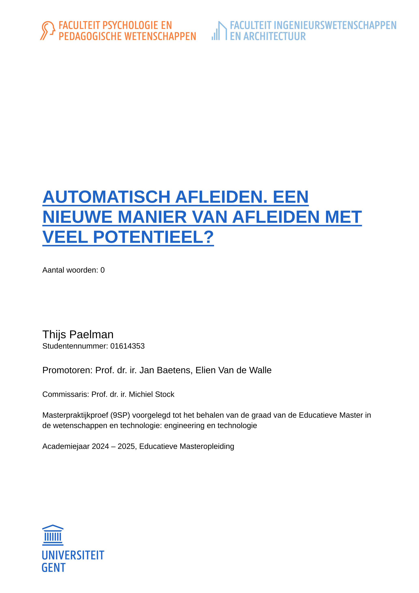
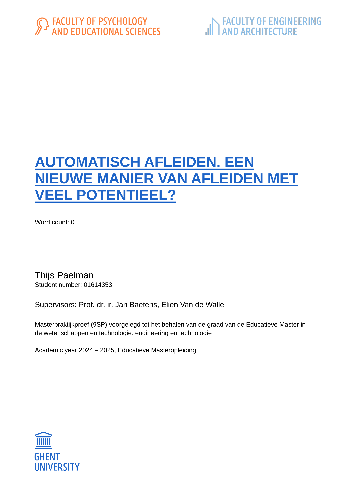

# SOS-UGent-style
> Jouw hulplijn voor de UGent huisstijl in Typst.
> Your hotline for UGent styling in Typst.

An unofficial template to bring the UGent style to Typst.
For students and staff alike.

## Table of Contents
- [Goals](#goals)
- [Features](#features)
- [Demo](#demo)
- [Usage](#usage)
- [Installation](#installation-options)
  - [Fonts](#fonts)
- [License](#license)
- [Community and contributions](#community-and-contributions)
  - [TODO's](#todos)
  - [Used in](#used-in)
  - [Inspired by](#inspired-by)
  - [About the name](#about-the-name)

## Goals
It is often needed to present very similar content in different formats.
This is why this template contains multiple entry points:
- [x] ugent-doc  
      Bare bones document with front page
  - [ ] Front page (all infrastructure is in place, just needs to be
        finalized to correctly show content)
- [x] ugent-dissertation  
  - Integrates some handy utility functions for dissertations.
- [ ] ugent-beamer  
      (not yet started. Contributions are welcome.)
These should all work together, but unneeded formats can be deleted.

## Features:
- Closely resemble the official [UGent MS Word/PowerPoint cover templates](https://styleguide.ugent.be/templates/index.html).
- Localized for:
  - [x] English
  - [x] Dutch/Nederlands
    - [ ] Create Dutch readme
- Take the faculty as option and load corresponding logo & colors.
  - [x] Works with two faculties. For example for the 'Educatieve Master'.
  - [x] The logos are also localized.
- Fonts
  - [x] For students: a good default, free font.
  - [x] For staff: good integration with UGent Panno Text.
  - [x] Easily adjustable according to preferences
- Smart referencing (go beyond the default capabilities of Typst)
  - [x] Reference math equations _with_ parentheses.
  - [x] Correctly reference elements depending on the current language, the requested
        capitalization and the element being referenced
        (e.g. Annex A instead of the default Chapter A).
  - [x] When referencing an unnumbered subheading, textually refer to the closest
        numbered heading, but digitally link to the original target.
- Other options
  - [x] Color internal and external links for clarity.
- [Utility functions](utils/README.md)
  - [x] `todo`: Use margin or inline notes about todo's in different colors.
        With a separate `todo-outline` to keep track of them.
  - [x] `flex-caption`: Long figure captions, short summaries in the outline.
  - [x] Math:
    - [x] `all-math-figures`: easily collect all math figures in one outline.
    - [x] `outline-group-by`: group all math figures by type in this single outline.
  - ...
- Reproducibility  
  Scientific results (including documents) should be as reproducible as
  possible, preferably bit-for-bit.
  - [x] [Guix](https://guix.gnu.org/) integration
        (implemented, but only tested in 1 scenario)
- [ ] Multi-file projects with individually-compilable parts (~ LaTeX' subfiles).
      Not yet feasable, see [design docs](src/design-docs/TODO-subfiles.md).
- No mandatory dependencies. Only integrated optional dependencies.
  See [`utils/`](utils/lib.typ) and [`src/utils/`](src/utils/README.md) for background.
  - [x] Integrated ['glossy'](https://typst.app/universe/package/glossy)
  - [x] Integrated [margin/inline notes](https://typst.app/universe/package/drafting)

## Demo
<table>
  <tr>
    <td></td>
    <td></td>
  </tr>
</table>

## Usage
Create a new copy of the template by executing
`typst init @preview/sos-ugent-style`
or "Start from template" in the web app.
Use `typst compile dissertation.typ` to create the dissertation pdf.
The same goes for `doc.typ` or `beamer.typ`. Remove the files you don't want.

Most options are mentioned under [features](#features) and/or explained in
the template itself. [Let me know](#community-and-contributions) if you have
remarks or ideas to improve this section or the template itself.

## Installation options
* **Use Typst Universe**  
  See [usage](#usage). This uses the latest version uploaded to the Universe,
  not necessarily the latest version.
* To get the latest version or to work on the package itself:
  [download & symlink](https://github.com/typst/packages?tab=readme-ov-file#local-packages)
  to `~/.local/share/typst/packages/preview/sos-ugent-style/0.1.0`.
  As long as [my contributions](https://github.com/swaits/typst-collection/pull/55)
  are not merged into _glossy_ itself and this repo is not yet updated to
  glossy:0.9.0+, you should also download and link
  [my fork](https://github.com/th1j5/typst-glossy/tree/main/glossy).
* **Use GUIX**  
  <TODO: these instructions can be a lot clearer, certainly since we aim to
  provide easy access to this package for users not familiar with guix.
  If you read this and are interested in better guix documentation, open an
  issue or send a mail. An example about how guix is used to enable
  reproducibility is found in [my dissertation](#used-in).>
  See [Specifying Additional Channels](https://guix.gnu.org/manual/en/guix.html#Specifying-Additional-Channels)
  in the Guix manual for instructions how to add it to your installation
  or simply add the following snippet to your channels.scm:
  ```guile
  (channel
    (name 'sos-ugent-style)
    (url "https://codeberg.org/th1j5/typst-sos-ugent-style")
    (branch "main")
    ; To pin to a certain release or commit, use the tag or commit hash here
    ; This enables reproducibility with guix time-machine. Remove this field
    ; to follow the latest commits.
    (commit "v0.1.0"))
  ```
  If you are on a tagged release (like `v0.1.0`), use `typst-sos-ugent-style`
  in your manifest and `@preview/sos-ugent-style:0.1.0` in `.typ` files.
  Besides the hassle-free font installation and free reproducibility
  garanties, the experience should be exactly the same as from Typst Universe.

  If you're following the main branch or are pinned to a non-release commit,
  use `typst-sos-ugent-style-next` in your manifest and
  `@next/sos-ugent-style:0.1.0` in `.typ` files.
  This is to signal to non-guix users that an unreleased version is used.

### Fonts
[Fonts cannot be packaged together with a Typst package/template.
](https://forum.typst.app/t/where-should-template-fonts-be-placed/2094)
The only way for Typst to find fonts are command-line options or environment
variables. For reproducibility, we add fonts using Guix.
If you don't use Guix, you can still find & install the fonts in the
directory 'fonts', or point typst to this location. Read the license remarks.

## License
This software is released under the [GNU GPL v3.0 License](https://www.gnu.org/licenses/gpl-3.0.en.html).
Some bundled assets are copyrighted by their respective owners.
See [fonts](fonts/README.md) and [logos](src/logos/README.md).
The `template` directory is available under the [MIT-0 license](https://opensource.org/license/mit-0),
thus requiring no attribution.

## Community and contributions
This is intended to be useful for UGent students AND staff, but I will most
likely not be maintaining it (I will be an ex-student). If you send me the
location of a maintained fork, I'll gladly advertise it here.
In the meantime, contributions are welcome.
You can checkout `src/design-docs/` to learn about some design decisions.

Contact: open an issue on codeberg or send a mail to
thijs.paelman+ugenttypst at hotmail.be (yes, I know, I should really switch
away from our evil overlords service 😓).

### TODO's
- [ ] Template
  - [ ] Show how to use a yaml file for abbreviations
  - [ ] How to set ugent font (not the default since this package is also used by students)
  - [ ] Maybe provide content about the perfect integration with Zotero?
- [ ] Replace bookman font by a free alternative
- [ ] Support both UGent Panno Text and our default font for headings.
      (the optimal font sizes differ between them - see code comments)
- [ ] Rewrite goals & features in this readme to be clearer.
- [ ] GUIX
  - [ ] Test and document GUIX more.
  - [ ] Contribute to guix-science
- [ ] Remove the need for `flex-caption`:
      Add a show rule which parses array or dict captions as a flex-caption,
      without needing to import & specify the `flex-caption` function.
      (not yet possible - cannot provide array/dict to a figure.caption, see
      also https://github.com/typst/typst/issues/1295)

### Used in:
Are you using this template? Drop me a line! And tell your colleagues and
friends :). This list can serve as an inspiration. Remember to distribute
your version of `sos-ugent-style` _if_ you adapted it to your needs (GPLv3
license), or even better: create a pull request to contribute your
enhancements!
- [Educatieve Masterpraktijkproef "Automatisch afleiden. Een nieuwe manier van
  afleiden met veel potentieel?" -- Nederlands -- CC BY-NC-SA 4.0](https://codeberg.org/th1j5/masterpraktijkproef-eduma)
  - Appendix B is about `sos-ugent-style` and Typst.
  - Creates a complete 50 page appendix directly from a Jupyter Notebook.
    Includes some (interesting) hacks to accomplish this.
  - Renders graphs created almost directly by Python.
  - Uses Guix for reproducibility.
  - Embeds a lot of source data in the pdf, to distribute the ground truth.
  - Tried to do 'subfiles', did not yet succeed.
  - Counts words with `wordometer`.
  - Tries to use `typst-languagetool` to check grammar when using offline.

### Inspired by
- https://github.com/Dherse/masterproef/ (typst - Sébastien d'Herbais de Thun)
  MIT licensed here: https://github.com/Dherse/masterproef/tree/6d0cbab9afc8c53e4bd2518794cd13ca8063b4a2
- [ugent-beamer](https://github.com/driesbenoit/ugent-beamer) (LaTeX - Dries Benoit)
- [ugent-doc](https://github.com/driesbenoit/ugent-doc) (LaTeX - Dries Benoit)
- [masterproef-template](https://github.com/merlijn-sebrechts/masterproef-template) (LaTeX - Merlijn Sebrechts)
- [ugent-thesis-latex-template](https://github.ugent.be/aavdiere/ugent-thesis-latex-template)
- UGent [style guide](https://styleguide.ugent.be/) and faculty guidelines
  (mostly engineering & architecture and 'Educatieve master')
- My own dissertations:
  - [Educatieve Masterpraktijkproef "Automatisch afleiden. Een nieuwe manier
    van afleiden met veel potentieel?" -- Nederlands -- CC BY-NC-SA 4.0](
    https://codeberg.org/th1j5/masterpraktijkproef-eduma)
  - [Master's dissertation "Rerouting in-flight data packets on address
    changes" -- English -- CC BY-NC-SA 4.0](TODO: publish online)

### About the name
The original working title of the project was `ugent-style`, but the naming
guidelines of Typst Universe required something more fun 😁. Thanks Noor for
the excellent suggestion! Thank you everyone who responded on my little
opinion poll.
