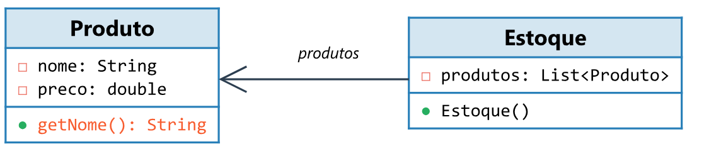
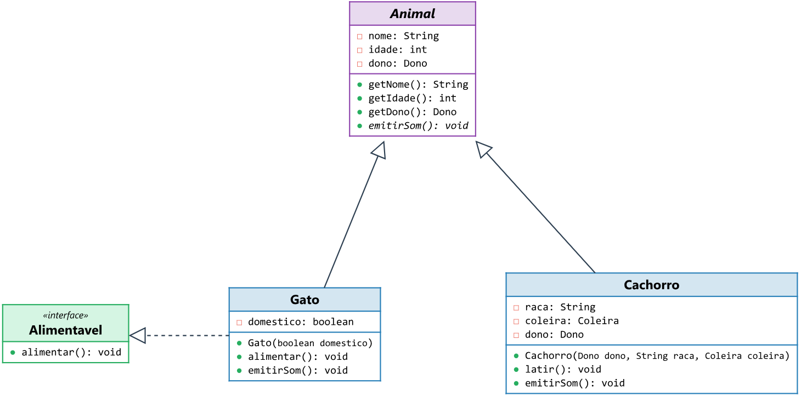
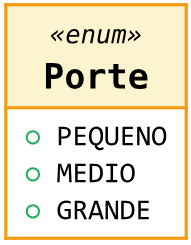

# source-to-class-diagram

Geração de Diagramas de Classe UML a partir de código-fonte Java ou C# diretamente no Typst, construído sobre o engine CeTZ.

## Visão Geral

**source-to-class-diagram** é um pacote Typst que gera diagramas de classe UML de forma automática. O pacote:

- **Infere relacionamentos** (herança, implementação, associação, agregação, composição) a partir da leitura do código-fonte real.
- **Renderiza** a caixa de classe com atributos, métodos e estereótipos (`«interface»`, `«enum»`, `«abstract»`).
- **Posiciona** as classes em um layout automático com suporte a posicionamento manual via anotação `@Layout`.
- **Escala** o diagrama para caber na largura disponível e, opcionalmente, em uma altura máxima definida.

## Instalação

Adicione o pacote ao seu projeto Typst:

```typst
#import "@preview/source-to-class-diagram:0.1.0": setup-classuml, class-diagram
```

## Formas de Uso

### 1. Via code fences (show-rule)

Ative o interceptador de code fences com `setup-classuml`:

```typst
#import "@preview/source-to-class-diagram:0.1.0": setup-classuml
#show: setup-classuml
```

Em seguida, use blocos de código com a linguagem correspondente:

````typst
```class-diagram-java
class Produto {
  private String nome;
  private double preco;
  public String getNome() {}
}
```
````

### 2. Via função `class-diagram`

Use a função diretamente para controlar parâmetros por diagrama:

```typst
#import "@preview/source-to-class-diagram:0.1.0": class-diagram

#class-diagram(
  "class Foo { private Bar bar; }",
  grammar: "java",
  max-height: 8cm
)
```

#### Exemplo Renderizado



## Importando Arquivos de Código-Fonte

Você pode ler arquivos `.java` ou `.cs` diretamente com a função `read()` do Typst, mantendo o diagrama sincronizado com seu código real.

```typst
#import "@preview/source-to-class-diagram:0.1.0": class-diagram

#let src = (
  read("src/model/Animal.java"),
  read("src/model/Cachorro.java"),
  read("src/model/Gato.java"),
  read("src/model/Alimentavel.java"),
).join("\n\n")

#class-diagram(src, grammar: "java")
```

#### Exemplo com Import Simplificado


### Injetando Layout

Você pode intercalar anotações `@Layout` sem modificar os arquivos fonte:

```typst
#let src = (
  "@Layout(level=0, order=0)",
  read("src/model/Animal.java"),
  "@Layout(level=1, order=0)",
  read("src/model/Cachorro.java"),
  "@Layout(level=1, order=1)",
  read("src/model/Gato.java"),
).join("\n\n")

#class-diagram(src, grammar: "java", max-height: 15cm)
```



## Controle de Tamanho

- **Ajuste à largura (`fit`)**: Por padrão (`true`), o diagrama escala para caber na página.
- **Altura máxima (`max-height`)**: Limita a altura do diagrama para evitar quebras de página.

```typst
#class-diagram(src, grammar: "java", max-height: 12cm)
```

## Posicionamento com `@Layout`

Use para forçar a organização das classes no diagrama:

| Propriedade | Significado                       |
| ----------- | --------------------------------- |
| `level`     | Linha vertical (0 = topo)         |
| `order`     | Posição horizontal (0 = esquerda) |

**Java:**

```java
@Layout(level=0, order=0)
class Animal { ... }
```

**C#:**

```csharp
[Layout(Level = 0, Order = 0)]
public class Animal { ... }
```

## Inferência de Relacionamentos

O pacote analisa o código e detecta:

- **Herança/Implementação**: `extends`, `implements`, `:`.
- **Associação**: Campos de tipos não-primitivos.
- **Composição**: Detectada pelo uso de `new Foo()` dentro da classe.
- **Agregação**: Detectada quando o tipo é recebido no construtor.
- **Dependência**: Detectada por `throw new Exception()`.

## Enums

Os valores de Enums são listados automaticamente:


## Criando Novas Gramáticas

O sistema é pluggável. Para adicionar uma nova linguagem:

1. Crie o arquivo em `src/grammars/`.
2. Implemente a função `parse(source) -> IR`.
3. Registre no `mod.typ`.

Consulte o [Manual Completo](docs/manual.typ) para mais detalhes técnicos.
