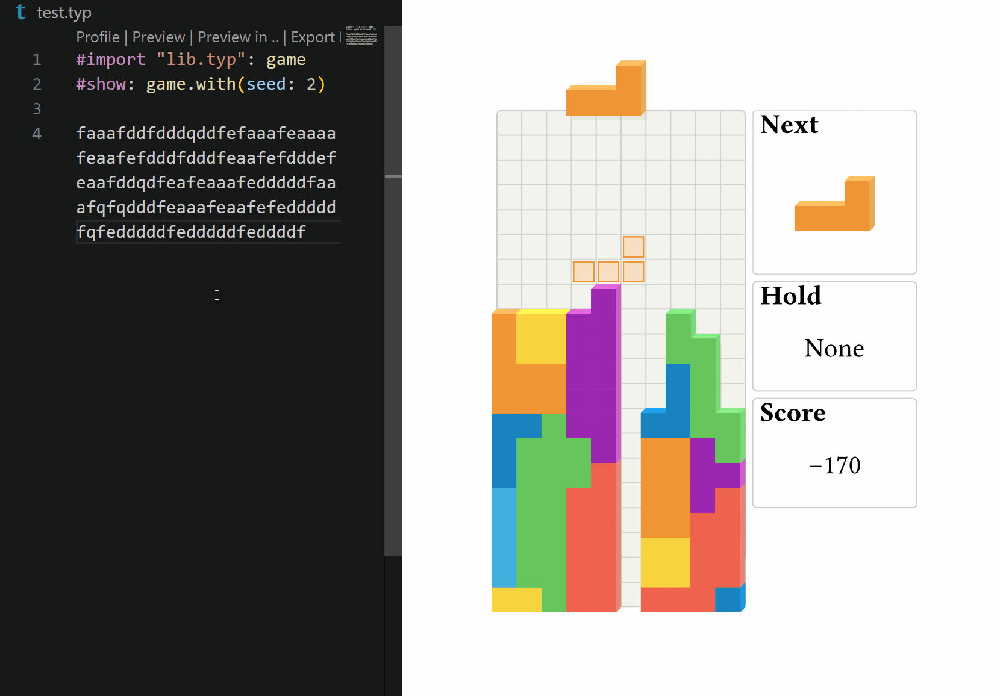

# soviet-matrix

This is a classic Tetris game implemented using Typst. The goal is to manipulate falling blocks to create and clear horizontal lines without letting the blocks stack up to the top of the playing field.



## How to Play

You can play the game in two ways:

1. **Online:**
   - Visit [https://typst.app/app?template=soviet-matrix&version=0.2.0](https://typst.app/app?template=soviet-matrix&version=0.2.0).
   - Enter any title of your choice and click **Create**.

2. **Locally:**
   - Open your command line interface.
   - Run the following command:
     ```bash
     typst init @preview/soviet-matrix
     ```
   - Typst will create a new directory.
   - Open `main.typ` in the created directory.
   - Use the [Typst Preview VS Code extension](https://marketplace.visualstudio.com/items?itemName=mgt19937.typst-preview) for live preview and gameplay.

Enjoy the game!


## Controls

- Move Left: a
- Move Right: d
- Soft Drop: s
- Hard Drop: f
- Rotate Left: q
- Rotate Right: e
- 180-degree Rotate: w
- Hold Piece: c

## Changing the Game Seed

If you want to play different game scenarios, you can change the game seed using the following method:

```typst
#import "@preview/soviet-matrix:0.1.0": game
#show: game.with(seed: 123) // Change the game seed
```

Replace `123` with any number of your choice.

## Changing Key Bindings

Modify the `actions` parameter in the `game.with` method to change the key bindings. The default key bindings are as follows:


```typst
#show: game.with(seed: 0, actions: (
  left: ("a", ),
  right: ("d", ),
  down: ("s", ),
  left-rotate: ("q", ),
  right-rotate: ("e", ),
  half-turn: ("w", ),
  fast-drop: ("f", ),
  hold-mino: ("c", ),
))
```

