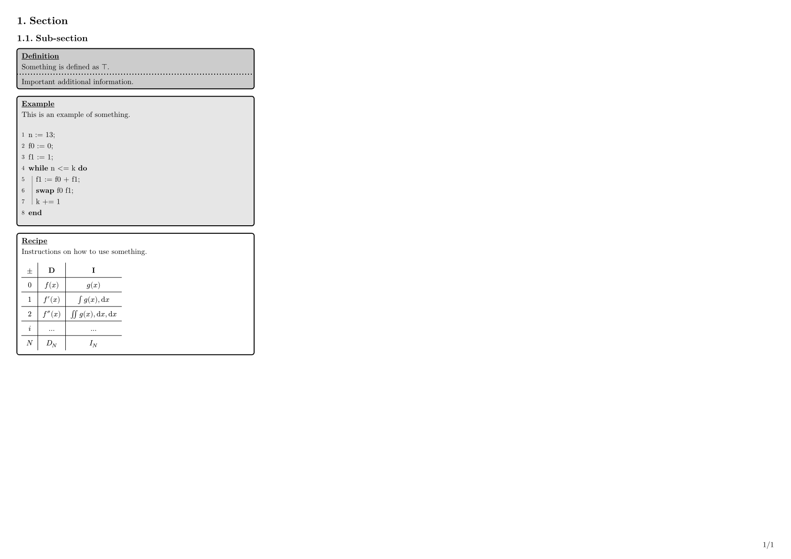

<picture>
  
</picture>

# The `spicky` Package Cheatsheet Template

Package with definitions and quality of life imports for simple cheatsheet template.

## Getting Started

Usage is pretty simple. Instantiate the package with your information. Use the predefined container functions `definition`, `example`, and `recipe` to build up your cheatsheet. The `grid` function allows for sleek tables.

```typ
#import "@preview/spicky:0.1.0": *

#show: conf.with(
  title: "My Cheatsheet",
  authors: ("Author Name",),
  description: "A cheatsheet built with the spicky package.",
)

= Section

== Sub-section

#definition[=== Definition][
  Something is defined as $top$.
][
  Important additional information.
]

#example[=== Example][
  This is an example of something.

  #pseudo[
    + n := 13;
    + f0 := 0;
    + f1 := 1;
    + *while* n <= k *do*
      + f1 := f0 + f1;
      + *swap* f0 f1;
      + k += 1
    + *end*
  ]
]

#recipe[=== Recipe][
  Instructions on how to use something.

  #grid[
    | $plus.minus$ | *D* | *I* |
    | --- | --- | --- |
    | $0$ | $f(x)$ | $g(x)$ |
    | $1$ | $f'(x)$ | $integral g(x) , dif x$ |
    | $2$ | $f''(x)$ | $integral.double g(x) , dif x , dif x$ |
    | $i$ | $dots$ | $dots$ |
    | $N$ | $D_N$ | $I_N$ |
  ]
]
```

<picture>
  
</picture>

## Additional Documentation and Acknowledgments

Huge thanks to all used packages. Especially showybox and tablem.
