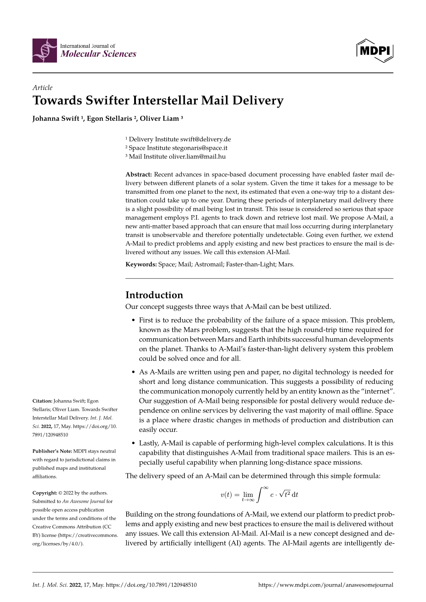
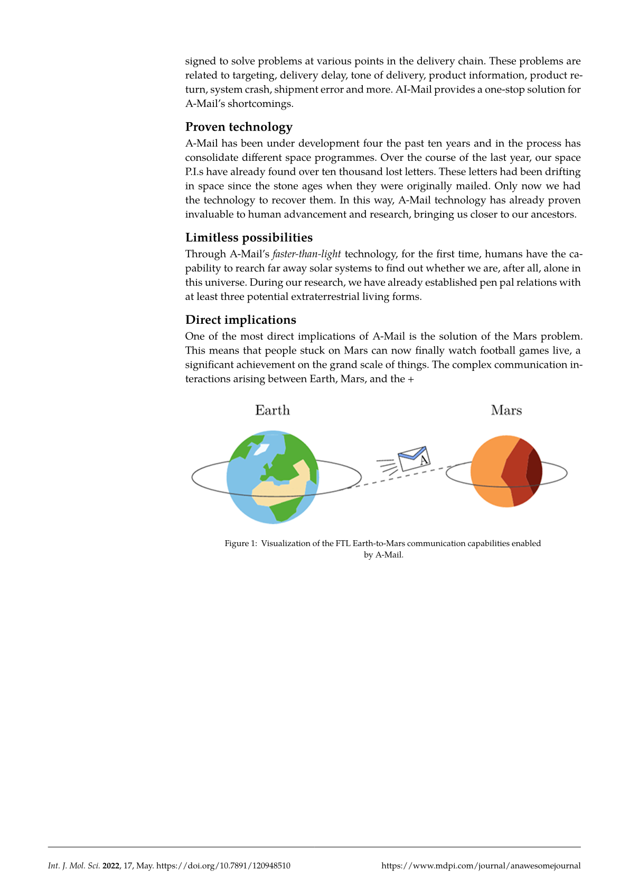

# The `splendid-mdpi` Package
<div align="center">Version 0.1.0</div>

A recreation of the MDPI template shown on the typst.app homepage.

## Media

<p align="center">
  
&nbsp; &nbsp; &nbsp; &nbsp;
  
</p>

## Getting Started

To use this template, simply import it as shown below:

```typ
#import "@preview/splendid-mdpi:0.1.0"

#show: splendid-mdpi.template.with(
  title: [Towards Swifter Interstellar Mail Delivery],
  authors: (
    (
      name: "Johanna Swift",
      department: "Primary Logistics Department",
      institution: "Delivery Institute",
      city: "Berlin",
      country: "Germany",
      mail: "swift@delivery.de",
    ),
    (
      name: "Egon Stellaris",
      department: "Communications Group",
      institution: "Space Institute",
      city: "Florence",
      country: "Italy",
      mail: "stegonaris@space.it",
    ),
    (
      name: "Oliver Liam",
      department: "Missing Letters Task Force",
      institution: "Mail Institute",
      city: "Budapest",
      country: "Hungary",
      mail: "oliver.liam@mail.hu",
    ),
  ),
  date: (
    year: 2022,
    month: "May",
    day: 17,
  ),
  keywords: (
    "Space",
    "Mail",
    "Astromail",
    "Faster-than-Light",
    "Mars",
  ),
  doi: "10:7891/120948510",
  abstract: [
    Recent advances in space-based document processing have enabled faster mail delivery between different planets of a solar system. Given the time it takes for a message to be transmitted from one planet to the next, its estimated that even a one-way trip to a distant destination could take up to one year. During these periods of interplanetary mail delivery there is a slight possibility of mail being lost in transit. This issue is considered so serious that space management employs P.I. agents to track down and retrieve lost mail. We propose A-Mail, a new anti-matter based approach that can ensure that mail loss occurring during interplanetary transit is unobservable and therefore potentially undetectable. Going even further, we extend A-Mail to predict problems and apply existing and new best practices to ensure the mail is delivered without any issues. We call this extension AI-Mail.
  ]
)
```
