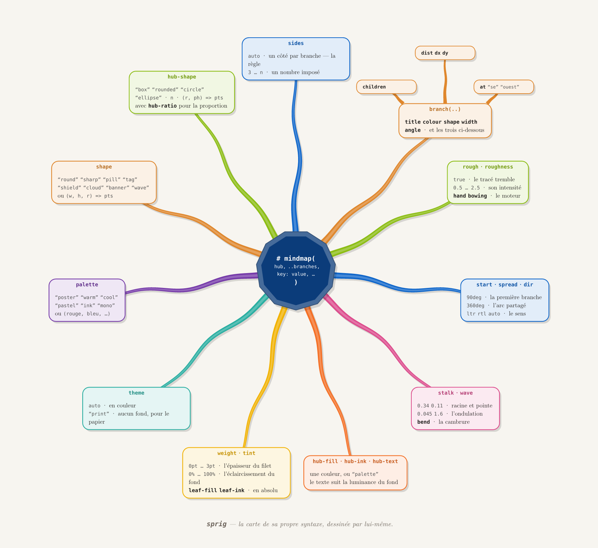

# sprig

Mind maps for Typst. A hub, branches growing out of it, a card at the end of
each one.



The hub is a polygon with **exactly as many sides as there are branches**,
and each branch leaves from the **midpoint of its own side** — so the stalk
meets a flat edge square-on instead of sprouting from a corner. That is the
default; a rectangle with twelve branches is one keyword away.

No dependencies, no plugin binary: everything is drawn with Typst's own
`curve`.

```typ
#import "@preview/sprig:0.1.0": *

#mindmap([*Le verbe*],
  branch(title: [Groupe])[1ᵉʳ, 2ᵉ, 3ᵉ.],
  branch(title: [Temps])[Simples, composés.],
  branch(title: [Mode])[Indicatif, subjonctif.],
  branch(title: [Voix])[Active, passive.],
)
```

## What you can change

| | |
|---|---|
| **hub** | `sides`, `hub-shape` (`"box"`, `"rounded"`, `"circle"`, `"ellipse"`, a number, or your own function), `hub-ratio`, `hub-fill` / `hub-ink` / `hub-text` |
| **leaves** | `shape` — fifteen built in, or a function — `palette` (six sets or an array), `weight`, `tint`, `leaf-fill`, `leaf-ink`, `icon` |
| **branches** | `stalk`, `stalk-tip`, `wave`, `waves`, `bend`, `start`, `spread` |
| **placement** | `dist`, `dx`, `dy`, `at` (compass points), `angle` |
| **sub-leaves** | `children` (nest them again for a third rank), `children-at`, `spread`, `child-dist`, `child-width` |
| **cross-links** | `links: (link(0, 2, label: [implies]), ..)` — a dashed curve with an arrow, over the cards |
| **modes** | `dir` (`ltr` / `rtl` / auto), `theme: "print"`, `rough` / `roughness` |

`mindgrid` lays the cards on a grid you choose instead of a ring, and runs
the branches behind whatever is in the way — or round it, with
`route: true`.

## The illustrated guide

[The illustrated manual](gallery/guide.pdf) shows every option with the code beside it, after the
manner of *visual-tikz*. `gallery/cover.typ` draws the package's own syntax
as a mind map — the obvious thing to make with a mind-map package, and a
fair test of it.

## Beyond the tree

A mind map is a tree; the ideas in it rarely are.

```typ
#mindmap([Cycle],
  links: (link(0, 1, label: [forme]), link(3, 0, via: "inside")),
  branch(title: [Évaporation], icon: [▲], children: (
    branch(title: [soleil], children: (branch[énergie],)),
  ))[..],
  )
```

`link` draws the association without breaking the hierarchy — dashed, over
the cards, so it reads as an annotation rather than as part of the skeleton.
`children` nests as deep as you like: three ranks are laid out, each fanning
around its own parent on the bearing that parent has from *its* parent, so
the tree always opens outward.

## Sizing

`leaf-width` is a **maximum**, not a fixed width: each card is measured
against its own text and shrinks to fit, floored at `min-width`. That is
what stops a one-word leaf from being handed the full width and breaking
`Évaporation` across two lines. The hub is sized from its title the same way — and it is inscribed in an
**ellipse** rather than a circle, because a line of text is almost always
wider than it is tall while a circle grows in both directions at once.
`hub-round: true` restores the circular hub. The ring is pushed out to clear
whatever size the hub turned out to be.

Not every shape fills its box. A speech balloon spends its bottom sixth on
the tail, a shield's flanks start a fifth of the way up, `torn` chews its
foot into teeth, `banner` bites a dovetail out of each end. Each shape
therefore declares the margin its ornament eats, and the card both grows by
it and insets its text — otherwise a line hangs out through the balloon's
tail, which is exactly what the Arabic example used to do.

`mindgrid` keeps fixed cell **widths** on purpose — in a grid, lining up is
the point — so an ornamented card there insets its text rather than growing
sideways; its height still follows its contents.

## Notes

* **Colours are removed, not desaturated, in `print`.** A grey wash still
  costs toner and still greys the text, so the branches are told apart by
  their outlines. The stalk is thinned too: a black area weighs far more
  than a coloured one of the same size.
* **Under `rtl` the branches run anticlockwise**, so the reading order goes
  right-to-left round the map. Compass names work in English, abbreviated,
  and in French.
* **`hub-text` follows the fill's luminance** rather than being white come
  what may — white on a pale hub is invisible.

## What is in the box

* [The illustrated manual](gallery/guide.pdf) — every option, shown, with
  complete code beside it
* [The cover](gallery/cover.pdf) — the map of sprig's own syntax

Three complete, real maps rather than option demos, each reproduced in the
guide with the source that made it:

* [`examples/typst.typ`](examples/typst.pdf) — Typst itself, documentation
  style: rounded hub, `note` leaves, almost-straight stalks
* [`examples/relatifs-ar.typ`](examples/relatifs-ar.pdf) — signed-number
  arithmetic in Arabic, classroom-poster style, right-to-left
* [`examples/grammar-en.typ`](examples/grammar-en.pdf) — English parts of
  speech, sketchbook style: `rough`, `ink`, `torn` leaves

And the smaller demonstrations:

* [`basic`](examples/basic.pdf) · [`subleaves`](examples/subleaves.pdf) ·
  [`rich`](examples/rich.pdf) · [`print`](examples/print.pdf) ·
  [`arabic`](examples/arabic.pdf)

These files are committed but excluded from the downloaded bundle, which is
96 kB: the four files the package actually needs.

The last three are complete, real maps rather than option demos; the guide
reproduces all three with the source that made them.

## Licence

MIT. 

FERGOUS Abdelhak
