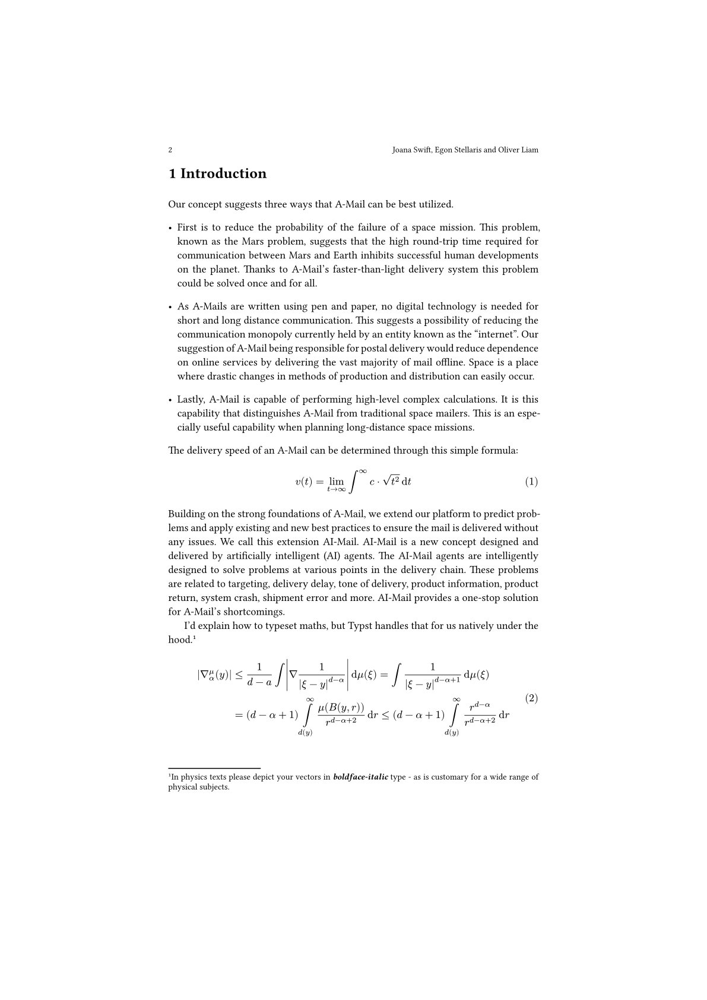
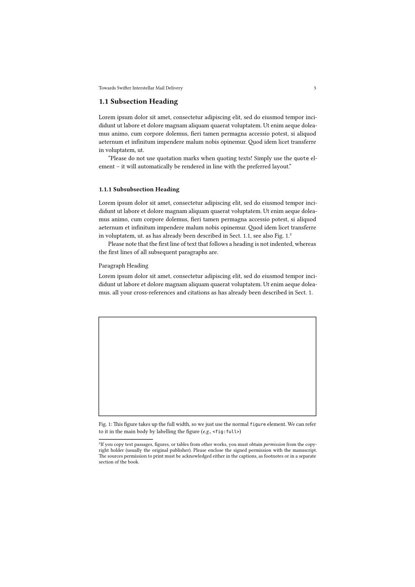

# The `springer-spaniel` Package
<div align="center">Version 0.1.0</div>

This is an loose recreation of the _Springer Contributed Chapter_ LaTeX template on Overleaf. It aims to provide template-level support for commonly used packages so you don't have to choose between style and features. 

## Media

<p align="center">
  
  
  
</p>


## Getting Started

These instructions will get you a copy of the project up and running on the typst web app. Perhaps a short code example on importing the package and a very simple teaser usage.

```typ
#import "@preview/springer-spaniel:0.1.0"
#import springer-spaniel.ctheorems: * // provides "proof", "theorem", "lemma"

#show: springer-spaniel.template(
  title: [Contribution Title],
  authors: (
    (
      name: "Name of First Author",
      institute: "Name",
      address: "Address of Institute",
      email: "name@email.address"
    ),
    // ... and so on
  ),
  abstract: lorem(75),

  // debug: true, // Highlights structural elements and links
  // frame: 1pt, // A border around the page for white on white display
  // printer-test: true, // Suitably placed CMYK printer tests
)

= Section Heading
== Subsection Heading
=== Subsubsection Heading
==== Paragraph Heading
===== Subparagraph Heading
```

### Local Installation

To install this project locally, follow the steps below;
+ Install Just
+ Clone repository
+ In a bash compatible shell, `just install-preview`
