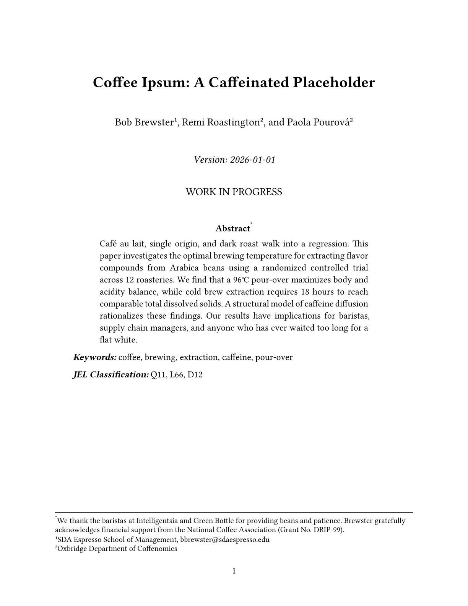

# ssrn-manuscript

[](https://typst.app/universe/package/ssrn-manuscript)


A Typst template for working papers in the social sciences, especially economics, finance, and accounting.

Main features:
- Clean, visual style
- Many options to customize (and open to suggestions)
- Endfloat mode for conference submissions
- Anonymized title page for blind review
- No external dependencies

**Example**: 


## Quick start

```typst
typst init @preview/ssrn-manuscript
typst compile main.typ
```

Or copy directly into an existing document:

```typst
#import "@preview/ssrn-manuscript:0.1.0": *

#show: paper.with(
  title: "Your Paper Title",
  authors: (
    (name: "Author One", affiliation: "University A", email: "one@a.edu"),
    (name: "Author Two", affiliation: "University B"),
    (name: "Author Three", affiliation: "University A"),
  ),
  date: "2026-01-01", // the only correct date format
  abstract: [Your abstract here.],
  keywords: [keyword one, keyword two, keyword three],
  jel: [G14, G38],
  acknowledgments: [We thank ...],
  bibliography: bibliography("refs.bib", title: "References"), 
)

= Introduction
Your text here.
```

## Features

- Superscript author affiliations, deduplicated automatically
- Table captions on top, figure captions on bottom
- Endfloat mode for journal submissions (figures and tables at the end, placeholders inline)
- Anonymized mode for blind review
- Draft watermark ("DO NOT CITE")
- Black hyperlinks for unintrusive print
- Chicago author-date citations by default (override in your `bibliography()` call)

## Parameters

| Parameter | Default | Description |
|---|---|---|
| `title` | `none` | Paper title |
| `authors` | `()` | Array of author dicts (`name`, `affiliation`, `email`, `note`) |
| `date` | `none` | Version date (string) |
| `abstract` | `none` | Abstract content |
| `keywords` | `none` | Keywords content |
| `jel` | `none` | JEL classification codes |
| `acknowledgments` | `none` | Footnote on the Abstract heading |
| `bibliography` | `none` | Bibliography specification |
| `anonymize` | `false` | Suppress authors, affiliations, date, and acknowledgments |
| `draft` | `false` | "DO NOT CITE" watermark |
| `endfloat` | `false` | Move figures and tables to end, leave placeholders inline |
| `line-spacing` | `"double"` | `"double"`, `"onehalf"`, or `"single"` |

<details>
<summary>Fine-tuning (click to expand)</summary>

| Parameter | Default | Description |
|---|---|---|
| `font` | `("Linux Libertine", "Times New Roman", "New Computer Modern")` | Serif font fallback chain |
| `fontsize` | `12pt` | Body text size |
| `subtitle` | `none` | Subtitle (e.g., "WORK IN PROGRESS") |
| `margin` | `1in` | Page margins |
| `paper` | `"us-letter"` | `"us-letter"` or `"a4"` |
| `first-line-indent` | `1.5em` | Paragraph indent |
| `par-spacing` | `auto` | Paragraph spacing (default matches line spacing) |
| `title-size` | `20pt` | Title font size |
| `subtitle-size` | `14pt` | Subtitle font size |
| `author-name-size` | `14pt` | Author name and date font size |
| `cover-text-width` | `90%` | Width of abstract/keywords/JEL block |
| `frontmatter-gap` | `12pt` | Vertical gap between cover page sections |

</details>

## All options

The template file shows every parameter with its default value:

```typst
#import "@preview/ssrn-manuscript:0.1.0": *

#show: paper.with(
  // -- metadata -----------------------------------------------------------
  title: "Your Paper Title",
  subtitle: none,                   // e.g., "WORK IN PROGRESS"
  authors: (
    (
      name: "Author One",
      affiliation: "University A",
      email: "one@a.edu",
      note: "ORCID: 0000-0001-2345-6789",
    ),
    (
      name: "Author Two",
      affiliation: "University B",
    ),
  ),
  date: "2026-01-01",              // date string shown on title page
  abstract: [Your abstract here.],
  keywords: [keyword one, keyword two],
  jel: [G14, G38],                 // optional JEL classification codes
  acknowledgments: [We thank ...], // footnote on the Abstract heading

  // -- bibliography -------------------------------------------------------
  bibliography: bibliography("refs.bib", title: "References"),
  citation-style: "chicago-author-date", // any CSL style name

  // -- typography ---------------------------------------------------------
  font: ("Linux Libertine", "Times New Roman", "New Computer Modern"),
  fontsize: 12pt,                   // body text size

  // -- layout -------------------------------------------------------------
  margin: 1in,                      // page margins (default: 1in)
  paper: "us-letter",               // "us-letter" or "a4"
  anonymize: false,                 // suppress authors, affiliations, date, acknowledgments
  draft: false,                     // "DO NOT CITE" watermark
  endfloat: false,                  // move figures/tables to end, leave placeholders inline

  // -- spacing ------------------------------------------------------------
  line-spacing: "double",           // "double", "onehalf", or "single"
  par-spacing: auto,                // paragraph spacing (auto = matches line spacing)
  first-line-indent: 1.5em,        // paragraph indent

  // -- title-page styling -------------------------------------------------
  title-size: 20pt,                 // title font size
  subtitle-size: 14pt,             // subtitle font size
  author-name-size: 14pt,          // author name font size
  cover-text-width: 90%,           // width of abstract/keywords/JEL block
  frontmatter-gap: 12pt,           // vertical gap between cover page sections
)

= Introduction
Your text here.
```

## Gallery

### Anonymized mode


### Endfloat mode


## License

MIT
