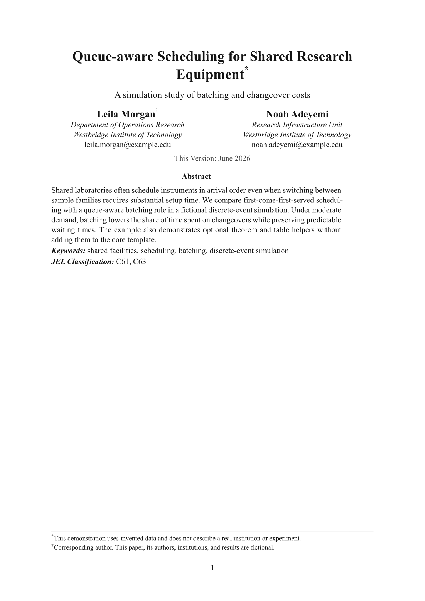
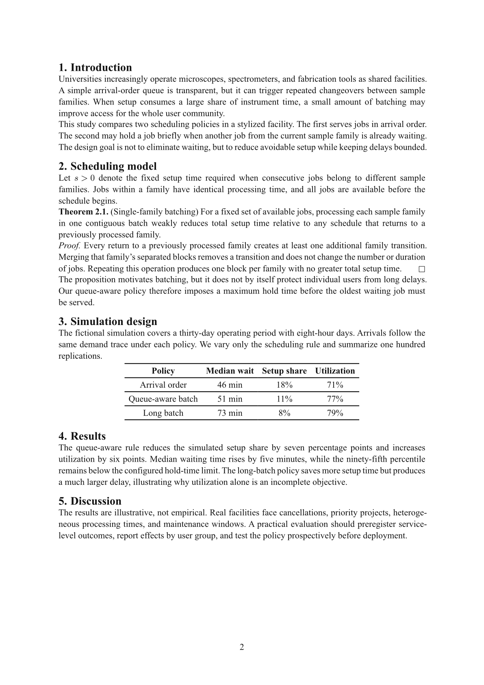
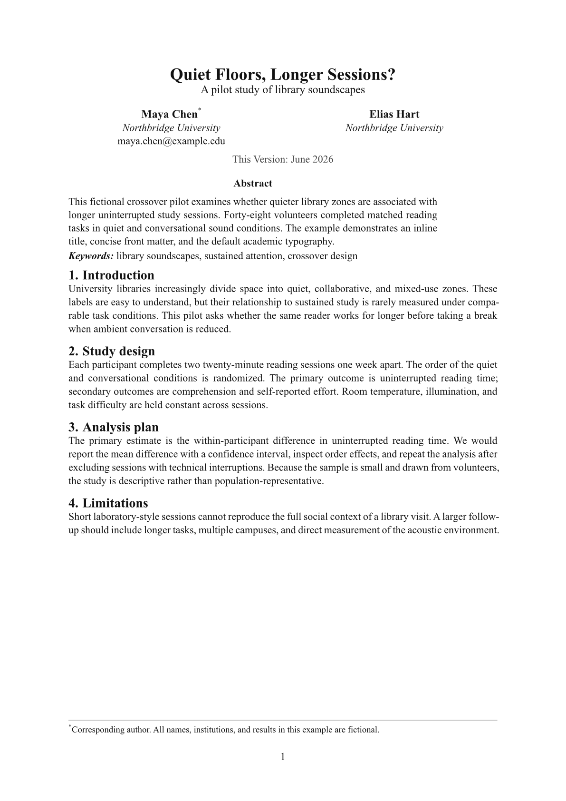

# SSRN Scribe

SSRN Scribe is a dependency-light Typst template for working papers, preprints,
and general academic manuscripts. Its defaults follow the conventional SSRN
working-paper pattern: a separate title page, centered author metadata, an
abstract and keywords block, Times-style typography, numbered serif headings,
grayscale output, and one-inch margins.

All authors, institutions, studies, data, and results in the repository examples
are fictional.

## Preview

### Separate title page

[](screenshots/paper-title.png)

### Manuscript body

[](screenshots/paper-body.png)

### Compact inline-title variant

[](screenshots/paper-brief.png)

## Choose a title mode

| Use case | Setting | Result |
| --- | --- | --- |
| Working paper, preprint, or review manuscript | `maketitle: true` | Separate title page followed by the numbered manuscript body |
| Short paper, note, handout, or internal draft | `maketitle: false` | Compact title block at the top of page 1 |

The title mode changes only the front matter. Body typography and heading
numbering remain consistent.

## Quick start

Create a project from Typst Universe:

```bash
typst init @preview/ssrn-scribe:0.10.0
cd ssrn-scribe
typst compile main.typ
```

The generated project contains:

```text
ssrn-scribe/
├── main.typ   # minimal paper starter
└── extra.typ  # optional theorem, table, and diagram helpers
```

The core `paper` template has no helper-package dependency. `extra.typ` is only
loaded when you import it explicitly.

During editing, rebuild automatically with:

```bash
typst watch main.typ
```

### First edit checklist

1. Replace the placeholder title, author fields, abstract, and keywords in
   `main.typ`.
2. Choose separate or inline title mode with `layout.maketitle`.
3. Write the manuscript with ordinary Typst headings.
4. Add a bibliography only when citations are present.
5. Compile and inspect the title page, first body page, heading hierarchy,
   equations, tables, and references.

## Minimal example

```typst
#import "@preview/ssrn-scribe:0.10.0": paper

#show: paper.with(
  meta: (
    title: [Your Paper Title],
    authors: (
      (name: "Your Name", affiliation: "Your Institution"),
    ),
    abstract: [State the question, method, main result, and contribution.],
    keywords: [Keyword one, Keyword two],
  ),
  layout: (
    maketitle: true,
    preset: "default",
  ),
)

= Introduction
Your paper starts here.
```

Typst passes the remaining document body to `paper.with(...)` automatically.

## Recommended manuscript workflow

- Keep title-page information in `meta`.
- Keep typography changes in `theme`.
- Keep page structure and rhythm in `layout`.
- Write the manuscript body after the `#show: paper.with(...)` rule.
- Import `extra.typ` only when the paper needs theorem, table, or diagram
  helpers.

Start from the defaults and override only settings required by a venue or
submission stage. This makes later migrations easier than copying individual
font and spacing rules into the manuscript.

## Configuration model

Settings are grouped by purpose so the starter stays memorable:

| Group | Use it for |
| --- | --- |
| `meta` | Title, subtitle, authors, date, abstract, keywords, JEL codes, acknowledgments, and bibliography |
| `theme` | Fonts, semantic colors, and type sizes |
| `layout` | Title-page mode, margins, author grid, text measure, and spacing |

### Author fields

Each author accepts `name` and optional `department`, `affiliation`, `email`, and
`note` fields. A `note` becomes a title-page footnote.

### Bibliography

Typst accepts BibLaTeX `.bib` files and Hayagriva `.yaml` files. Add the rendered
bibliography to `meta`:

```typst
meta: (
  bibliography: bibliography(
    "references.bib",
    title: "References",
    style: "apa",
  ),
)
```

Use citation keys normally in the document:

```typst
Prior work motivates the scheduling rule @chen2025publicaudit.
```

When `meta.bibliography` is set, SSRN Scribe renders it after the manuscript
body. The repository's sample bibliography contains fictional records; replace
it in your own paper.

## Default working-paper design

The defaults deliberately avoid a branded or editorial look. They are intended
to resemble the broadly used economics, law, business, and social-science
working papers commonly distributed through SSRN.

| Role | Default |
| --- | --- |
| Body font | `Times New Roman`, 11pt; `Libertinus Serif` fallback |
| Heading font | Same serif family, bold |
| Main text and headings | `#111111` |
| Muted metadata | `#444444` |
| Links | Black, preserving grayscale output |
| Rules | Neutral gray `#8a8a8a` |
| Page margin | 2.54cm on all sides |
| Body leading | `0.62em` at the default preset |
| Paragraph spacing | `0.55em` at the default preset |
| Word spacing | `100%` |

`body-line-leading` is Typst paragraph leading, meaning the extra space between
lines rather than a CSS-style total line height.

Semantic theme values can be overridden together:

```typst
#let theme = (
  font: ("Times New Roman", "Libertinus Serif"),
  heading-font: ("Times New Roman", "Libertinus Serif"),
  body-size: 11pt,
  text: rgb("#111111"),
  heading: rgb("#111111"),
  muted: rgb("#444444"),
  accent: rgb("#111111"),
  rule: rgb("#8a8a8a"),
)
```

The main type-size overrides are `body-size`, `title-size`, `subtitle-size`, and
`author-size`.

## Layout options

Common layout keys are:

| Key | Purpose | Default |
| --- | --- | --- |
| `preset` | Coordinated rhythm: `"compact"`, `"default"`, or `"relaxed"` | `"default"` |
| `maketitle` | Put front matter on a separate title page | `true` |
| `margin` | Page margin | `(left: 2.54cm, right: 2.54cm, top: 2.54cm, bottom: 2.54cm)` |
| `author-columns` | Override the automatic author grid | `none` |
| `author-alignment` | Align each author block | `center` |
| `cover-text-width` | Width of abstract and metadata on the title page | `86%` |
| `body-line-leading` | Optional override for space between body lines | `0.62em` at the default preset |
| `body-paragraph-spacing` | Optional override for space between body paragraphs | `0.55em` at the default preset |
| `body-first-line-indent` | First-line paragraph indent | `0em` |
| `body-text-spacing` | Word spacing | `100%` |

For a wider review manuscript, select the relaxed preset without changing the
visual identity:

```typst
layout: (
  preset: "relaxed",
)
```

`preset` is also accepted as a top-level argument, matching modernpro-cv and
modernpro-coverletter. The older spellings `density: "balanced"` and
`density: "spacious"` still resolve.

Each preset coordinates title-page spacing, author rows, front matter, body
leading, paragraph rhythm, and the space above and below all three heading
levels. Additional advanced keys can override individual tokens such as
`heading-1-after`, `cover-spacing`, inline-title sizes, author gutters, and
front-matter gaps. See `example.typ` for a complete grouped setup.

## Optional advanced helpers

The generated `extra.typ` file provides theorem/proof blocks, equation helpers,
`tablex` and `tablem`, and CeTZ diagram utilities. Enable it only in papers that
need those features:

```typst
#import "extra.typ": *
#show: great-theorems-init
```

The full [`example.typ`](example.typ) demonstrates theorem and table helpers.
The smaller [`example-brief.typ`](example-brief.typ) uses only the core template.

`mitex` remains commented out in `extra.typ` because compatibility depends on
the Typst and package versions you select.

## Common recipes

### Use an inline title

```typst
layout: (
  maketitle: false,
)
```

### Set two author columns

```typst
layout: (
  author-columns: 2,
  author-alignment: center,
)
```

### Add JEL codes and acknowledgments

```typst
meta: (
  JEL: [C61, C63],
  acknowledgments: [Add acknowledgments here.],
)
```

### Prepare a roomier review copy

```typst
layout: (
  preset: "relaxed",
)
```

## Legacy flat API

Older documents can continue to pass flat arguments such as `title`, `authors`,
`font`, `fontsize`, and `maketitle` directly to `paper`. New documents should use
`meta`, `theme`, and `layout`.

If grouped and flat values are mixed, grouped values win. This lets existing
documents migrate one group at a time without changing their content.

## Troubleshooting

- **Page 1 contains only front matter:** this is the expected
  `maketitle: true` working-paper layout; select `false` for an inline title.
- **Times New Roman is unavailable:** the default falls back to Libertinus
  Serif, or set another installed serif family in `theme`.
- **An optional helper import fails:** remove the `extra.typ` import when those
  helpers are unused, or update the package versions inside that file.
- **The manuscript feels too tight:** select `preset: "relaxed"` before changing
  individual leading or heading gaps.
- **References do not appear:** pass the constructed bibliography through
  `meta.bibliography`, not as an unused standalone expression.

## Local development

From this repository, compile both examples with:

```bash
typst compile example-brief.typ
typst compile example.typ
```

All people, institutions, studies, and results in the examples are fictional.

## License

This template is released under the MIT License. See [LICENSE](LICENSE).
