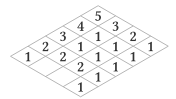
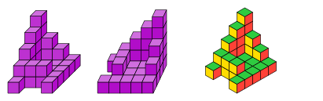
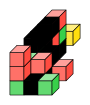
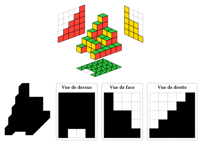
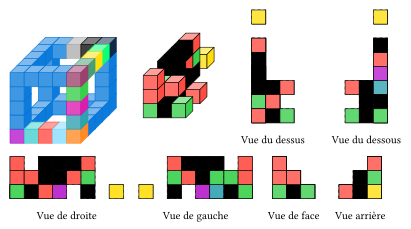
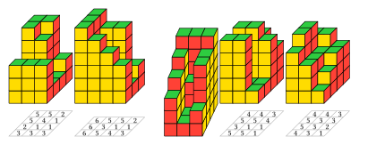
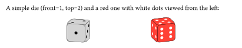
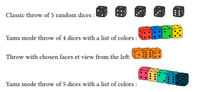
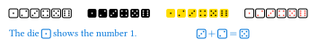

# Stacked

Package for stacks of cubes (simple or more complex) and dices (dice-face from eric1102 on Discord, with his permission, 3d and throws). Inspired by the LaTeX packages tikz3d-fr and ProfCollege and using cetz:0.5.2 (and suiji). A few colormaps (most from lilaq) are also defined. Two functions help-en and help-fr may be used to get help about a function or a parameter (ex: #help-fr("throws") or #help-en("pile(side)")). The manuals and the help functions are made with help from tidy.

[](LICENSE.txt)
[][french manual]
[][english manual]

## Installing

Install stacked by cloning it or importing like this:

```typ
#import "@preview/stacked:0.1.0": cube

#canvas(z:(-.5,-.5),{
  import draw:*
  cube((),c:(teal,blue,gray),border-stroke: white)
})
```

<div align="center">
  
</div>

## Stacks of cubes

The functions pile and building work differently.

+ For pile, the arguments (or array) `54321, 3112, 2112, 11111` corresponds to a grid like definition by heights (back to front in each "number" or string or array then left to right) : 

  <div align="center">
    
  </div>
  
  which gives :
  
  ```typ
  #import "@preview/stacked:0.1.0": pile
  #pile((54321, 3112, 2112, 11111,purple),border-stroke: true,side: true,light:(15%,0%,40%))#h(1fr)
  #pile(54321, 3112, 2112, 11111,z-spread: 0,iso:true,below-separation: 5)#h(1fr)
  ```
  
  <div align="center">
    
  </div>

+ For building, the arguments (or array) `(31670104,23312300,20111200),(11100000,2100000),30200000` corresponds correspond to a definition by "colors" in a color-list (1 for the first color, 2 for the second ... up to "g" for the sixteenth color and 0 to not draw a cube). The first array of integers or strings corresponds to the left-most slice (row by row bottom to top) ... So

  ```typ
  #import "@preview/stacked:0.1.0": building
  
  #building((31670104,23312300,20111200),(11100000,2100000),30200000,color-list: (aqua.mix(blue),red, green,yellow,blue,eastern, purple),border-stroke: true,)
  ```
  
  <div align="center">
    
  </div>

## Getting the views

+ With pile, you can have the front, right and above views at once (or a selection):

  ```typ
  #import "@preview/stacked:0.1.0": pile

  #h(1fr)
  #pile(54321,3212,3212,11111,none,grids:true,solution: true,back-separation: 4,left-separation: 4,plan: true,iso:1,)
  #h(1fr)
  
  #pile(54321,3212,3212,11111,eastern.mix(teal),border-stroke: true,iso:false, shadow: false,disposition: "",grids: true,solution: true,plan: true)
  ```
  
  <div align="center">
    
  </div>

+ With building, you can have all 6 views but it's "necessary" to call the functions made for it:

   ```typ
  #import "@preview/stacked:0.1.0": building, above-view, below-view, right-view, left-view, front-view, back-view

  // An example with visibles holes and a construct and its 6 views:
  #let construct-param = (color-list: (aqua.mix(blue),red, green,yellow,blue,eastern, purple),border-stroke: true,)
  #let construct = ((31670104,23312300,20111200),(11100000,2100000),30200000,)
  
  #building((("21111","xooox","10001","10001","11111"),
    ("30001",0,0,0,"10001"),
    ("40001",0,0,0,"1000g"),
    ("50001",0,0,0,"1000f"),
    ("61111","70001",80001,"90001","abcde")),)#h(1fr)
  #building(..construct,..construct-param,box-args: (baseline:-30%,))#h(1fr)
  #above-view(..construct,..construct-param)#h(1fr)
  #below-view(..construct,..construct-param)
  
  #right-view(..construct,..construct-param)#h(1fr)
  #left-view(..construct,..construct-param)#h(1fr)
  #front-view(..construct,..construct-param)#h(1fr)
  #back-view(..construct,..construct-param)#h(1fr)
  ```
  
  <div align="center">
    
  </div>

## Random modes with pile

Random by default gives a (3 x 4 x 5) stack, but width, depth and height can be set and there are 4 random modes (n°2 by Claude and 3 calling suiji are recommended) :

```typ
#import "@preview/stacked:0.1.0": pile
#pile(random-mode: 4, plan: true,)
#pile(random: true, width: 4, depth: 3, height: 6, seed: 2,side: true,random-mode: 2,plan: true,) //2
// 2. Mode aléatoire avec Plan de niveau
// #pile(random: true, plan: true, seed: 22,hauteur: 5,random-mode: 1)
// 2. Mode aléatoire avec Plan de niveau
#pile(aleatoire: true, plan: true, seed: 5,hauteur: 5,random-mode: 2,)
// 2. Mode aléatoire avec Plan de niveau
#pile(aleatoire: true, plan: true, seed: 3,random-mode: 3,hauteur: 5)
```
  
<div align="center">
  
</div>

## Dices

```typ
#import "@preview/stacked:0.1.0": dice

A simple die (front=1, top=2) and a red one with white dots viewed from the left:

#h(1fr) #dice(front: 1, top: 2,theta: 75,phi: 105, s: 1.5) 
#h(1fr)
// Un dé rouge tourné, avec une vue inversée (gauche)
#dice(front: 6, top: 5, color: red, s: 1.5, vue: "G", dot-color: white)#h(1fr) 
```

<div align="center">
  
</div>

```typ
#import "@preview/stacked:0.1.0": throws

// Lancer classique (aligné horizontalement) de 5 dés aléatoires :
Classic throw of 5 random dices :
#throws(5, seed: 42,colors:luma(25%),dot-color: white)

// Lancer mode Yams (accolés) avec liste de couleurs :
Yams mode throw of 4 dices with a list of colors :
#throws(
  4, 
  yams: true,
  yams-h: -.2,
  colors: (red, blue, green, yellow),
  seed: 987,
  s: 1.2,
  vue: "G"
)

// Lancer avec faces explicitement définies (pour du contrôle précis) et vue de gauche :
Throw with chosen faces et view from the left:
#throws(
  3,
  list: ((1, 2), (6, 5), (4, 1)),
  espace-h: -1mm,
  colors: orange,
  vue: "G"
)

// Lancer style Yams (alignement en diagonale 3D partagée) avec couleurs mélangées
Yams mode throw of 5 dices with a list of colors :
#throws(
  5, 
  yams: true, 
  colors: (rgb("ef476f"), rgb("ffd166"), rgb("06d6a0"), rgb("118ab2"), rgb("073b4c")), 
  seed: 999, 
  s: 1.2,
)
```

<div align="center">
  
</div>

```typ
#import "@preview/stacked:0.1.0": dice-face

#for n in range(1, 7) { dice-face(n) + h(2pt) } #h(1fr)
#for n in range(1, 7) { dice-face(n, fill: black) + h(2pt) } #h(1fr)
#for n in range(1, 7) { dice-face(n, fill: yellow) + h(2pt) } #h(1fr)
#for n in range(1, 7) { dice-face(n, spot-fill: red) + h(2pt) }

#set text(fill: blue)
The die #dice-face(1) shows the number 1.#h(1fr) 
$#dice-face(3) + #dice-face(2) = #dice-face(5)$ #h(1fr)
```

<div align="center">
  
</div>

More on these functions in the [french manual](Exemples/stacked-fr.pdf) or the [english manual](Exemples/stacked-en.pdf).

## Contributing

Any contributions are welcome! Just fork the repository and make a pull request.

[french manual]: Exemples/stacked-fr.pdf
[english manual]: Exemples/stacked-en.pdf