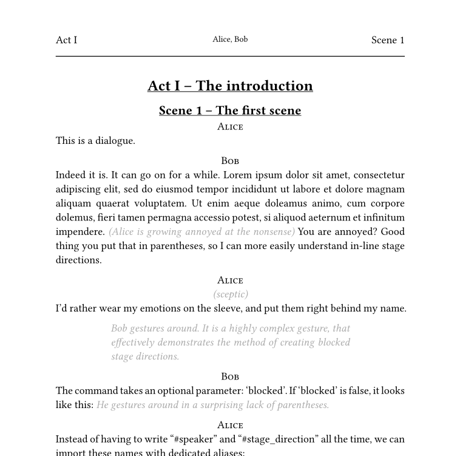
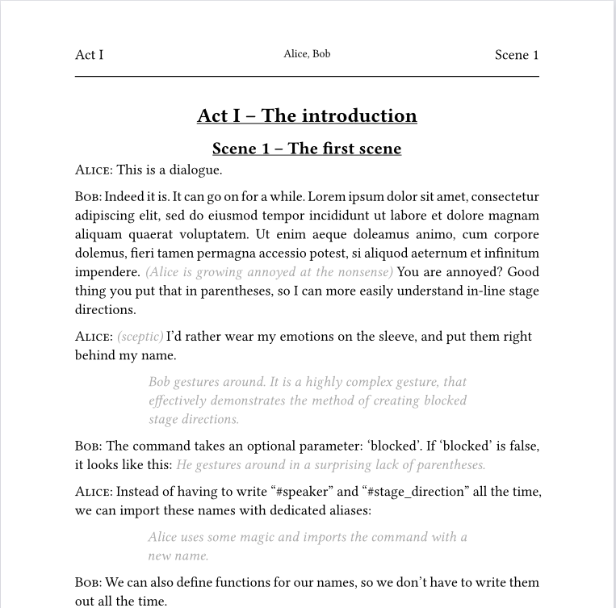

# stagehand
A typst template for easily creating pretty and legible theatre scripts meant for amateur use, with several useful gimmicks. This does not follow industry standards, but is meant to be easy to write, pleasing to the eye and highly customizable.

## Basic usage
If you just want to get started with the default values, simply init a new typst document with this template.
From the webapp, choose this template when starting a new project, from the CLI, use 
```bash
typst init @preview/stagehand:0.1.0
```
Read the template text to learn the basic syntax, and you're good to go!
For a basic script, you need to write nothing but 
```typ
#speaker[Character's name]
The dialog the character speaks
```

I recommend setting aliases for recurring characters, and to use shorter, alternative function names, as shown in the template.

Alternatively, add this to the start of your typst file:
```typ
#import "@preview/stagehand:0.1.0":*
#show: theatre
```

## Features
### Layouts
Two different layouts: "fancy" 



and "concise"



It can be switched by changing the `speaker-layout` parameter of the `stagehand` function (see below).

### Headers
The header includes current act, scene and a list of all speakers in that scene, so you can see on first glance who needs to be at the rehearsal.

### Dramatis personae
A simple, automated Dramatis personae is generated at the beginning of the play, sorted by order of appearance.

### Prop list
You can mark words as "props" within the text. At the end of the document, an index of all props is printed.

### To-Do list
You can add brightly colored "To-Do" items to the text and list them at the end of the document. This can be useful in the editing process.

### Title page
A title page with title, descriptor and author is created depending on your input.

### Functions
stagehand comes with the following functions:

#### speaker
Adds a speaker name. Arguments:
- name `(content)`: required
  - The name of the character
- t `(string|content|array(string|content)|auto|false)`: default: auto
  - With which character(s) to tag this line for the list of characters. Uses `name` by default. Doesn't tag this line at all if `false`
- p `(string|content)` default: none
  - If not none, adds a little stage direction directly behind the character name
 
#### stage-direction
Adds specially formatted stage directions. Arguments:
- body `(content)`: required
  - The content of the stage direction
- blocked `(boolean)`: default: false
  - If true, this is formatted as it's own block. If false, it is inline within other text.

#### prop
Marks text as a prop. It is not specially formatted, but will be listed and linked to in the prop section at the end of the file.

#### todo
Marks text as a TODO note. It will be brightly colored, and will be listed and linked to in the TODO section at the end of the file.

### Customization:
You can adjust the `stagehand` function using the `with` function, as seen in the template. These are the possible parameters:
|Parameter name|Possible values|Default value|Description|
|---|---|---|---|
|lang|language code|"en"|Sets the document's language, which affects things like quotes and hyphenation. If set to "en", "de" or "it", it also localizes strings from this package, like the names for "Act" or "Props". Falls back to english.|
|title|none/string|none|The title on the title page, and the title of pdf|
|descriptor|none/string|none|The descriptor on the title page|
|author|none/string/array(author)|none|The author(s) on the title page. If title, desciptor and author are all `none`, the title page will not be created.|
|font|font-string|"Libertinus Serif"|The font used throughout the document. Note: The template uses smallcaps, which are not supported by all fonts.|
|font-size|size|14pt|The size used for the main part of the document|
|toc|boolean|true|Whether to include a table of content at the beginning of the document|
|dramatis-personae|boolean|true|Whether to create a Dramatis Personae, a list of all characters, at the beginning of the document|
|props|boolean|true|Whether to include the list of props at the end of the document|
|todos|boolean|false|Whether "TODO"-notes are visible and listed at the end of the document|
|speaker-layout|"fancy"/"concise"|"fancy"|Which layout to use, see above|
|speaker-function|function|smallcaps|Which function to use on character names. You could, for example, use `upper` to transform all characters to capital letters.|
|break-size|int|900|After how many characters a paragraph should be allowed to split at a page break. Paragraphs below this limit will always stay together.|
|parentheses-mean-stage-directions|boolean|true|If true, using round parentheses in markup mode will mark text as an inline stage direction.|
|has-header|boolean|true|Whether to create a header on each page|
|has-footer|boolean|true|Whether to create a footer on each page|
|speakers-in-header|boolean|true|Whether to add the names of speakers to the header|
|custom-localization|dict/none|none|Add custom localization strings. See the fallback dictionary below for an example.|
|chapter-settings|dict|dict|Special settings for heading levels. See the template for an example.|

### Custom localization
Dictionaries like this can be added for custom localization strings:
```typc
(
    w-and: "and",
    w-by: "by",
    prop-title: "Props",
    todo-title: "TODOs",
    dramatis-personae-title: "Dramatis Personae",
    act-title: "Act",
    scene-title: "Scene",
    appendix-title: "Appendix"
  )
```
You only need to specify the keys you want to change, the rest will automatically fall back.
