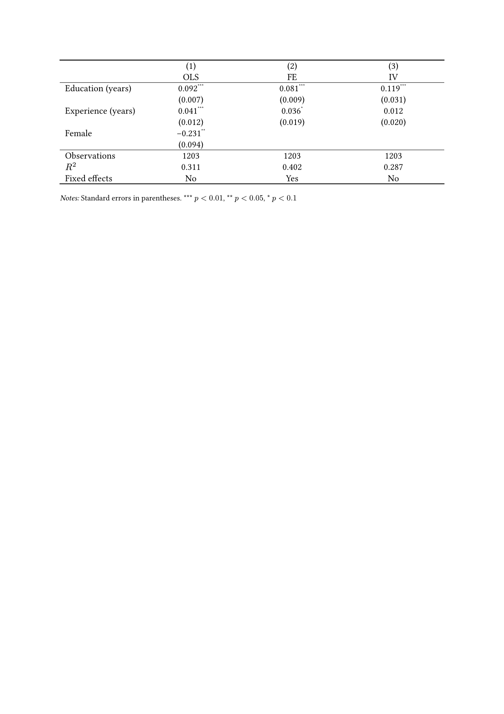

# stargazing

A Typst package that typesets regression tables from finished model results.

## What it does

The package does not estimate models. You run the regressions in Python, R, or Stata and save the results as JSON. The package reads the results and draws one table. The table has one column for each model. Each variable has a row for the coefficient and a row for the standard error. The package adds significance stars and a note below the table.



## Requirements

* Typst 0.15.1 or later. The package was tested only with 0.15.1.

## Install

Import the package from Typst Universe in your document:

```typst
#import "@preview/stargazing:0.1.0": regression-table
```

Typst downloads the package when it compiles the document.

## Usage

Call `regression-table` with an array of models. Each model is a dictionary with these keys:

* `name`: the text in the column header.
* `coefficients`: a dictionary. Each key is a variable name. Each value has `coef` and `se`, and can have `p`.
* `stats`: a dictionary of numbers or text, for example `N`, `R2`, or `Fixed effects`.

Example. The file `examples/results.json` holds the data for the table above.

```typst
#import "@preview/stargazing:0.1.0": regression-table

#let data = json("results.json")

#regression-table(
  data.models,
  labels: data.labels,
  stats: ("N", "R2", "Fixed effects"),
)
```

If a model has no `p`, the package computes the stars from the ratio `coef / se`. It uses the normal critical values 2.576, 1.960, and 1.645. A variable that a model does not contain gets an empty cell.

## Configuration

All settings are named arguments of `regression-table`.

| Argument | Default | Meaning |
|---|---|---|
| `labels` | `(:)` | Dictionary from a variable or stat key to the text shown. |
| `order` | `auto` | Variable keys to show, in order. The default is the order of first use. |
| `stats` | `auto` | Stat keys to show, in order. The default is the keys of the first model. |
| `digits` | `3` | Decimals for coefficients, standard errors, and decimal stats. |
| `levels` | `((0.01, "***"), (0.05, "**"), (0.1, "*"))` | Pairs of a limit and a mark. The strictest limit comes first. |
| `notes` | `auto` | `auto` writes the standard note. `none` removes the note. Content replaces the note. |

The keys `N`, `R2`, and `adj_R2` have the default labels "Observations", R², and "Adjusted R²". Integers print without decimals. Decimal numbers print with `digits` decimals.

The package exports two more functions: `format-number(x, digits: 3)` and `stars-for(entry, levels: ...)`.

## How it works

The file `lib.typ` holds all code. `format-number` rounds a number, pads the decimals with zeros, and writes a true minus sign. `stars-for` returns the mark for one coefficient. `regression-table` builds the cells row by row and passes them to one `table` call with horizontal rules at the top, below the header, above the statistics, and at the bottom.

To run the checks, compile the test file. The compile fails if an assertion fails:

```
typst compile --root . tests/test.typ /dev/null --format pdf
```

To rebuild the example image:

```
typst compile --root . examples/example.typ examples/example.png --ppi 150
```

## License

This project uses the GNU General Public License, version 3 or any later version. See the `LICENSE` file.
