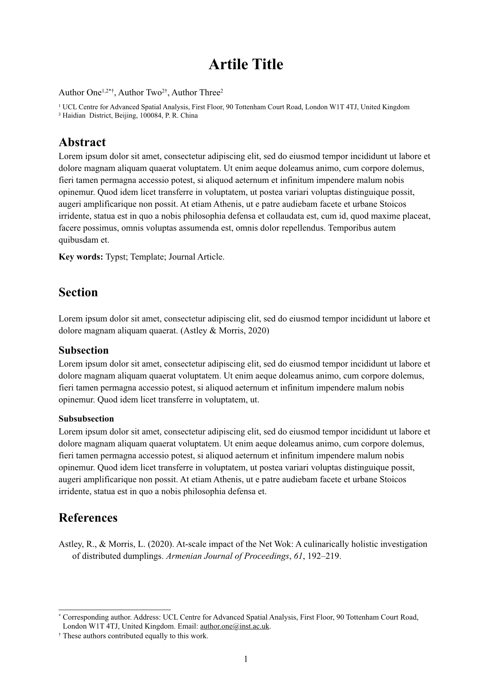

# A starter template for journal articles

This package provides a template for writing journal articles
to organise authors, institutions, and information of corresponding authors.



## Usage

Run the following command to use this template

```typst
typst init @preview/starter-journal-article
```

## Documentation

### `article` 

The template for creating journal articles.
It needs the following arguments.

Arguments:

- `title`: The title of this article. Default: `"Article Title"`.
- `authors`: A dictionary of authors. 
  Dictionary keys are authors' names.
  Dictionary values are meta data of every author, 
  including label(s) of affiliation(s), email, contact address, 
  or a self-defined name (to avoid name conflicts).
  The label(s) of affiliation(s) must be those claimed in the argument `affiliations`.
  Once the email or address exists, the author(s) will be labelled as the corresponding author(s), and their address will show in footnotes.
  Function `author-meta()` is useful in creating information for each author.
  Default: `("Author Name": author-meta("affiliation-label"))`.
- `affiliations`: A dictionary of affiliation.
  Dictionary keys are affiliations' labels.
  These labels show be constent with those used in authors' meta data.
  Dictionary values are addresses of every affiliation.
  Default: `("affiliation-label": "Affiliation address")`.
- `abstract`: The paper's abstract. Default: `[]`.
- `keywords`: The paper's keywords. Default: `[]`.
- `bib`: The bibliography. Accept value from the built-in `bibliography` function. Default: `none`.

### `author-meta`

A helper to create meta information for an author.

Arguments:

- `..affiliation`: Capture the positioned arguments as label(s) of affiliation(s). Mandatory.
- `email`: The email address of the author. Default: `none`.
- `alias`: The display name of the author. Default: `none`.
- `address`: The address of the author. Default: `none`.
- `cofirst`: Whether the author is the co-first author. Default: `false`.

## Example

See [the template](./template/main.typ) for full example.

```typst
#show: article.with(
    title: "Artile Title",
    authors: (
      "Author One": author-meta(
        "UCL", "TSU",
        email: "author.one@inst.ac.uk",
      ),
      "Author Two": author-meta(
        "TSU",
        cofirst: true
      ),
      "Author Three": author-meta(
        "TSU"
      )
    ),
    affiliations: (
      "UCL": "UCL Centre for Advanced Spatial Analysis, First Floor, 90 Tottenham Court Road, London W1T 4TJ, United Kingdom",
      "TSU": "Haidian  District, Beijing, 100084, P. R. China"
    ),
    abstract: [#lorem(100)],
    keywords: ("Typst", "Template", "Journal Article"),
    bib: bibliography("./ref.bib")
)
```

