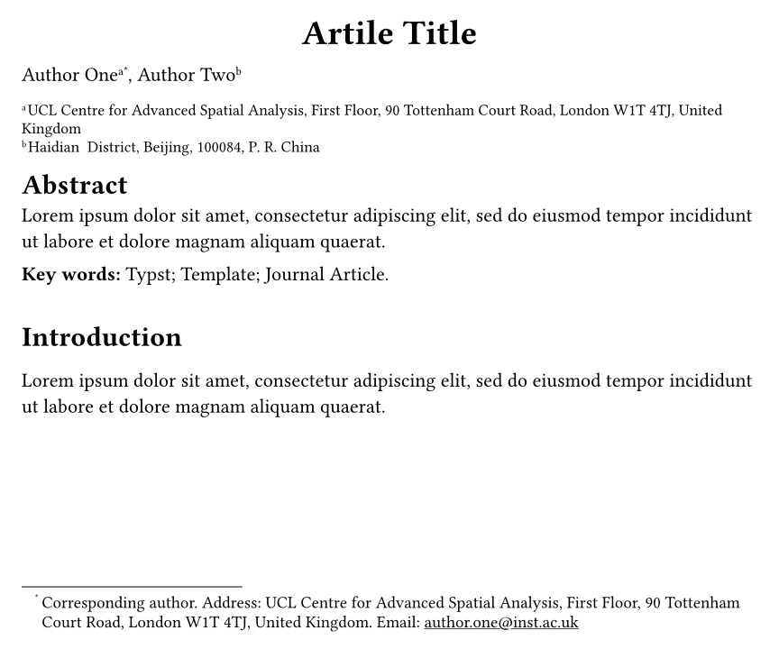
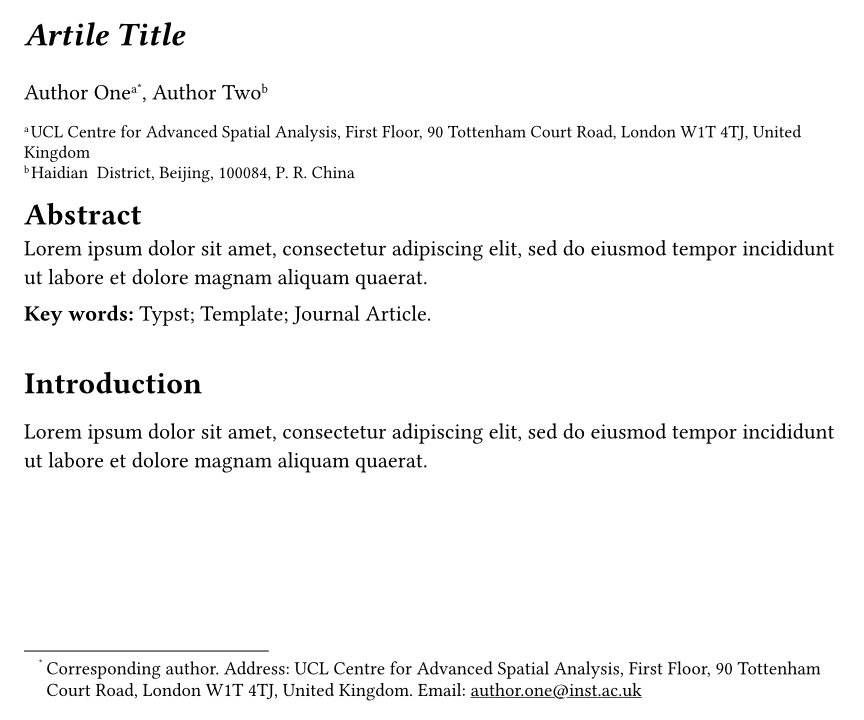
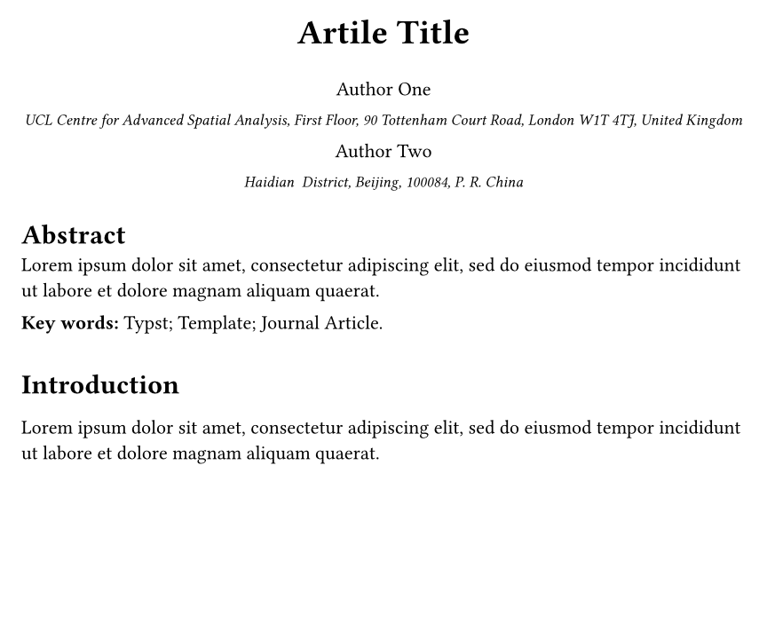
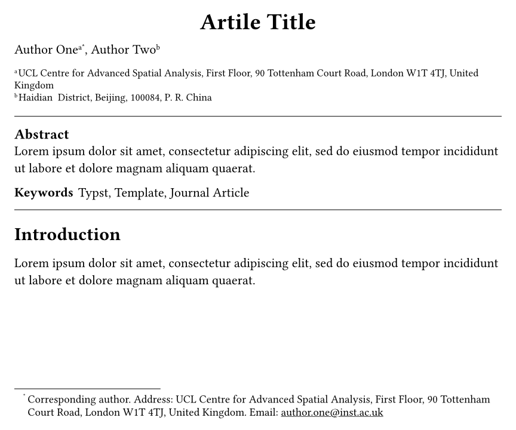

# A configurable starter template for journal articles

This package provides a template for writing journal articles
to organise authors, institutions, and information of corresponding authors.

## Usage

Run the following command to use this template

```typst
typst init @preview/starter-journal-article
```

## Documentation

### `article` 

The template for creating journal articles.
It needs the following arguments.

Arguments:

- `title`: The title of this article. Default: `"Article Title"`.
- `authors`: A dictionary of authors. 
  Dictionary keys are authors' names.
  Dictionary values are meta data of every author, 
  including label(s) of affiliation(s), email, contact address, 
  or a self-defined name (to avoid name conflicts).
  The label(s) of affiliation(s) must be those claimed in the argument `affiliations`.
  Once the email or address exists, the author(s) will be labelled as the corresponding author(s), and their address will show in footnotes.
  Function `author-meta()` is useful in creating information for each author.
  Default: `("Author Name": author-meta("affiliation-label"))`.
- `affiliations`: A dictionary of affiliation.
  Dictionary keys are affiliations' labels.
  These labels show be constent with those used in authors' meta data.
  Dictionary values are addresses of every affiliation.
  Default: `("affiliation-label": "Affiliation address")`.
- `abstract`: The paper's abstract. Default: `[]`.
- `keywords`: The paper's keywords. Default: `[]`.
- `bib`: The bibliography. Accept value from the built-in `bibliography` function. Default: `none`.
- `template`: Templates for the following parts. Please see below for more informations
  - `title: (title) => {}`: how to show the title of this article.
  - `author-info: (authors, affiliations) => {}`: how to show each author's information.
  - `abstract: (abstract, keywords) => {}`: how to show the abstract and keywords.
  - `bibliography: (bib) => {}`: how to show the bibliography.
  - `body: (body) => {}`: how to show main text.

### `author-meta`

A helper to create meta information for an author.

Arguments:

- `..affiliation`: Capture the positioned arguments as label(s) of affiliation(s). Mandatory.
- `email`: The email address of the author. Default: `none`.
- `alias`: The display name of the author. Default: `none`.
- `address`: The address of the author. Default: `none`.
- `cofirst`: Whether the author is the co-first author. Default: `false`.

### `appendix`

A helper to show contents as appendices.

- Heading numbers are shown in capital letters with a prefix "Appendix".
- Appendix numbers are prepended to figure (and table, etc.) numbers.

Usage:

```typst
#show: appendix
```

### `suffix`

A helper to show contents after the main text but before the appendix.
The only behavior of this function is to hide the heading numbers.

Usage:

```typst
#show: suffix
```

### `booktab`

A helper to create three-line tables.
This function is a wrapper of the built-in `table` function.
It adds a top line and a bottom line to the table,
and a middle line under the first row by default.

Arguments:

- `..args`: Capture the positioned arguments as the table contents. Mandatory.
- `top-bottom`: The stroke of the top and bottom lines. Default: `1pt`.
- `mid`: The stroke of the middle line. Default: `0.5pt`.

Usage:

```typst
#booktab(
  columns: 3,
  rows: 3,
  ..((lorem(2),) *9)
)
```

## Default templates

The following code shows how the default templates are defined.
You can override any of the by setting the `template` argument in the `article()` function to customise the template.

```typst
#let default-title(title) = {
  show: block.with(width: 100%)
  set align(center)
  set text(size: 1.75em, weight: "bold")
  title
}

#let default-author(author) = {
  text(author.name)
  super(author.insts.map(it => str(it)).join(","))
  if author.corresponding {
    footnote[
      Corresponding author. Address: #author.address.
      #if author.email != none {
        [Email: #underline(author.email).]
      }
    ]
  }
  if author.cofirst == "thefirst" {
    footnote("cofirst-author-mark")
  } else if author.cofirst == "cofirst" {
    locate(loc => query(footnote.where(body: [cofirst-author-mark]), loc).last())
  }
}

#let default-affiliation(id, address) = {
  set text(size: 0.8em)
  super([#(id+1)])
  address
}

#let default-author-info(authors, affiliations) = {
  {
    show: block.with(width: 100%)
    authors.map(it => default-author(it)).join(", ")
  }
  {
    show: block.with(width: 100%)
    set par(leading: 0.4em)
    affiliations.keys().enumerate().map(((ik, key)) => {
      default-affiliation(ik, affiliations.at(key))
    }).join(linebreak())
  }
}

#let default-abstract(abstract, keywords) = {
  // Abstract and keyword block
  if abstract != [] {
    stack(
      dir: ttb,
      spacing: 1em,
      ..([
        #heading([Abstract])
        #abstract
      ], if keywords.len() > 0 {
        text(weight: "bold", [Key words: ])
        text([#keywords.join([; ]).])
      } else {none} )
    )
  }
}

#let default-bibliography(bib) = {
  show bibliography: set text(1em)
  show bibliography: set par(first-line-indent: 0em)
  set bibliography(title: [References], style: "apa")
  bib
}

#let default-body(body) = {
  show heading.where(level: 1): it => block(above: 1.5em, below: 1.5em)[
    #set pad(bottom: 2em, top: 1em)
    #it.body
  ]
  set par(first-line-indent: 2em)
  set footnote(numbering: "1")
  body
}
```

## Example

See [the template](./template/main.typ) for full example.

```typst
#show: article.with(
  title: "Artile Title",
  authors: (
    "Author One": author-meta(
      "UCL", "TSU",
      email: "author.one@inst.ac.uk",
    ),
    "Author Two": author-meta(
      "TSU",
      cofirst: true
    ),
    "Author Three": author-meta(
      "TSU"
    )
  ),
  affiliations: (
    "UCL": "UCL Centre for Advanced Spatial Analysis, First Floor, 90 Tottenham Court Road, London W1T 4TJ, United Kingdom",
    "TSU": "Haidian  District, Beijing, 100084, P. R. China"
  ),
  abstract: [#lorem(100)],
  keywords: ("Typst", "Template", "Journal Article"),
  bib: bibliography("./ref.bib")
)
```



### Custom title

```typst
#show: article.with(
  title: "Artile Title",
  authors: (
    "Author One": author-meta(
      "UCL", "TSU",
      email: "author.one@inst.ac.uk",
    ),
    "Author Two": author-meta(
      "TSU",
      cofirst: true
    ),
    "Author Three": author-meta(
      "TSU"
    )
  ),
  affiliations: (
    "UCL": "UCL Centre for Advanced Spatial Analysis, First Floor, 90 Tottenham Court Road, London W1T 4TJ, United Kingdom",
    "TSU": "Haidian  District, Beijing, 100084, P. R. China"
  ),
  abstract: [#lorem(100)],
  keywords: ("Typst", "Template", "Journal Article"),
  bib: bibliography("./ref.bib"),
  template: (
    title: (title) => {
      set align(left)
      set text(size: 1.5em, weight: "bold", style: "italic")
      title
    }
  )
)
```



### Custom author infomation

```typst
#show: article.with(
  title: "Artile Title",
  authors: (
    "Author One": author-meta("UCL", email: "author.one@inst.ac.uk"),
    "Author Two": author-meta("TSU")
  ),
  affiliations: (
    "UCL": "UCL Centre for Advanced Spatial Analysis, First Floor, 90 Tottenham Court Road, London W1T 4TJ, United Kingdom",
    "TSU": "Haidian  District, Beijing, 100084, P. R. China"
  ),
  abstract: [#lorem(20)],
  keywords: ("Typst", "Template", "Journal Article"),
  template: (
    author-info: (authors, affiliations) => {
      set align(center)
      show: block.with(width: 100%, above: 2em, below: 2em)
      let first_insts = authors.map(it => it.insts.at(0)).dedup()
      stack(
        dir: ttb,
        spacing: 1em,
        ..first_insts.map(inst_id => {
          let inst_authors = authors.filter(it => it.insts.at(0) == inst_id)
          stack(
            dir: ttb,
            spacing: 1em,
            {
              inst_authors.map(it => it.name).join(", ")
            },
            {
              set text(0.8em, style: "italic")
              affiliations.values().at(inst_id)
            }
          )
        })
      )
    }
  )
)
```



### Custom abstract

```typst
#show: article.with(
  title: "Artile Title",
  authors: (
    "Author One": author-meta("UCL", email: "author.one@inst.ac.uk"),
    "Author Two": author-meta("TSU")
  ),
  affiliations: (
    "UCL": "UCL Centre for Advanced Spatial Analysis, First Floor, 90 Tottenham Court Road, London W1T 4TJ, United Kingdom",
    "TSU": "Haidian  District, Beijing, 100084, P. R. China"
  ),
  abstract: [#lorem(20)],
  keywords: ("Typst", "Template", "Journal Article"),
  template: (
    abstract: (abstract, keywords) => {
      show: block.with(
        width: 100%,
        stroke: (y: 0.5pt + black),
        inset: (y: 1em)
      )
      show heading: set text(size: 12pt)
      heading(numbering: none, outlined: false, bookmarked: false, [Abstract])
      par(abstract)
      stack(
        dir: ltr,
        spacing: 4pt,
        strong([Keywords]),
        keywords.join(", ")
      )
    }
  )
)
```



## Changelog

### 0.4.0

Breaking changes:

- Affiliation labels are now shown with alphabetic characters instead of numbers.
- Parameter `bib` is removed. Users should use the built-in `bibliography` function to create a bibliography in the right place.

New features:

- A `appendix` function is added to show contents as appendices.
- A `suffix` function is added to show additional contents before the appendix. This is useful when heading numbers are shown but need to be hide for the "suffix" part.
- A `booktab` function is added to create three-line tables.

Improvements:

- A 1em space is added beneath the abstract and keywords.
- The `placement` argument of the `figure` function is set to `top` by default.
- The separator between figure labels and captions is changed to a period followed by a space.
