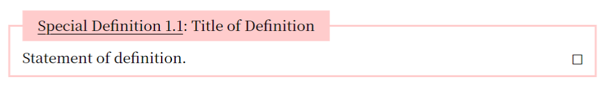

# statementsp
## Description
This statementsp, the statement special package, enables you to make these boxes with counters for some statement in mathematics.


## How to use
At first, you need to write the following code in your main typst file.
```typst
#import "@preview/statementsp:0.1.1": *
#set heading(numbering: "1.")
#show heading: reset-counter(statementnum, levels: 1)
```
If you prefer, you can change the second code like 
```typst
#set heading(numbering: "1")
```
```typst
#set heading(numbering: "A.")
```
and so on.

Then, there are 3 steps to make your own boxes.
### Step1: Set a newstatementsp function
If you want to make Def boxes as the above sample image, you need to use a newstatament function and ready to make boxes.
```typst
#newstatementsp(
  box-name: "def",
  box-display: "Def",
  title-color: black,
  box-color: rgb("#FFCCCC"),
)
```
First one is a box name you use in typst script. Second is a strings displayed at boxes. If you set second argument "Special Definition", box will be made like this.



Third argument is a color of title text. Fourth is a color of box itself.

### Step2: Let's make your box
To make the box you set with a newstatementsp function, write the following code.

```typst
#statementsp(
  box-name: "def",
  box-label: "deflabelsample",
  box-title: "Title of Definition",
  number: true,
)[
  Statement of definition.
]
```
Then, you can make your "def" box as the first box in the sample images. You can omit `box-label`, `box-title`, `number` keys. In this case, the box has no label, title, however has a number. 
If you set `number: false`, a box does not have a number. And the statament counter is not stepped.
If you set a label here, you can use a label `<def:deflabelsample>`. A label name is not `<deflabelsample>`. 

### Step3: How to use cross refferences
If you set a box and its label, you can reffer it in any other places in the document. To do this, write the following code.
```typst
#linksp(<def:deflabelsample>)
```
Then, you can see the hyperlink desplayed like "Def 1.1". Of course, you can use `#linksp` in sentences like a normal `#link`.
```typst
Some sentences...Remenber #linksp(<def:deflabelsample>) and prove the next theorem...
```

## Remark
I use showybox package mainly.
You can not attach labels to a box without number.
I am a beginner of typst and English. So this document may be a bit confusing. 
