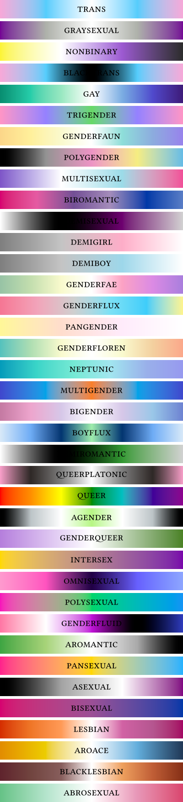

# Stonewall: colourful, accurate pride flags colour palette for queer gradients
You can use the colour palette with _gradients_ for maximum results! 
For example the code in `example.typ` which is
```typ
#import "@preview/stonewall:0.2.0": flags

#set page(width: 200pt, height: auto, margin: 0pt)
#set text(fill: black, size: 12pt)
#set text(top-edge: "bounds", bottom-edge: "bounds")


#stack(
  spacing: 3pt,
  ..flags.map(((name, preset)) => block(
    width: 100%,
    height: 20pt,
    fill: gradient.linear(..preset),
    align(center + horizon, smallcaps(name)),
  ))
)
```
gives the following stack of flags as of v0.2.0


To use only one flag you only import the one you want
