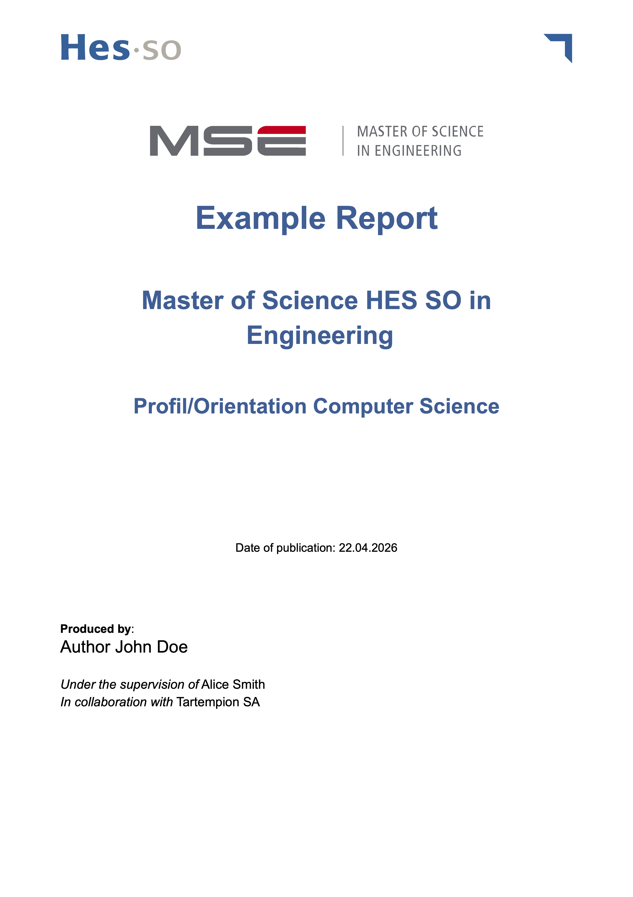

# HES-SO MSE Thesis

<p align="center">
  
</p>

A clean and customizable Typst template for Master of Science in Engineering HES-SO thesis and reports.

---

## Features

- HES-SO inspired layout
- Automatic cover page
- Table of contents
- Styled headers and footers
- Code and table formatting
- Bilingual support (French / English)
- Appendix support

## Quick Start

### Using the published package

```typst
#import "@preview/structured-mse-thesis:0.1.0": report-template

#show: report-template.with(
  title: "My Thesis Title",
  author: "John Doe",
)

= Introduction
Hello world
```

## Configuration

You can customize the template using the following parameters:

```typst
#show: report-template.with(
  title: "Title",
  subtitle: "Master of Science HES SO in Engineering",
  author: "Your Name",
  teacher: "Supervisor Name",
  orientation: "Computer Science",
  company: "Company Name",
  confidential: false, // true or false

  // Footer
  state: "To be finalized",
  font: "Arial", // Any system font or custom font
  file-name: "structured-mse-thesis.typ", // For metadata
  project-type: "Master Thesis", // For metadata

  lang: "en", // "en" or "fr"

  acknowledgments: [
    Thanks to everyone...
  ],

  en-resume: [
    This thesis explores...
  ],

  fr-resume: [
    Ce travail explore...
  ],
)
```

---

## Language Support

Set the language using:

```typst
lang: "en" // or "fr"
```

This automatically adapts:

- Section titles
- Labels
- Static text

## Appendix

```typst
#show: appendix

= Additional Material
Content...
```

## Examples

Check the `examples/` folder for sample documents using the template.
