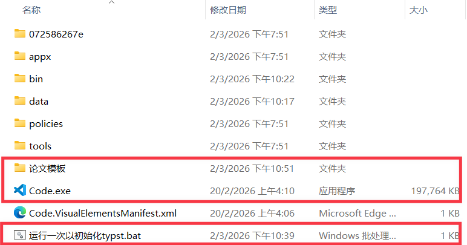
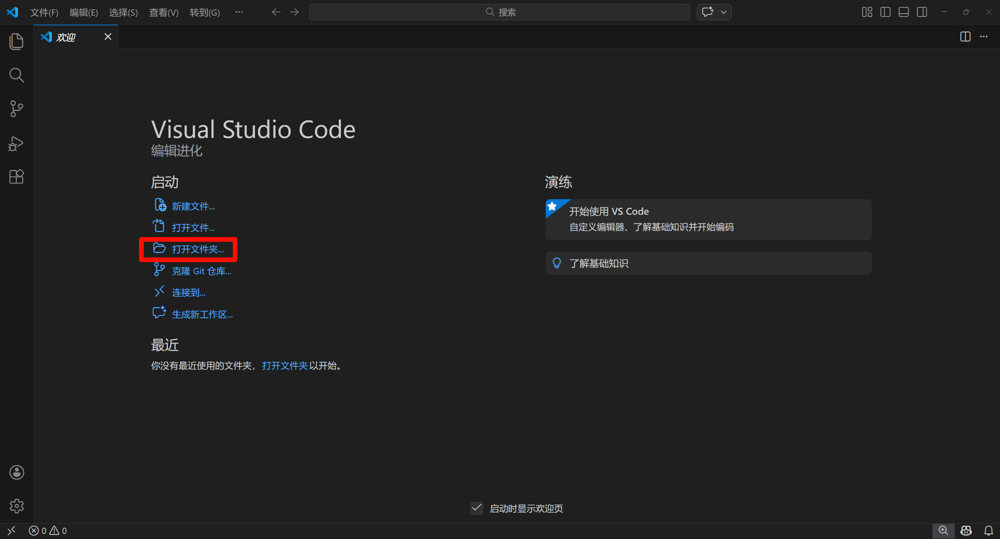
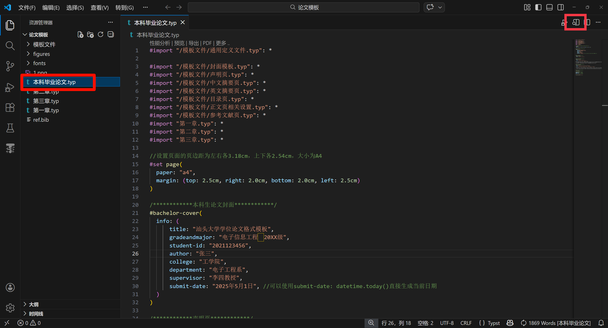
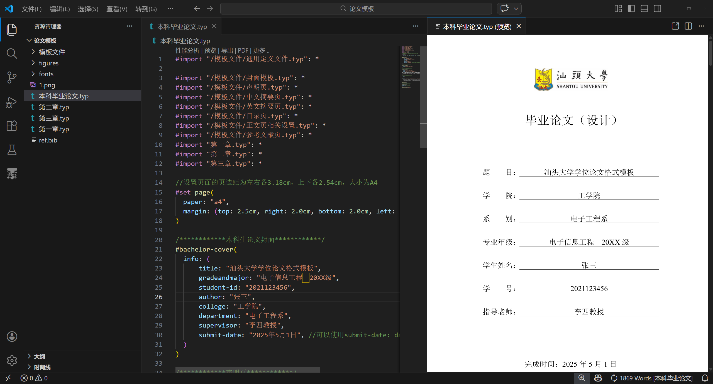
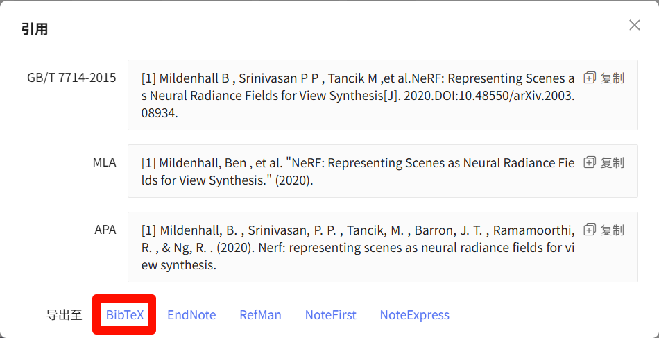
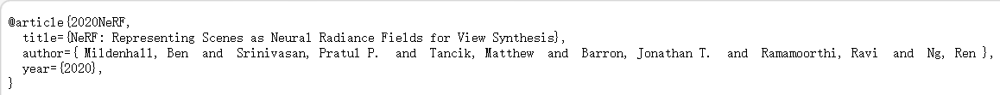

# 使用说明

有问题需要提问时，请在提问前***完整阅读使用说明***。

## 模板使用

推荐可以访问`GitHub`且具备一定动手能力的同学使用。

安装好`typst`后输入：

```bash
typst init @preview/stu-thesis my-thesis
cd my-thesis
```

推荐需要提交的版本使用`Windows`系统进行编译。
其它系统可能会缺少相应字体。

## 程序安装

直接下载打包好的程序包，解压后如下图所示：



双击`运行一次以初始化typst`之后双击打开`Code.exe`。



点击`打开文件夹`按钮→选中上面下载的`论文模板`文件夹→点击`选择文件夹`。



选中`main.typ`→点击右上方的`Typst预览`按钮→可看到预渲染的毕业论文。



## 论文封面、声明页、中英文摘要

论文封面、声明页、中英文摘要相关的内容如下所示，需要将各项内容修改为自己的信息。
需要注意的是，由于typst的分词分段机制，摘要中如果需要换行，需要隔一行写入内容。
详细说明见下面代码的注释。

```typst
#show: text-body => template-main(
  /************封面************/
  (
    title: "汕头大学学位论文格式模板",
    title-en: "Shantou University Dissertation Format Template",
    gradeandmajor: "电子信息工程　20XX级",
    student-id: "2021123456",
    author: "张三",
    college: "工学院",
    department: "电子工程系",
    supervisor: "李四教授",
    //submit-date: "2026年5月1日", // 默认直接使用当前日期，取消注释以设置日期

    /*摘要相关*/
    abstract: [
      //中文摘要
      学位论文是学生从事科研工作、工程实践的成果的主要表现，集中表明了作者在工作、实践中获得的新的发明、理论或见解，是学生申请学生、硕士或博士学位的重要依据，也是科研领域中的重要文献资料和社会的宝贵财富。

      为了提高学生学位论文的质量，做到学位论文在内容和格式上的规范化与统一化，特制作本模板。
    ],
    keywords: ("学位论文", "论文格式", "规范化", "模板"), //中文关键词
    abstract-en: [
      //英文摘要
      A dissertation is a primary manifestation of students' achievements
      in scientific research work and engineering practice.
      It systematically demonstrates the author's new inventions, theories or insights
      obtained through research and practice.
      It serves as an important basis for students to apply
      for bachelor's, master's or doctoral degrees,
      and is also an important literature resource
      in the scientific research field and a valuable asset to society.

      In order to improve the quality of students' dissertations
      and achieve standardization and unification of dissertations
      in both content and format, this template has been specially created.
    ],
    keywords-en: (
      //英文关键词
      "dissertation",
      "dissertation format",
      "standardization",
      "template",
    ),
  ),
  text-body,
)
```

## 论文目录页

已通过`setup-outline()`函数封装并且已经被封装进`template-main()`函数。

## 论文正文

论文正文通过章节形式进行组织。通过修改`chapter_1.typ`、`chapter_2.typ`、`chapter_3.typ`中的具体内容进行修改即可。

如果论文的内容不止三章，可新建文件，如`chapter_4.typ`，然后写入如下内容：

```typst
#let Chapter_four = [
  = 第四章
]
```

随后在`main.typ`的最上方引入该章节的内容：

```typst
#import "chapter_4.typ": *
```

再在`main.typ`中添加`Chapter_four`即可：

```typst
/************正文************/
#Chapter_one;//显示第一章内容
#Chapter_two;//显示第二章内容
#include "chapter_3.typ"//显示第三章内容
#Chapter_four;//显示第四章内容
```

## 参考文献

和目录页类似，已通过`setup-bibliography()`函数封装，通过调用该函数即可生成参考文献：

```typst
#setup-bibliography("ref.bib")
```

## 输出pdf格式文档

点击VSCode上方的`终端`按钮->选择`新建终端`->在终端中输入如下代码即可实现pdf文件的生成：

```bash
typst c --font-path ./fonts template.typ
```

## 格式说明

### 标题说明

typst通过`=`号标注文字为标题，一个`=`表示一级标题，两个`=`组成的`==`则表示二级标题。本模板规定一级标题为章节名称，因此在每一章的开头必须先写一个一级标题如下：

```typst
= 绪论
```

此外，本模板最高支持五级标题，即`===== xx`，注意***不可超过五级标题***。

### 数学符号

不同于Word和LaTeX，Typst具有特殊的数学语法和库函数，用于排版数学公式。具体语法可查询
[https://typst.dev/docs/reference/math/](https://typst.dev/docs/reference/math/ "https://typst.dev/docs/reference/math/")
。数学公式可以嵌入文本中显示（例如 $x^2$，使用两个`$`符号包括公式内容），也可以作为单独的块状公式显示（使用两个`$`符号包括公式内容，但`$`前后需要使用换行或者空格将公式内容隔开），如下所示：

```typst
  $
  x^2
  $ <equation1>//equation1为该公式的代称，标注了该代称之后，可在正文中引用该公式
```

然后通过`@equation1`来对公式进行引用，这一操作在正文中将显示为`式x`。

### 引用参考文献

参考文献通过`ref.bib`进行管理，bib中的文献格式为BibTeX，该格式可通过学术网站直接下载。
比如使用百度学术搜索神经辐射场的文章：*NeRF: Representing Scenes as
Neural Radiance Fields for View Synthesis*，随后点击引用并选择BibTeX格式即可复制该文章的引用。





需要强调的是，通过百度学术或者谷歌学术等第三方平台取得的BibTeX格式并不一定准确，最严谨的取得文章引用的方法是通过文章发布的期刊的官网获得。

将文章的BibTeX内容复制到bib文件中后，可通过`@`符号进行引用，比如`@2020NeRF`。

### 插入图片

在typst中插入图片很简单，输入如下代码即可：

```typst
#figure(
  image(
    "figures/energy-distribution.png", //图片的路径
    width: 80%, //图片的宽度
  ),
  caption: [内热源沿径向的分布], //图片的标题名称
) <energy-distribution>//图片的标识，通过该标识在正文中引入图片
```

在正文中通过`@`符号进行引用，比如`@energy-distribution`。

### 插入表格

根据汕头大学毕业论文格式规范，文章中的表格可使用三线表和普通表。

#### 三线表示例如下：

```typst
#figure(
  caption: [三线表格],
  table(
    //设置表格列数和列宽比例
    columns: (8em, 8em, 8em),
    //设置表格边框宽度
    stroke: 0pt,

    /******标题行******/
    //设置三线表的顶线，参数end: 3表示在第3列结束，stroke: 1.25pt表示线宽为1.25pt
    table.hline(end: 3, stroke: 1.25pt),
    //设置第一列内容
    [Animal],
    //设置第二列内容
    [Desciption],
    //设置第三列内容
    [Price(\$)],
    //设置三线表的中线，参数end: 3表示在第3列结束
    table.hline(end: 3, stroke: 0.35pt),

    [Gnat], [per gram], [13.65],
    [], [each], [0.01],
    [Gnu], [stuffed], [92.50],
    [Emu], [stuffed], [33.33],
    [Armadillo], [frozen], [8.99],
    //设置三线表的底线，参数end: 3表示在第3列结束，stroke: 1.25pt表示线宽为1.25pt
    table.hline(end: 3, stroke: 1.25pt),
  ),
) <threelinetable>
```

#### 普通表示例如下：

```typst
#figure(
  caption: [普通表],
  table(
    //设置表格列数和列宽比例
    columns: (8em, 8em, 8em),
    //设置表格边框宽度
    stroke: 1pt,

    //设置第一列内容
    [Animal],
    //设置第二列内容
    [Desciption],
    //设置第三列内容
    [Price(\$)],

    [Gnat], [per gram], [13.65],
    [], [each], [0.01],
    [Gnu], [stuffed], [92.50],
    [Emu], [stuffed], [33.33],
    [Armadillo], [frozen], [8.99],
  ),
) <normallinetable>
```

表格的引用与图片类似，不再赘述。

### 脚注

可通过`#footnote[]`标识引入脚注，脚注的具体内容写在方括号内部，如下所示：

```typst
表格的编排建议采用国际通行的三线表
#footnote[三线表，以其形式简洁、功能分明、阅读方便而在科技论文中被推荐使用。
  三线表通常只有 3 条线，即顶线、底线和栏目线，没有竖线。]，如@threelinetable 所示。
```

### 算法环境

按行文规范，论文中不应该出现代码，如果需要对算法进行说明，需要使用算法描述环境进行描述，本模板提供`algo`环境进行实现：

```typst
#import "@preview/stu-thesis:0.1.0": algo, comment, d, i
#algo(
  line-numbers: false,
  strong-keywords: false,
)[
  if $n < 0$:#i\
  return null#d\
  if $n = 0$ or $n = 1$:#i\
  return $n$#d\
  \
  let $x <- 0$\
  let $y <- 1$\
  for $i <- 2$ to $n-1$:#i #comment[so dynamic!]\
  let $z <- x+y$\
  $x <- y$\
  $y <- z$#d\
  \
  return $x+y$
]
```

### 代码环境

再次强调，**代码不应该出现在论文中，尤其不应该大面积贴代码以凑页数**！如果需要通过代码说明问题，需要使用伪代码，本模板提供通过引入`codly`包实现：

````typst
#import "@preview/codly:1.3.0": *
#import "@preview/codly-languages:0.1.10": *
#show: codly-init.with()
#codly(languages: codly-languages)

#block(breakable: false)[
  ```python
  def fibonacci(n: int) -> int:
      # 输入：整数 n
      # 输出：Fibonacci 数列的第 n 项

      if n == 0:
          return 0
      if n == 1:
          return 1

      a = 0
      b = 1
      for i in range(2, n + 1):
          tmp = a + b
          a = b
          b = tmp
      return b
  ```
]
````
