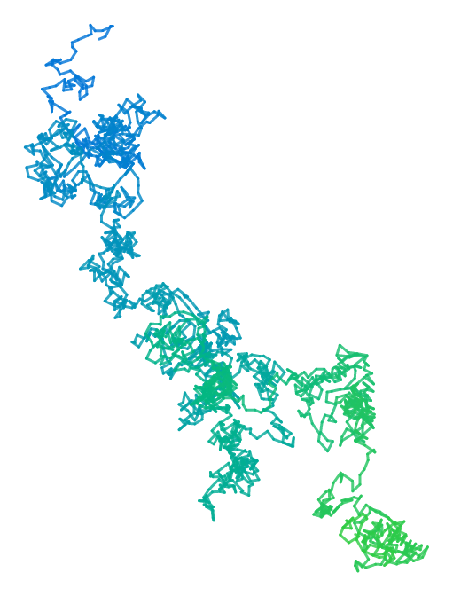
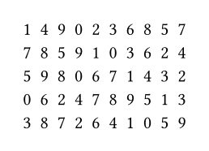

# Suiji

[Suiji](https://github.com/liuguangxi/suiji) (随机 in Chinese, /suíjī/, meaning random) is a high efficient random number generator in Typst. Partial algorithm is inherited from [GSL](https://www.gnu.org/software/gsl) and many APIs are similar to [NumPy Random Generator](https://numpy.org/doc/stable/reference/random/generator.html).

Suiji provides pure function implementations of all its features, and does not rely on `counter` or `state`, resulting in better performance and independency. Functionally, it can completely replace related functions in LaTeX package `pgfmath`.


## Features

- All functions are immutable, which means results of random are completely deterministic.
- Core random engine chooses "Maximally equidistributed combined Tausworthe generator", which has higher quality and efficiency compared with other algorithms like LCG, MT19937, etc.
- Generate random integers of the parameterized interval.
- Generate random floats uniformly distributed over the parameterized interval.
- Generate random floats from a normal distribution.
- Randomly shuffle the array of objects.


## Example

The example below uses `suiji` and `cetz` package to create a trajectory graph of a random walk.

```typ
#import "@preview/suiji:0.1.0": *
#import "@preview/cetz:0.2.1"

#set page(width: auto, height: auto, margin: 0.5cm)

#cetz.canvas(length: 6pt, {
  import cetz.draw: *

  let n = 2000
  let (cx, cy) = (0, 0)
  let (cx-new, cy-new) = (0, 0)
  let rng = gen-rng(42)
  let v = 0
  let col = blue
  for i in range(n) {
    (rng, v) = uniform(rng, low: -1.0, high: 1.0)
    cx-new = cx + v
    (rng, v) = uniform(rng, low: -1.0, high: 1.0)
    cy-new = cy + v
    col = color.mix((blue.transparentize(20%), 1-i/n), (green.transparentize(20%), i/n))
    line(stroke: (paint: col, cap: "round", thickness: 1.5pt),
      (cx, cy), (cx-new, cy-new)
    )
    (cx, cy) = (cx-new, cy-new)
  }
})
```




## Usage

The idea of `suiji` is creating the random number generator object by `gen-rng` function, and then call other functions like `integers` with the random number generator object before as argument.

Note that a seed (integer) must be provided to `gen-rng` function. Due to the immutability of the functions, the random number generator object should exist in both input and output argument in all other functions. It seems a little inconvenient, but this is limited by the programming paradigm.

The code below generates several random permutations of 0 to 9. Each time function `shuffle` is called, the value of variable `rng` is updated.

```typ
#import "@preview/suiji:0.1.0": *

#{
  let rng = gen-rng(42)
  let a = ()
  for i in range(5) {
    (rng, a) = shuffle(rng, range(10))
    [#(a.map(it => str(it)).join("  ")) \ ]
  }
}
```




## Reference

### `gen-rng`

Initialized the random number generator.

```typ
gen-rng(seed) -> rng
```

**Arguments:**

- `seed` : [`integer`] &mdash; value of seed, an integer.
- `rng` : [`object`] &mdash; generated object of random number generator.


### `integers`

Return random integers from `low` (inclusive) to `high` (exclusive).

```typ
integers(rng, low: 0, high: 100, size: 1) -> (rng, arr)
```

**Arguments:**

- `rng` : [`object`] &mdash; object of random number generator, both for input and output.
- `low` : [`integer`] &mdash; lowest (signed) integers to be drawn from the distribution, optional.
- `high` : [`integer`] &mdash; one above the largest (signed) integer to be drawn from the distribution, optional.
- `size` : [`integer`] &mdash; returned array size, must be positive integer, optional.
- `arr` : [`integer` or `array`] &mdash; single random number if `size` = 1 otherwise array of random numbers.


### `random`

Return random floats in the half-open interval [0.0, 1.0).

```typ
random(rng, size: 1) -> (rng, arr)
```

**Arguments:**

- `rng` : [`object`] &mdash; object of random number generator, both for input and output.
- `size` : [`integer`] &mdash; returned array size, must be positive integer, optional.
- `arr` : [`float` or `array`] &mdash; single random number if `size` = 1 otherwise array of random numbers.


### `uniform`

Draw samples from a uniform distribution. Samples are uniformly distributed over the half-open interval [`low`, `high`) (includes `low`, but excludes `high`).

```typ
uniform(rng, low: 0.0, high: 1.0, size: 1) -> (rng, arr)
```

- `rng` : [`object`] &mdash; object of random number generator, both for input and output.
- `low` : [`float`] &mdash; lower boundary of the output interval, optional.
- `high` : [`float`] &mdash; upper boundary of the output interval, optional.
- `size` : [`integer`] &mdash; returned array size, must be positive integer, optional.
- `arr` : [`float` or `array`] &mdash; single random number if `size` = 1 otherwise array of random numbers.


### `normal`

Draw random samples from a normal (Gaussian) distribution.

```typ
normal(rng, loc: 0.0, scale: 1.0, size: 1) -> (rng, arr)
```

- `rng` : [`object`] &mdash; object of random number generator, both for input and output.
- `loc` : [`float`] &mdash; float, mean (centre) of the distribution, optional.
- `scale` : [`float`] &mdash; float, standard deviation (spread or width) of the distribution, must be non-negative, optional.
- `size` : [`integer`] &mdash; returned array size, must be positive integer, optional.
- `arr` : [`float` or `array`] &mdash; single random number if `size` = 1 otherwise array of random numbers.


### `shuffle`

Return a new sequence by shuffling its contents.

```typ
shuffle(rng, arr) -> (rng, arr)
```

- `rng` : [`object`] &mdash; object of random number generator, both for input and output.
- `arr` : [`array`] &mdash; array of objects, both for input and output.
