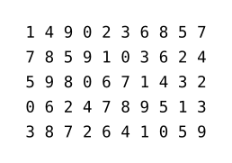

# Suiji

[Suiji](https://github.com/liuguangxi/suiji) (随机 in Chinese, /suíjī/, meaning random) is a high efficient random number generator in Typst. Partial algorithm is inherited from [GSL](https://www.gnu.org/software/gsl) and most APIs are similar to [NumPy Random Generator](https://numpy.org/doc/stable/reference/random/generator.html). It provides pure function implementation and does not rely on any global state variables, resulting in better performance and independency.


## Features

- All functions are immutable, which means results of random are completely deterministic.
- Core random engine chooses "Maximally equidistributed combined Tausworthe generator", which has higher quality and efficiency compared with other algorithms like LCG, MT19937, etc.
- Generate random integers or floats from various distribution.
- Randomly shuffle an array of objects.
- Randomly sample from an array of objects.
- Generate blind text of Simplified Chinese.


## Examples

The example below uses `suiji` and `cetz` packages to create a trajectory of a random walk.

```typ
#import "@preview/suiji:0.2.2": *
#import "@preview/cetz:0.2.2"

#set page(width: auto, height: auto, margin: 0.5cm)

#cetz.canvas(length: 5pt, {
  import cetz.draw: *

  let n = 2000
  let (x, y) = (0, 0)
  let (x-new, y-new) = (0, 0)
  let rng = gen-rng(42)
  let v = ()

  for i in range(n) {
    (rng, v) = uniform(rng, low: -2.0, high: 2.0, size: 2)
    (x-new, y-new) = (x - v.at(1), y - v.at(0))
    let col = color.mix((blue.transparentize(20%), 1-i/n), (green.transparentize(20%), i/n))
    line(stroke: (paint: col, cap: "round", thickness: 2pt),
      (x, y), (x-new, y-new)
    )
    (x, y) = (x-new, y-new)
  }
})
```


Another example is drawing the the famous **Matrix** rain effect of falling green characters in a terminal.

```typ
#import "@preview/suiji:0.2.2": *
#import "@preview/cetz:0.2.2"

#set page(width: auto, height: auto, margin: 0pt)

#cetz.canvas(length: 1pt, {
  import cetz.draw: *

  let font-size = 10
  let num-col = 80
  let num-row = 32
  let text-len = 16
  let seq = "abcdefghijklmnopqrstuvwxyz!@#$%^&*".split("").slice(1, 35).map(it => raw(it))
  let rng = gen-rng(42)
  let num-cnt = 0
  let val = 0
  let chars = ()

  rect((-10, -10), (font-size * (num-col - 1) * 0.6 + 10, font-size * (num-row - 1) + 10), fill: black)

  for c in range(num-col) {
    (rng, num-cnt) = integers(rng, low: 1, high: 3)
    for cnt in range(num-cnt) {
      (rng, val) = integers(rng, low: -10, high: num-row - 2)
      (rng, chars) = choice(rng, seq, size: text-len)
      for i in range(text-len) {
        let y = i + val
        if y >= 0 and y < num-row {
          let col = green.transparentize((i / text-len) * 100%)
          content(
            (c * font-size * 0.6, y * font-size),
            text(size: font-size * 1pt, fill:col, stroke: (text-len - i) * 0.04pt + col, chars.at(i))
          )
        }
      }
    }
  }
})
```


## Usage

Import `suiji` module first before use any random functions from it.

```typ
#import "@preview/suiji:0.2.2": *
```

For functions that generate various random numbers or randomly shuffle, a random number generator object (**rng**) is required as both input and output arguments. And the original **rng** should be created by function `gen-rng`, with an integer as the argument of seed. This calling style seems to be a little inconvenient, as it is limited by the programming paradigm. For function `discrete`, the given probalilities of the discrete events should be preprocessed by function `discrete-preproc`, whose output serves as an input argument of `discrete`.

The function `rand-sc` creates blind text of Simplified Chinese. This function yields a Chinese-like Lorem Ipsum blind text with the given number of words, where punctuations are optional.

The code below generates several random permutations of 0 to 9. Each time after function `shuffle` is called, the value of variable `rng` is updated, so generated permutations are different.

```typ
#{
  let rng = gen-rng(42)
  let a = ()
  for i in range(5) {
    (rng, a) = shuffle(rng, range(10))
    [#(a.map(it => str(it)).join("  ")) \ ]
  }
}
```



For more codes with these functions see [tests](./tests).


## Reference

### `gen-rng`

Construct a new random number generator with a seed.

```typ
#let gen-rng(seed) = {...}
```

- **Input Arguments**
  - `seed` : [`int`] value of seed.

- **Output Arguments**
  - `rng` : [`object`] generated object of random number generator.


### `integers`

Return random integers from `low` (inclusive) to `high` (exclusive).

```typ
#let integers(rng, low: 0, high: 100, size: none, endpoint: false) = {...}
```

- **Input Arguments**
  - `rng` : [`object`] object of random number generator.
  - `low` : [`int`] lowest (signed) integers to be drawn from the distribution, optional.
  - `high` : [`int`] one above the largest (signed) integer to be drawn from the distribution, optional.
  - `size` : [`none` or `int`] returned array size, must be none or non-negative integer, optional.
  - `endpoint` : [`bool`] if true, sample from the interval [`low`, `high`] instead of the default [`low`, `high`), optional.

- **Output Arguments**
  - [`array`] : (`rng-out`, `arr-out`)
    - `rng-out` : [`object`] updated object of random number generator.
    - `arr-out` : [`int` | `array` of `int`] array of random numbers.


### `random`

Return random floats in the half-open interval [0.0, 1.0).

```typ
#let random(rng, size: none) = {...}
```

- **Input Arguments**
  - `rng` : [`object`] object of random number generator.
  - `size` : [`none` or `int`] returned array size, must be none or non-negative integer, optional.

- **Output Arguments**
  - [`array`] : (`rng-out`, `arr-out`)
    - `rng-out` : [`object`] updated object of random number generator.
    - `arr-out` : [`float` | `array` of `float`] array of random numbers.


### `uniform`

Draw samples from a uniform distribution. Samples are uniformly distributed over the half-open interval [`low`, `high`) (includes `low`, but excludes `high`).

```typ
#let uniform(rng, low: 0.0, high: 1.0, size: none) = {...}
```

- **Input Arguments**
  - `rng` : [`object`] object of random number generator.
  - `low` : [`float`] lower boundary of the output interval, optional.
  - `high` : [`float`] upper boundary of the output interval, optional.
  - `size` : [`none` or `int`] returned array size, must be none or non-negative integer, optional.

- **Output Arguments**
  - [`array`] : (`rng-out`, `arr-out`)
    - `rng-out` : [`object`] updated object of random number generator.
    - `arr-out` : [`float` | `array` of `float`] array of random numbers.


### `normal`

Draw random samples from a normal (Gaussian) distribution.

```typ
#let normal(rng, loc: 0.0, scale: 1.0, size: none) = {...}
```

- **Input Arguments**
  - `rng` : [`object`] object of random number generator.
  - `loc` : [`float`] mean (centre) of the distribution, optional.
  - `scale` : [`float`] standard deviation (spread or width) of the distribution, must be non-negative, optional.
  - `size` : [`none` or `int`] returned array size, must be none or non-negative integer, optional.

- **Output Arguments**
  - [`array`] : (`rng-out`, `arr-out`)
    - `rng-out` : [`object`] updated object of random number generator.
    - `arr-out` : [`float` | `array` of `float`] array of random numbers.


### `discrete-preproc` and `discrete`

Return random indices from the given probalilities of the discrete events.

```typ
#let discrete-preproc(p) = {...}
```

- **Input Arguments**
  - `p`: [`array` of `int` or `float`] the array of probalilities of the discrete events, probalilities must be non-negative.

- **Output Arguments**
  - `g`: [`object`] generated object that contains the lookup table.

```typ
#let discrete(rng, g, size: none) = {...}
```

- **Input Arguments**
  - `rng` : [`object`] object of random number generator.
  - `g` : [`object`] generated object that contains the lookup table by `discrete-preproc` function.
  - `size` : [`none` or `int`] returned array size, must be none or non-negative integer, optional.

- **Output Arguments**
  - [`array`] : (`rng-out`, `arr-out`)
    - `rng-out` : [`object`] updated object of random number generator.
    - `arr-out` : [`int` | `array` of `int`] array of random indices.


### `shuffle`

Randomly shuffle a given array.

```typ
#let shuffle(rng, arr) = {...}
```

- **Input Arguments**
  - `rng` : [`object`] object of random number generator.
  - `arr` : [`array`] the array to be shuffled.

- **Output Arguments**
  - [`array`] : (`rng-out`, `arr-out`)
    - `rng-out` : [`object`] updated object of random number generator.
    - `arr-out` : [`array`] shuffled array.


### `choice`

Generate random samples from a given array.

```typ
#let choice(rng, arr, size: none, replacement: true, permutation: true) = {...}
```

- **Input Arguments**
  - `rng` : [`object`] object of random number generator.
  - `arr` : [`array`] the array to be sampled.
  - `size` : [`none` or `int`] returned array size, must be none or non-negative integer, optional.
  - `replacement`: [`bool`] whether the sample is with or without replacement, optional; default is true, meaning that a value of `arr` can be selected multiple times.
  - `permutation`: [`bool`] whether the sample is permuted when sampling without replacement, optional; default is true, false provides a speedup.

- **Output Arguments**
  - [`array`] : (`rng-out`, `arr-out`)
    - `rng-out` : [`object`] updated object of random number generator.
    - `arr-out` : [`array`] generated random samples.


### `rand-sc`

Generate blind text of Simplified Chinese.

```typ
#let rand-sc(words, seed: 42, punctuation: false, gap: 10) = {...}
```

- **Input Arguments**
  - `words` : [`int`] the length of the blind text in pure words.
  - `seed` : [`int`] value of seed, optional.
  - `punctuation` : [`bool`] if true, insert punctuations in generated words, optional.
  - `gap` : [`int`] average gap between punctuations, optional.

- **Output Arguments**
  - [`str`] : generated blind text of Simplified Chinese.
