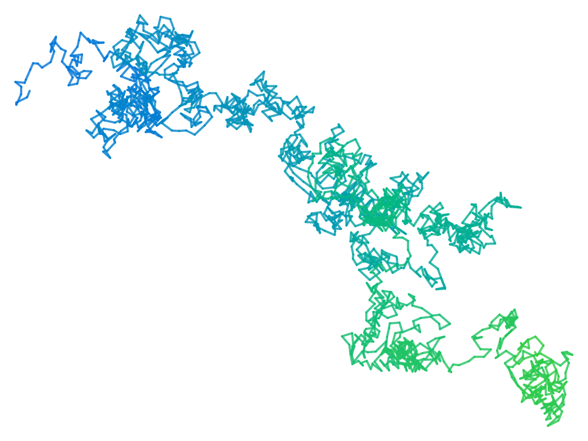
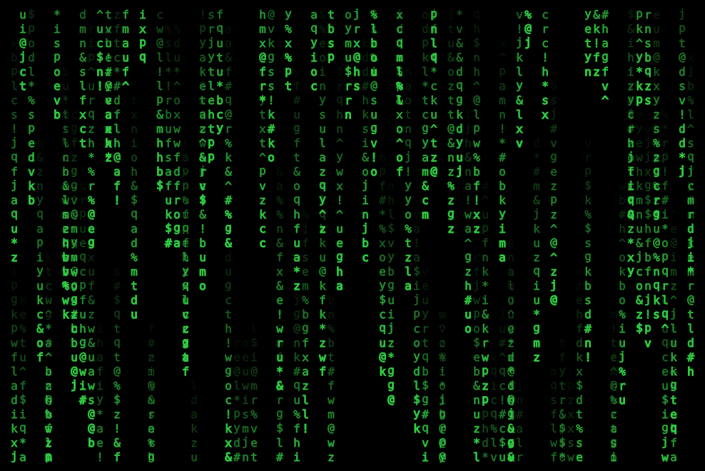
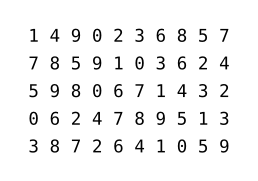

# Suiji

[Suiji](https://github.com/liuguangxi/suiji) (随机 in Chinese, /suíjī/, meaning random) is a high efficient random number generator in Typst. Partial algorithm is inherited from [GSL](https://www.gnu.org/software/gsl) and most APIs are similar to [NumPy Random Generator](https://numpy.org/doc/stable/reference/random/generator.html). It provides pure function implementation and does not rely on any global state variables, resulting in better performance and independency.


## Features

- All functions are immutable, which means results of random are completely deterministic.
- Core random engine chooses _maximally equidistributed combined Tausworthe generator_.
- Generate random integers or floats from various distribution.
- Randomly shuffle an array of objects.
- Randomly sample from an array of objects.
- Accelerate random number generation based on the WebAssembly plugin.


## Examples

The example below uses `suiji` and `cetz` packages to create a trajectory of a random walk.



<details>
<summary>Show code</summary>

```typ
#import "@preview/suiji:0.4.0": *
#import "@preview/cetz:0.3.4"

#set page(width: auto, height: auto, margin: 0.5cm)

#cetz.canvas(length: 5pt, {
  import cetz.draw: *

  let n = 2000
  let (x, y) = (0, 0)
  let (x-new, y-new) = (0, 0)
  let rng = gen-rng-f(42)
  let v = ()

  for i in range(n) {
    (rng, v) = uniform-f(rng, low: -2.0, high: 2.0, size: 2)
    (x-new, y-new) = (x - v.at(1), y - v.at(0))
    let col = color.mix((blue.transparentize(20%), 1-i/n), (green.transparentize(20%), i/n))
    line(stroke: (paint: col, cap: "round", thickness: 2pt),
      (x, y), (x-new, y-new)
    )
    (x, y) = (x-new, y-new)
  }
})
```
</details>

Another example is drawing the the famous **Matrix** rain effect of falling green characters in a terminal.



<details>
<summary>Show code</summary>

```typ
#import "@preview/suiji:0.4.0": *
#import "@preview/cetz:0.3.4"

#set page(width: auto, height: auto, margin: 0pt)

#cetz.canvas(length: 1pt, {
  import cetz.draw: *

  let font-size = 10
  let num-col = 80
  let num-row = 32
  let text-len = 16
  let seq = "abcdefghijklmnopqrstuvwxyz!@#$%^&*".split("").slice(1, 35).map(it => raw(it))
  let rng = gen-rng-f(42)
  let num-cnt = 0
  let val = 0
  let chars = ()

  rect((-10, -10), (font-size * (num-col - 1) * 0.6 + 10, font-size * (num-row - 1) + 10), fill: black)

  for c in range(num-col) {
    (rng, num-cnt) = integers-f(rng, low: 1, high: 3)
    for cnt in range(num-cnt) {
      (rng, val) = integers-f(rng, low: -10, high: num-row - 2)
      (rng, chars) = choice-f(rng, seq, size: text-len)
      for i in range(text-len) {
        let y = i + val
        if y >= 0 and y < num-row {
          let col = green.transparentize((i / text-len) * 100%)
          content(
            (c * font-size * 0.6, y * font-size),
            text(size: font-size * 1pt, fill:col, stroke: (text-len - i) * 0.04pt + col, chars.at(i))
          )
        }
      }
    }
  }
})
```
</details>


## Usage

Import `suiji` module first before use any random functions from it.

```typ
#import "@preview/suiji:0.4.0": *
```

For functions that generate various random numbers or randomly shuffle, a random number generator object (**rng**) is required as both input and output arguments. And the original **rng** should be created by function `gen-rng`, with an integer as the argument of seed. For function `discrete`, the given probalilities of the discrete events should be preprocessed by function `discrete-preproc`, whose output serves as an input argument of `discrete`.

Another set of functions with the same functionality provides higher performance and has the suffix `-f` in their names. For example, `gen-rng-f` and `integers-f` are the fast versions of `gen-rng` and `integers`, respectively. It is recommended to always use the function version accelerated by the plugin.

The code below generates several random permutations of 0 to 9. Each time after function `shuffle-f` is called, the value of variable `rng` is updated, so generated permutations are different.

```typ
#{
  let rng = gen-rng-f(42)
  let a = ()
  for i in range(5) {
    (rng, a) = shuffle-f(rng, range(10))
    [#(a.map(it => str(it)).join("  ")) \ ]
  }
}
```



For more information, see the [manual](https://github.com/liuguangxi/suiji/blob/main/doc/manual.pdf).

This package comes with some unit tests under the [tests](https://github.com/liuguangxi/suiji/tree/main/tests) directory.
