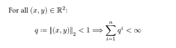
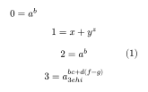

# Super-Suboptimal
A Typst package enabling support for unicode super- and subscript characters in equations.

## Usage
The package exposes the template-function `super-subscripts`. It affects every `math.equation` by attaching every superscript- and subscript-character to the first non-space-element to its left.
```typ
#import "@preview/super-suboptimal:0.1.0": *
#show: super-subscripts

For all $(x,y)∈ℝ²$:
$
  q := norm((x,y))₂ < 1
  ==> ∑ᵢ₌₁ⁿ q ⁱ < ∞
$
```


Because code like `$x+yᶻ$` throws a "unknown variable" error, the package also exposes the function `eq`, which works around this by inserting spaces before every superscript- and subscript-character before passing it on to `math.equation`. This comes at the cost of missing syntax-highlighting and code-suggestions in your IDE.

`eq` accepts a `raw` string as a positional parameter, and an argument-sink that's passed onto `math.equation`. Unless specified otherwise in the argument-sink, the resulting equation is typeset with `block: true` iff the `raw` also satisfied `block: true`.
The function `eq` is also automatically applied to evere `raw` with `lang: "eq"`.

````typ
#eq(`0 = aᵇ`)

#eq(```
  1 = x+yᶻ
```)

#eq(`2 = aᵇ`, block: true, numbering: "(1)")

```eq
  3 = aᵇᶜ⁺ᵈ₃ₑ⁽ᶠ⁻ᵍ⁾ₕᵢ
```
````


Sometimes in mathematical writing, variables are decorated with an asterisk, e.g. `$x^*$`. The character `꙳` can now be used instead: `$x꙳ = x^*$`.

## Known issues
- As mentioned above, writing `$aᵇ$` leads to an "unknown variable" error. As a workaround, you can type `$a ᵇ$` instead, or use the `eq` function described above.
  - The first workaround means it's not reasonably feasible to have top-left and bottom-left attachments. For example, `a ³b` is rendered like `attach(a, t: 3) b`, rather than `a attach(b, tl: 3)`, perhaps contrary to expectation.
- Multiple attachments are concatenated into one content without another pass of `equation`. For example, ```#eq(`0ˢⁱⁿ⁽ᵏ⁾`)``` is equivalent to `$0^(s i n "(" k ")")$`, rather than `$0^sin(k)$`. I won't fix this, because:
  - Another pass of `equation` would cause performance issues at best, and infinite loops at worst.
  - If this were fixed, code such as `$e ˣ ʸ$` would undesirably produce an "unknown variable `xy`" error.
- Let's call a piece of content "small" if it consists of only a single non-separated sequence of characters in Typst (internally, this is the distinction between sequences of text, and mere text). For instance, `$1234$` and `$a$` produce "small" content, but `$a b$` and `$3a$` do not.
  
  This package can only run on non-"small" pieces of content. For example, `$sqrt(35²)$` still renders with the default-unicode-character and will look different from `$sqrt(35^2)$`. On the other hand, `$sqrt(a²)$` *is* rendered correctly. This is because `35²` constitutes "small" content, but `a²` does not.
  
  A workaround is implemented for "small" content immediately within an equation, i.e. not nested within another content-function. For example, $7²$ renders the same as $7^2$.
- Equations within other content-elements might trigger multiple show-rule-passes, possibly causing performance-issues.