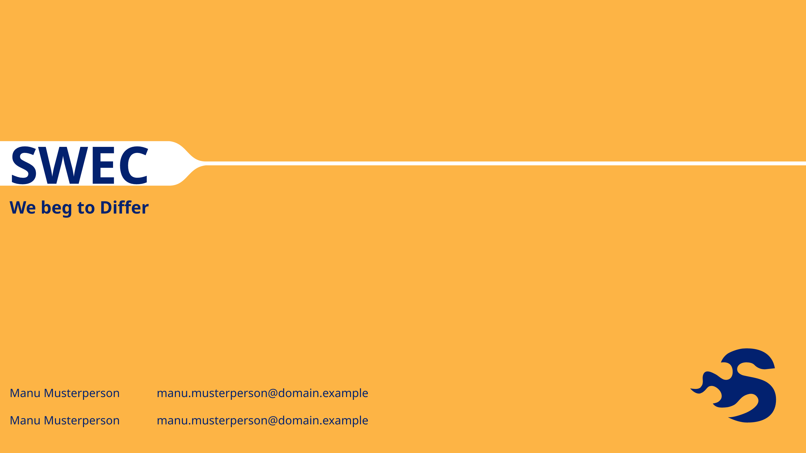

# swec-slides

This is a typst template for slide decks using polylux in the style of the [SoftWare Engineering Camp](https://www.swe-camp.de/).



## Usage

You can use this template in the Typst web app by clicking "Start from template" on the dashboard
and searching for swec-slides.

Alternatively, you can use the CLI to kick this project off using the command

```sh
typst init @preview/swec-slides
```

This template requires the [Noto Sans](https://fonts.google.com/noto/specimen/Noto+Sans) font.

## Configuration

The template provides a `swec-template` function to configure the layout:

```typst
#show: swec-template.with(
  aspect-ratio: "16-9",  // Optional
  dark-mode: false, // Optional
  
  title: [SWEC],
  subtitle: [We beg to Differ], // Optional
  authors: (
    ("Manu Musterperson", "manu.musterperson@subdomain.example"),
    ("Manu Musterperson", "manu.musterperson@subdomain.example"),
  ), // Optional
)
```

## Functions

For the title slide you can use `#title-slide()` to generate the SWEC Title slide based on the
metadata configured with `swec-template()`

Subsequent slides can be created with

```typst
#slide(
    title: [Slide Title],
    page-number: true, // Optional,
)[
    Some Text
]
```
