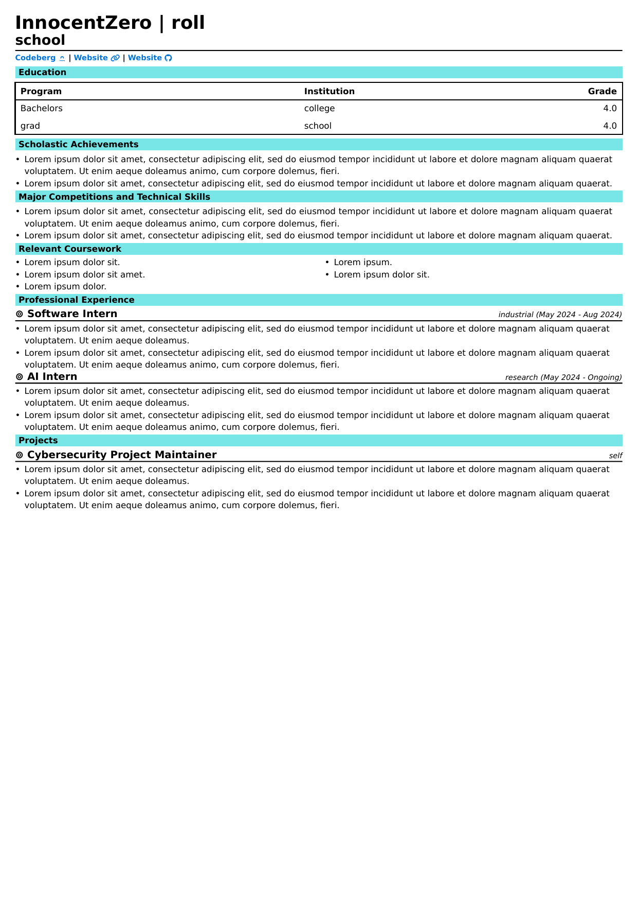

# Resume template

A basic resume template in typst.

To compile/watch, make sure you pass the argument `--font-path ./fonts/` to typst-cli.

If you use the helix editor, a configuration has been given in the repository.
This auto-compiles your document on saving and you can preview the results in real time
using a pdf viewer. Also provides autocomplete, code renaming, and other cool (LSP) features.

Make sure you have tinymist and typstyle installed before using the helix config.

## Preview

## LICENSE

The FontAwesome Free/Brand fonts are licensed under [Font Awesome Free License](https://github.com/FortAwesome/Font-Awesome?tab=License-1-ov-file)

The Codeberg SVG in the svg directory are licensed under [Creative Commons CC0](https://codeberg.org/Codeberg/Design/src/commit/ac514aa9aaa2457d4af3c3e13df3ab136d22a49a/LICENSE)

For the rest, see [LICENSE](./LICENSE).

## Fonts

For fonts, please install the fonts from the repository of the project in codeberg.
