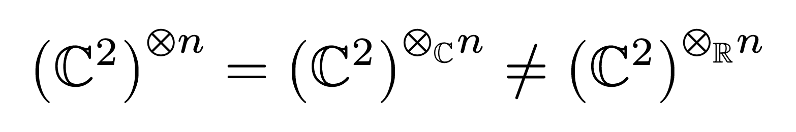
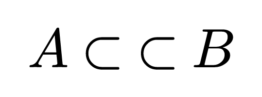

# SymbolX
Typst `symbol`s can currently only be defined with single-codepoint strings as variants.
This package provides a workaround that allows defining symbols with _anything_ as variants.

This works by using the [Supplementary Private Use Area-B](https://www.unicode.org/charts/PDF/U100000.pdf),
which contains 65534 Unicode code points that don't have a predefined meaning.[^1]

[^1]: There are also other Private Use Areas that could have been used, but this package only uses the last one since it is the least likely to already be used for a different purpose in the same document.

## How to use
Start by importing
```typst
#import "@preview/symbolx:0.1.0": symbol, symbolx-rule
```

Then you can define your first symbol using the `symbol` function, which is a drop-in replacement for the [`std.symbol` constructor](https://typst.app/docs/reference/foundations/symbol/#constructor).[^2]
If all variants are already single-codepoint strings, then `symbol` works exactly like `std.symbol`.
Otherwise, it will return a pair of `(map, s)`, where `s` is the symbol and `map` is a special value that contains a map from Private Use codepoints to non-single-codepoint-string variants.

[^2]: Do note that this will shadow the `symbol` _type_, so e.g. to compare `type(x) == symbol`, you'd have to write `type(x) == std.symbol`, since `symbol` is now a function and not a type, so the former comparison would always be `false`.

Then, you can pass that `map` to the `symbolx-rule` function, which will return a show rule that makes the whole thing work.
For example:
```typst
#let (map, tensor) = symbol("⊗", ("r", $times.circle_RR$), ("c", $times.circle_CC$))
#show: symbolx-rule(map)

$ (CC^2)^(tensor n) = (CC^2)^(tensor.c n) != (CC^2)^(tensor.r n) $
```


If you want to define more than one symbol with non-single-codepoint-string variants,
you have to pass the `map` returned from the first `symbol` call as the first positional argument to the second `symbol` call:
```typst
#let (map, tensor) = symbol("⊗", ("r", $times.circle_RR$), ("c", $times.circle_CC$))
#let (map, subset) = symbol(map, "⊂", ("c", $class("binary", subset subset)$))
#show: symbolx-rule(map)

$ A subset.c B $
```

