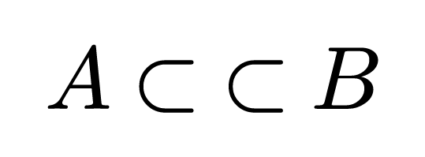
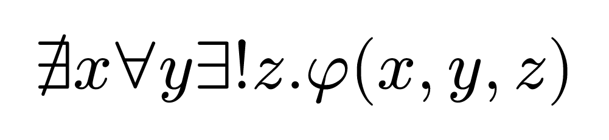
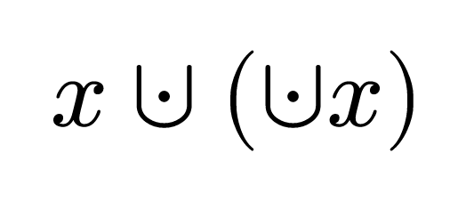

# SymbolX
Typst `symbol`s can currently only be defined with certain strings[^3] as variants.
This package provides a workaround that allows defining symbols with _anything_ as variants.

This works by using the [Supplementary Private Use Area-B](https://www.unicode.org/charts/PDF/U100000.pdf),
which contains 65534 Unicode code points that don't have a predefined meaning.[^1]

Additionally, it allows you to extend existing symbols with new variants
or modify an existing symbol's variants with a function, or do a combination of all of the above.

[^3]: Before Typst 0.14, they were limited to a single [codepoint](https://www.unicode.org/glossary/#code_point); In Typst 0.14, the restriction was slightly relaxed to a single [grapheme cluster](https://www.unicode.org/glossary/#extended_grapheme_cluster).
[^1]: There are also other Private Use Areas that could have been used, but this package only uses the last one since it is the least likely to already be used for a different purpose in the same document.

## How to use
Start by importing
```typst
#import "@preview/symbolx:1.1.0": symbol, symbolx-rule
```

Then you can define your first symbol using the `symbol` function, which is a drop-in replacement for the [`std.symbol` constructor](https://typst.app/docs/reference/foundations/symbol/#constructor).[^2]
If all variants are valid for a regular symbol\*, then `symbol` just passes them to `std.symbol` and returns the result.
Otherwise, it returns a pair `(map, s)`, where `s` is the symbol and `map` is a special value that contains a map from Private Use codepoints to the actual symbol variants they represent.\
\*See [Version Dependence](#version-dependence) below.

[^2]: Do note that this will shadow the `symbol` _type_, so e.g. to compare `type(x) == symbol`, you'd have to write `type(x) == std.symbol`, since `symbol` is now a function and not a type, so the former comparison would always be `false`.

Then, you can pass that `map` to the `symbolx-rule` function, which will return a show rule that makes the whole thing work.
For example:
```typst
#let (map, tensor) = symbol("⊗", ("r", $times.circle_RR$), ("c", $times.circle_CC$))
#show: symbolx-rule(map)

$ (CC^2)^(tensor n) = (CC^2)^(tensor.c n) != (CC^2)^(tensor.r n) $
```


If you want to define more than one symbol with non-single-codepoint-string variants,
you have to pass the `map` returned from the first `symbol` call as the first positional argument to the second `symbol` call:
```typst
#let (map, tensor) = symbol("⊗", ("r", $times.circle_RR$), ("c", $times.circle_CC$))
#let (map, subset) = symbol(map, "⊂", ("c", $class("binary", subset subset)$))
#show: symbolx-rule(map)

$ A subset.c B $
```


You can also inherit variants from existing symbols by
- passing `(s,)` in place of a variant, where `s` is a symbol.
	This appends all variants of `s` to the list of variants of the new symbol.
	If symbols worked like dictionaries, this would be equivalent to `..s`.
- passing `(s, f)` in place of a variant, where `s` is a symbol and `f` is a function.
	This works as above, but applies a function to each variant before appending it to the list.
	The function can also return `()`, in which case that variant will be discarded instead.

```typst
#let (map, exists) = symbol((sym.exists,), ("unique", $exists!$))
#show: symbolx-rule(map)

$ exists.not x forall y exists.unique z. phi(x, y, z) $
```


```typst
#let (map, union) = symbol((sym.union,), (sym.union, var => {
	let (modifs, value) = if type(var) == str { ("", var) } else { var }
	if "big" in modifs { return () }
	if modifs != "" { modifs += "." }
	(modifs + "unary", math.class("unary", value))
}))
#show: symbolx-rule(map)

$ x union.dot (union.dot.unary x) $
```


## Version Dependence
What variants are valid for a regular symbol depends on the Typst version,
so, by default, `symbol` will only pass to `std.symbol` if all variants are valid *as seen by Typst 0.12.0*.

To opt into pass-through for newer valid variants
(e.g. the multi-character single-grapheme-cluster strings introduced in Typst 0.14),
you need to pass `typst-version: <version>` to the `symbol` function.\
It is recommended to set this directly after importing, i.e.
```typst
#import "@preview/symbolx:1.1.0": symbol, symbolx-rule
#let symbol = symbol.with(typst-version: version(0, 14))
```
For convenience, you can also import
```typst
#import "@preview/symbolx:1.1.0": symbolx as symbol
// ... which is equivalent to ...
#import "@preview/symbolx:1.1.0": symbol
#let symbol = symbol.with(typst-version: sys.version)
```
but be warned that using this may **break** your documents when switching Typst versions.
