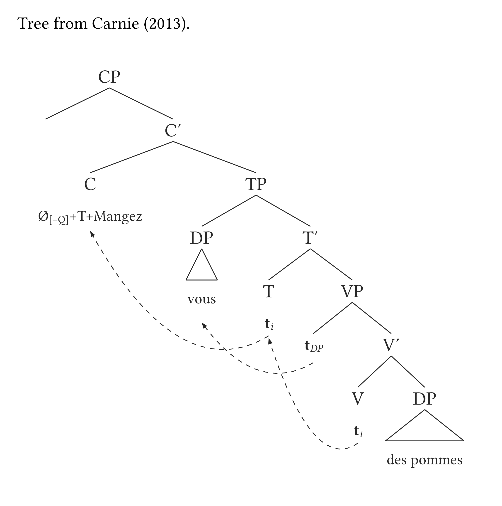
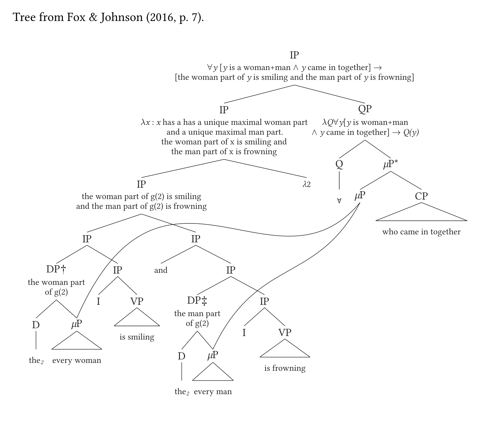
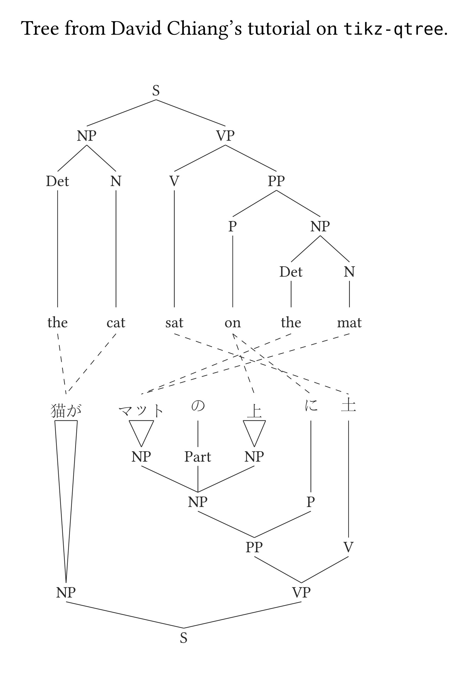
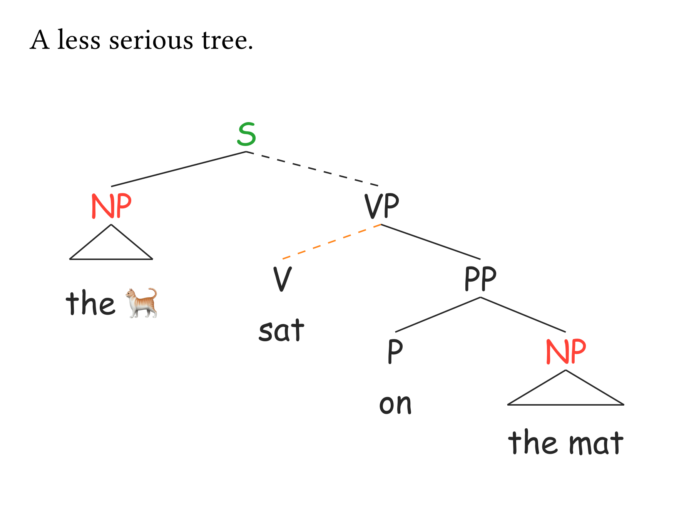
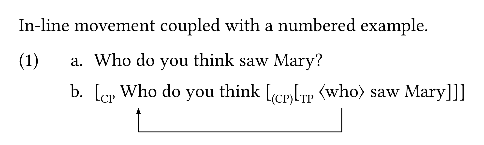
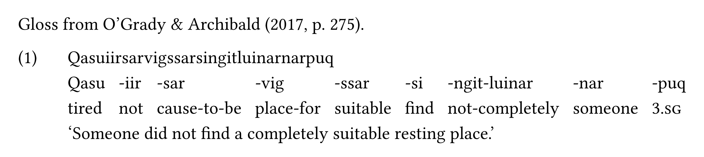

<div align="center">
  <picture>
    <source media="(prefers-color-scheme: dark)" srcset="https://gdgarcia.ca/typst/logo_syn_white.png">
    <source media="(prefers-color-scheme: light)" srcset="https://gdgarcia.ca/typst/logo_syn.png">
    
  </picture>
</div>

<div align="center">


[](https://github.com/guilhermegarcia/synkit/blob/5462097bf4d6d895b93cc340aed1f996a9d6d9be/synkit.pdf)

</div>

`synkit` is a Typst package for drawing syntax trees from bracket notation. It focuses on fast authoring, clean output, and the kinds of features syntacticians and semanticists actually need in day-to-day work.

## Philosophy

There are two key design choices for this package. First, the syntax should be minimal, intuitive, and readable. As a result, a tree is separated from its add-ons (arrows, highlights, etc.) inside the `#tree()` function. Second, functions should be smart enough to detect patterns, which helps minimize the amount of code you have to type. These two points are clearly connected to each other.

Here are some examples illustrating this philosophy.

1. Labels are automatically created. Every word or node you add to a tree automatically becomes a label that can later be targeted by an arrow, an annotation, or by an aesthetic adjustment (color, highlight, etc.).
2. Triangles are automatically added to trees. `[XP content]` will trigger a triangle, but `[XP [X' [X content ] ] ]` will not. So, while you _can_ add triangles manually, you will likely never have to do that.
3. Terminal branches aren't displayed by default (e.g., no line/link between a terminal node and its content `[X content]`). You can activate them if you so choose, but by default they won't be there.
4. When you define a tree, spaces don't matter so much: `[NP[Det][N]]` is the same as `[NP [Det ] [N] ]` or any other equivalent string. Thus, you will no longer get syntax errors if you forget a space between two `]]` (cf. `tikz-qtree` in LaTeX).

## Some examples

<table>
<tr>
  <td align="center" width="33%">
    <a href="gallery/tree_1.typ"></a>
    <br><sub>Tree with arrows indicating movement</sub>
  </td>
  <td align="center" width="33%">
    <a href="gallery/tree_2.typ"></a>
    <br><sub>Semantic annotation and multidominance</sub>
  </td>
  <td align="center" width="33%">
    <a href="gallery/tree_3.typ"></a>
    <br><sub>Equivalences between two different trees</sub>
  </td>
</tr>
<tr>
  <td align="center">
    <a href="gallery/tree_4.typ"></a>
    <br><sub>Adjust color, font, and add emojis for less serious trees</sub>
  </td>
  <td align="center">
    <a href="gallery/tree_5.typ"></a>
    <br><sub>In-line movement with minimal syntax</sub>
  </td>
  <td align="center">
    <a href="gallery/tree_6.typ"></a>
    <br><sub>Examples and glosses</sub>
  </td>
</tr>
</table>

## Installation

```typst
#import "@preview/synkit:0.0.1": *
```

If you are working from a local clone instead, import `lib.typ` directly:

```typst
#import "synkit/lib.typ": *
```

## Highlights

- Draw syntax trees with flexible bracket notation using `#tree()`
- Add movement arrows, curved paths, delinking, and trace targeting
- Don't worry about creating triangles manually: they are automatically added based on phrase structure
- Add multidominance and cross-tree equivalence lines between two trees using `#garden()`
- Add semantic annotation between node labels and branches
- Create numbered examples with `#eg()` and interlinear glosses with `#gloss()`
- Adjust spacing, direction, scale, highlighting, numbering, and colors with lightweight arguments
- Smart labels ensure that you never have to create labels yourself: every word, node and even emoji is its own label

## Manual

See the manual for a comprehensive description of each function available. Check `synkit.pdf` in the GitHub repository.

## Repository

- GitHub: <https://github.com/guilhermegarcia/synkit>

## Author

**Guilherme D. Garcia**  
Email: <guilherme.garcia@lli.ulaval.ca>  
Website: <https://gdgarcia.ca>

## License

MIT
