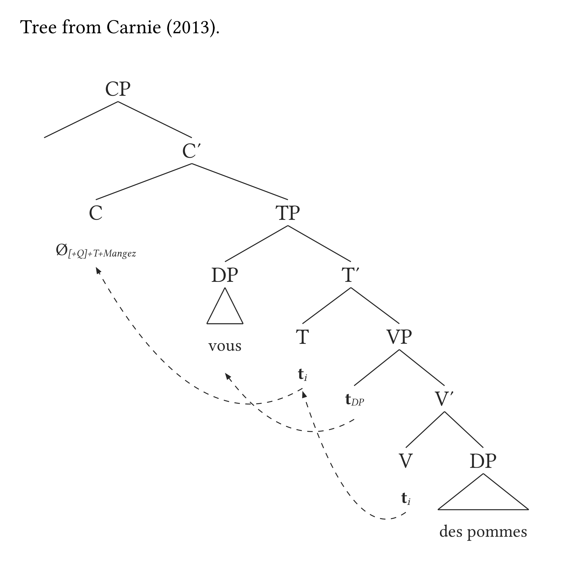
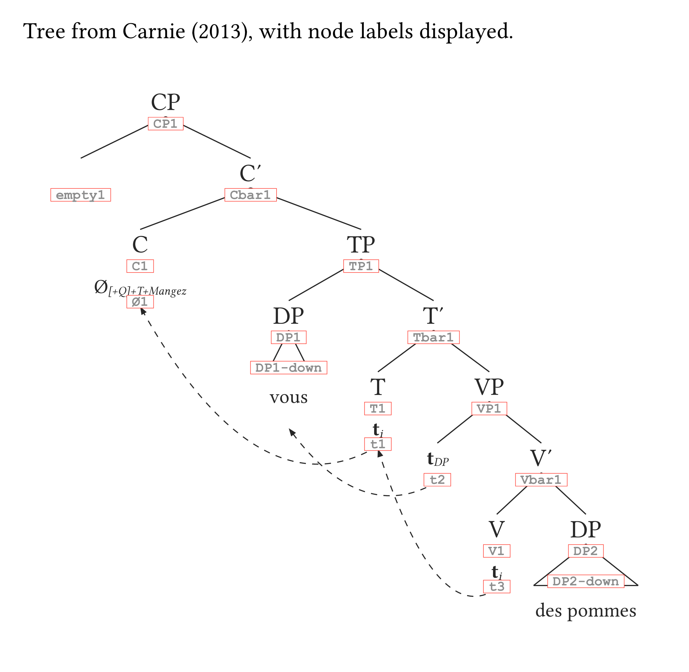
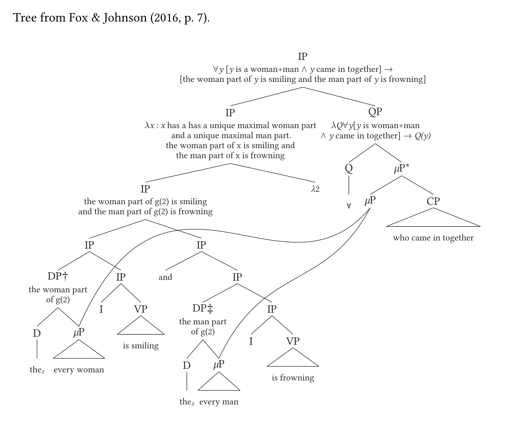
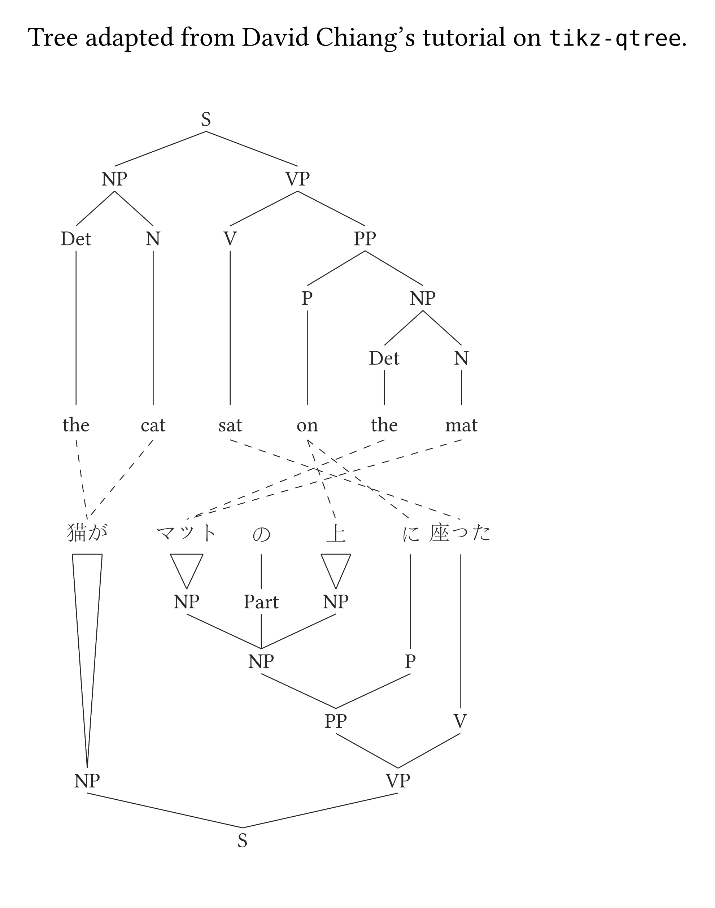
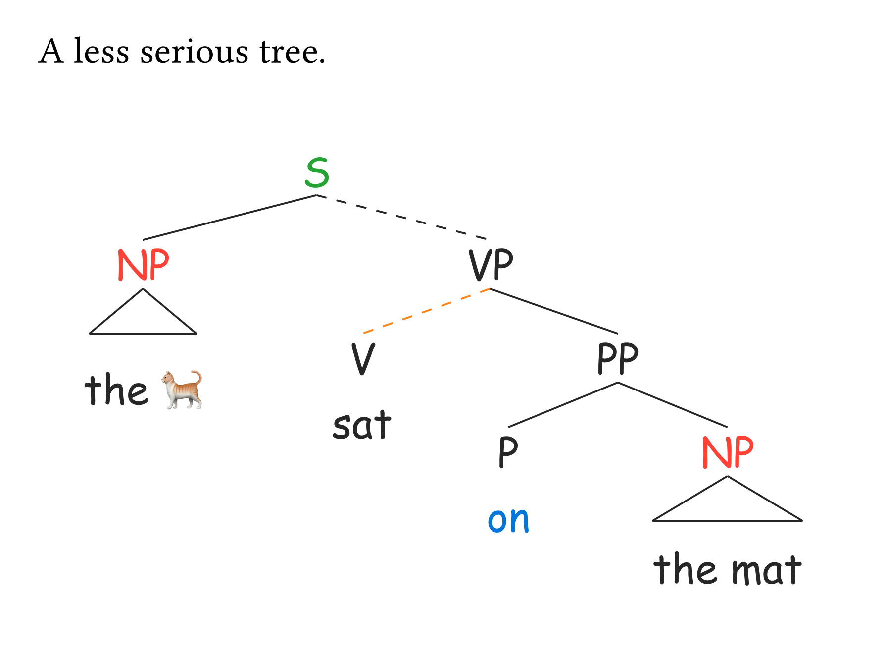
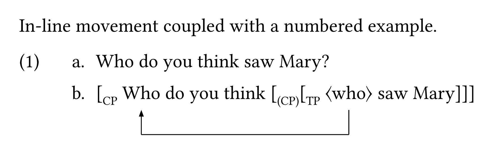
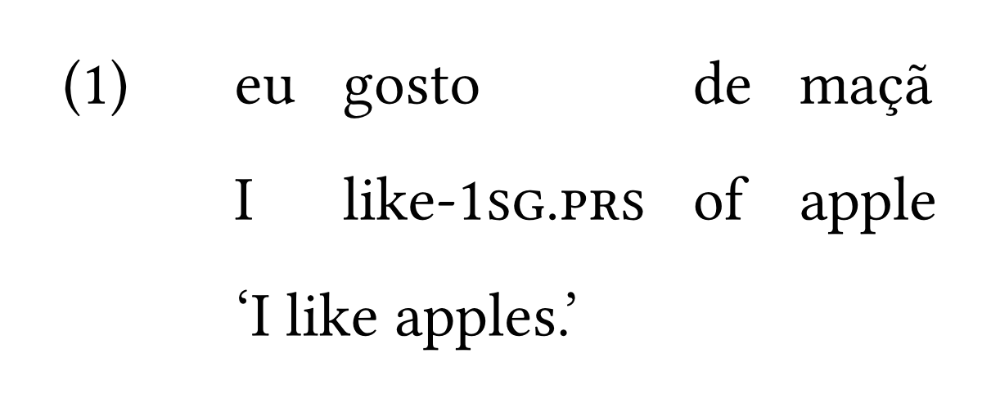

<div align="center">
  <picture>
    <source media="(prefers-color-scheme: dark)" srcset="https://gdgarcia.ca/typst/logo_syn_white.png">
    <source media="(prefers-color-scheme: light)" srcset="https://gdgarcia.ca/typst/logo_syn.png">
    
  </picture>
</div>

<div align="center">


[](https://doi.org/10.5281/zenodo.19405774)

</div>

`synkit` is a Typst package for drawing syntax trees from bracket notation. It focuses on fast authoring, clean output, and the kinds of features syntacticians and semanticists actually need in day-to-day work.

## Installation

```typst
#import "@preview/synkit:0.1.0": *
```

If you are working from a local clone instead, import `lib.typ` directly:

```typst
#import "synkit/lib.typ": *
```

## Quick start

A tree is a bracketed string. Nothing else is required:

```typst
#tree("[S [NP [Det the] [N cat]] [VP [V sat] [PP [P on] [NP [Det the] [N mat]]]]]")
```

Spacing inside the string is up to you: `[NP[Det][N]]` and `[NP [Det ] [N] ]` parse identically, so a missing space before `]]` will never cost you a compile error.

## Examples

Every example below is complete: paste it under the import line and it compiles. Each one is also available as a standalone file in [`gallery/`](gallery/).

### Movement arrows

Nodes become targetable labels automatically, so arrows are declared separately from the tree itself.

<div align="center">
  
</div>

```typst
// Tree from Carnie (2013).
#tree(
  "[ CP [] [ C' [ C Ø_{\[+Q\]+T+Mangez} ] [ TP [ DP vous ] [ T' [ T *t*_i ] [ VP [ *t*_{DP} ] [ V' [V *t*_i ] [DP des pommes] ] ]  ] ] ] ]",
  arrows: (
    (from: "t3", to: "T1"),
    (from: "t2", to: "DP1"),
    (from: "t1", to: "C1"),
  ),
  curved: true,
)
```

#### Finding label names

You never create labels yourself, so the question is how to discover them. While they are meant to be intuitive because they simply foloow the name of a given node (plus a number), things can get less clear as your trees become more convoluted and your nodes contain specific symbols. In those scenarios, you can add `show-refs: true` to any tree and every reference name is printed next to its node:

```typst
#tree(
  "[ CP [] [ C' [ C Ø_{\[+Q\]+T+Mangez} ] [ TP [ DP vous ] [ T' [ T *t*_i ] [ VP [ *t*_{DP} ] [ V' [V *t*_i ] [DP des pommes] ] ]  ] ] ] ]",
  arrows: (
    (from: "t3", to: "T1"),
    (from: "t2", to: "DP1"),
    (from: "t1", to: "C1"),
  ),
  curved: true,
  show-refs: true,
)
```

<div align="center">
  
</div>

Target whatever you need, then turn it back off. A few conventions are visible here: sister nodes of the same category are numbered in document order (`DP1`, `DP2`), bar levels drop the prime (`C'` is `Cbar1`), an empty node is `empty1`, and leaf content sits at `-down` (`DP2-down` is *des pommes*, under the triangle). Traces follow the same rule as everything else, taking their name from their own content (`t1`, `t2`, ...), and that is what `arrows` targets. Note that references are case-sensitive: `T1` is the T node, `t1` is the trace beneath it.

### Semantic annotation and multidominance

Annotations attach to node labels; `dominance` draws multidominance links with optional control points.

<div align="center">
  
</div>

```typst
// Tree from Fox & Johnson (2016, p. 7).
#tree(
  "[IP [IP [IP [IP [DP† [D the_2] [\\muP every woman] ] [IP [I] [VP is smiling] ] ] [IP [and] [IP [DP‡ [D the_2] [\\muP every man] ] [IP [I] [VP is frowning] ] ] ] ] [\\lambda2] ] [QP [Q \\forall ] [\\muP\\* [\\muP] [CP who came in together] ] ] ]",
  annotation: (
    (
      "IP1",
      [$forall$_y_ [_y_ is a woman+man $and$ _y_ came in together] $arrow$ \
        [the woman part of _y_ is smiling and the man part of _y_ is frowning]],
    ),
    (
      "IP2",
      [$lambda$_x_ : _x_ has a has a unique maximal woman part \
        and a unique maximal man part. \
        the woman part of x is smiling and \
        the man part of x is frowning],
    ),
    (
      "QP1",
      [$lambda$_Q_$forall$_y_[_y_ is woman+man \
        $and$ _y_ came in together] $arrow$ _Q(y)_],
    ),
    (
      "IP3",
      [the woman part of g(2) is smiling \
        and the man part of g(2) is frowning],
    ),
    ("DP†1", [the woman part \ of g(2)]),
    ("DP‡1", [the man part \ of g(2)]),
  ),
  annotation-size: 0.8,
  dominance: (
    (from: "muP4", to: "muP1", ctrl: (-6.1, 8.5)),
    (from: "muP4", to: "muP2", ctrl: (-6, 5)),
  ),
  scale: 0.8,
  spread: 0.8,
  terminal-branch: true,
)
```

### Equivalences between two trees

`#garden()` lays out several trees together and links them. Labels are suffixed by tree index (`P1-1` is `P1` in the first tree), and a tree can be flipped with `direction: "up"`.

<div align="center">
  
</div>

```typst
// Tree adapted from David Chiang's tutorial on tikz-qtree.
#garden(
  (
    input: "[S [NP [Det the] [N cat]] [VP [V sat] [PP [P on] [NP [Det the] [N mat]]]]]",
    spread: 1.55,
    content-size: 1,
  ),
  (
    input: "[S [NP 猫が] [VP [PP [NP [NP マット] [Part の] [NP 上] ] [P に]] [V 座った]]]",
    direction: "up",
    content-size: 1,
  ),
  equivalence: (
    ("Det1-1", "NP1-2"),
    ("P1-1", "P1-2"),
    ("P1-1", "NP4-2"),
    ("N1-1", "NP1-2"),
    ("N2-1", "NP3-2"),
    ("Det2-1", "NP3-2"),
    ("V1-1", "V1-2"),
  ),
  gap: 2.5,
  scale: 0.7,
)
```

### Color, fonts, and emoji

Anything that appears in the string is a label, emoji included, so styling targets the same names you already wrote.

<div align="center">
  
</div>

```typst
#tree(
  "[S [NP the 🐈] [VP[V sat][PP[P on] [NP the mat]]]]",
  content-size: 1,
  drop: 0.8,
  spread: 1.5,
  dash-branches: (
    ("VP1", "V1"),
    ("S1", "VP1"),
  ),
  color: (
    ("S1", green.darken(20%)),
    ("NP1", red),
    ("NP2", red),
    ("P1-down", blue),
    ("VP1", "V1", orange),
  ),
  font: "Comic Sans MS",
)
```

### Inline movement in numbered examples

`#move()` renders movement inside running text, so it composes with `#eg()` numbering.

<div align="center">
  
</div>

```typst
#show: eg-rules

#eg(labels: (<s-plain>, <s-move>))[
  - Who do you think saw Mary?
  - #move(
      "[CP Who do you think [(CP)[TP<who>saw Mary]]]",
      arrows: ((from: "who2", to: "who1", dash: "solid", color: black),),
    )
] <eg-wh>
```

### Interlinear glosses

`#gloss()` aligns the lines of a gloss automatically; small caps in grammatical labels come from `{...}`.

<div align="center">
  
</div>

```typst
#show: eg-rules

#gloss(spacing: 1.2em, caption: [An example from Portuguese])[
  - eu gosto de maçã
  - I like-{1sg.prs} of apple
  - 'I like apples.'
] <eg-gloss-1>
```

## Philosophy

There are two key design choices for this package. First, the syntax should be minimal, intuitive, and readable. As a result, a tree is separated from its add-ons (arrows, highlights, etc.) inside the `#tree()` function. Second, functions should be smart enough to detect patterns, which helps minimize the amount of code you have to type. These two points are clearly connected to each other.

In practice, this means:

1. **Labels are automatically created.** Every word or node you add to a tree automatically becomes a label that can later be targeted by an arrow, an annotation, or by an aesthetic adjustment (color, highlight, etc.).
2. **Triangles are automatically added.** `[XP content]` will trigger a triangle, but `[XP [X' [X content ] ] ]` will not. So, while you *can* add triangles manually, you will likely never have to do that.
3. **Terminal branches aren't displayed by default** (e.g., no line/link between a terminal node and its content `[X content]`). You can activate them if you so choose, but by default they won't be there.
4. **Spaces don't matter.** `[NP[Det][N]]` is the same as `[NP [Det ] [N] ]` or any other equivalent string. Thus, you will no longer get syntax errors if you forget a space between two `]]` (cf. `tikz-qtree` in LaTeX).

## Highlights

- Draw syntax trees with flexible bracket notation using `#tree()`
- Add movement arrows, curved paths, delinking, and trace targeting
- Don't worry about creating triangles manually: they are automatically added based on phrase structure
- Add multidominance and cross-tree equivalence lines between two trees using `#garden()`
- Add semantic annotation between node labels and branches
- Create numbered examples with `#eg()` and interlinear glosses with `#gloss()`
- Adjust spacing, direction, scale, highlighting, numbering, and colors with lightweight arguments
- Smart labels ensure that you never have to create labels yourself: every word, node and even emoji is its own label

Literal square brackets inside labels can be written as `\[` and `\]`, which is useful for Adger-style feature bundles such as `DP_i\[wh, ~uOP~: INT\]`.

## Manual

Download the [**manual**](https://doi.org/10.5281/zenodo.19405774) for a comprehensive description of each function available.

## Repository

- GitHub: <https://github.com/guilhermegarcia/synkit>

## Author

**Guilherme D. Garcia**  
Email: <guilherme.garcia@lli.ulaval.ca>  
Website: <https://gdgarcia.ca>

## License

MIT
