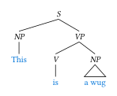
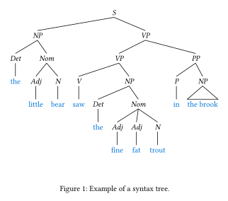
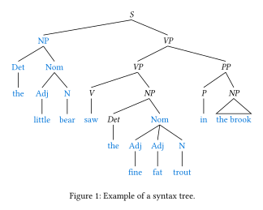
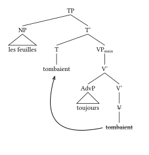

# typst-syntree

**syntree** is a [Typst](https://typst.app) package for rendering syntax trees / parse trees (the kind linguists use).

# Installation
Add `#import "@preview/syntree:0.3.1: *` somewhere in the preamble. This will add both the latest version of the package, and import the `tree`, `syntree`, and `listtree` functions from the library.

# Usage
The name and default syntax are inspired by Miles Shang's [`syntree`](https://github.com/mshang/syntree). Here's an example to get started:

<table>
<tr>
<td>

```typ
#import "@preview/syntree:0.3.1": syntree

#syntree(
  nonterminal: (style: "italic"),
  terminal: (fill: blue),
  child-spacing: 3em, // default: 1em
  layer-spacing: 2em, // default: 2.3em
)[
  [S [NP This] [VP [V is] [^NP a wug]]]
]
```

</td>
<td>



</td>
</tr>
</table>

There's full support for formulas inside nodes; for example, `#syntree[[DP$zws_i$ this]]` or `#syntree[[C $diameter$]]`. For more flexible tree-drawing, `tree` can be used directly:

<table>
<tr>
<td>

```typ
#import "@preview/syntree:0.3.1": tree

#let bx(col) = box(fill: col, width: 1em, height: 1em)
#tree("colors",
  tree("warm", bx(red), bx(orange)),
  tree("cool", bx(blue), bx(teal)))
```

</td>
<td>


</td>
</tr>
</table>

In addition to standard syntree bracket syntax, a list-based syntax is also provided:

<table>
<tr>
<td>

```typ
#import "@preview/syntree:0.3.1": listtree

#figure(gap: 2em,
  caption: "Example of a syntax tree.")[
  #listtree(
    nonterminal: (style: "italic"),
    terminal: (fill: blue),
  )[
    - S
      - NP
        - Det
          - the
        - Nom
          - Adj
            - little
          - N
            - bear
      - VP
        - VP
          - V
            - saw
          - NP
            - Det
              - the
            - Nom
              - Adj
                - fine
              - Adj
                - fat
              - N
                - trout
        - PP
          - P
            - in
          - ^NP
            - the brook
  ]
]
```

</td>
<td>



</td>
</tr>
</table>

And `tree`, `syntree`, and `listtree` all can compose with each other.

<table>
<tr>
<td>

```typ
#import "@preview/syntree:0.3.1": listtree

#figure(gap: 2em,
  caption: "Example of a syntax tree.")[
  #listtree(
    nonterminal: (style: "italic"),
    terminal: (fill: blue),
  )[
    - S
      #syntree[
        [NP
          [Det the]
          [Nom
            [Adj little]
            [N bear]
          ]
        ]
      ]
      - VP
        - VP
          - V
            - saw
          - NP
            - Det
              - the
            #tree("Nom",
              tree("Adj", "fine"),
              tree("Adj", "fat"),
              tree("N", "trout"))
        - PP
          - P
            - in
          - ^NP
            - the brook
  ]
]
```

</td>
<td>



</td>
</tr>
</table>

`syntree` aims to be a relatively minimal package and so does not provide any utilities for displaying movement or dependency relationships. However, `syntree` composes freely with external packages such as [`larrow`](https://typst.app/universe/package/larrow):

<table>
<tr>
<td>

```typst
#import "@preview/syntree:0.3.1": listtree
#import "@preview/larrow:1.1.0": label-arrow

#listtree[
  - TP
    - ^NP
      - les feuilles
    - T'
      - T
        - tombaient <t-end>
      - VP#sub[main]
        - V'
          - ^AdvP
            - toujours
          - V'
            - #strike[V]
              - #strike[tombaient] <t-start>
]
#label-arrow(<t-start>, <t-end>, bend: -100,
  from-offset: (-5pt, -5pt), to-offset: (20pt, -15pt))
```

</td>
<td>



</td>
</tr>
</table>
