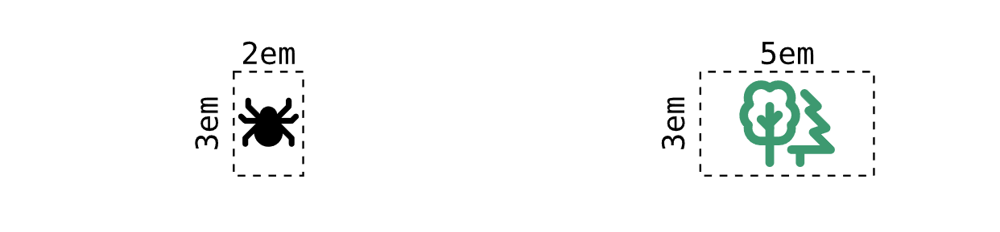
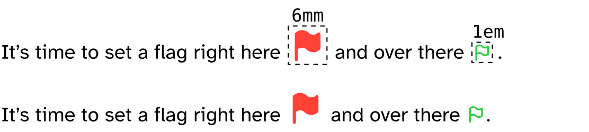

Read the doc as a pdf at [/docs/tableau-icons-doc.pdf](./docs/tableau-icons-doc.pdf)

> [!warning]
> This package contains the symbols from Tabler Icons v3.29.0, but has no association with the Tabler.io team themselves.

Despite the bad naming (the name is translated Table icons, which is only one character away from Tabler icons), this package implements a couple of functions to allow the use of Tabler.io Icons (https://tabler.io/icons) in your documents.

## Usage

For the use, I highly recommend to not wildcard include the package (`...0.1.0": *`), but to give it a name, such as tbl or similar. This way, the function writing is a bit more readable.

```typst
#import "@preview/tableau-icons:0.1.0" as tbl
```

### Block Functions

To draw icons, grab the name of the desired icon over at https://tabler.io/icons and insert it into one of the two icon type functions.

```typst
#filled(body,
  fill: rgb("#000000"),
  width: 1em,
  height: auto
)
#outlined( ⋯ )  // same as 'filled'
```

**Example**

```typst
#tbl.filled("spider", fill: black, width: 2em, height: 3em)
#tbl.outlined("trees", fill: olive, width: 5em, height: 3em)
```

<div align="center">
    
</div>

### Inline Functions

Similar to the previous two functions, the following ones can be used as inline.

```typst
#inline-filled(body,
  baseline: 15%,
  fill: rgb("#000000"),
  width: 1em,
  height: auto
)
#inline-outlined( ⋯ ) // same as 'inline-filled'
```

**Example**

```typst
It's time to set a flag right here #tbl.inline-filled("flag", fill: red, width: 3mm) and over there #tbl.inline-outlined("flag", fill: green).
```

> [!note]
> The example image shows the same line with and without the dashed boxes (it does not create duplicates!).

<div align="center">
    
</div>

### General Function

The `#render-icon` function is the base function, which the other functions use. It can be directly called.

```typst
#render-icon(body,
  fill: rgb("#000000"),
  icon-type: "outline",
  width: 1em,
  height: auto
)
```

**Example**

```typst
#tbl.render-icon("flag", fill: red, icon-type: "filled", width: 5em, height: 3em)
```

<div align="center">
    
</div>

## Updating the package

Read the same chapter in the pdf-version at [/docs/tableau-icons-doc.pdf](./docs/tableau-icons-doc.pdf)

## Changelog
- **v0.1.0**
  - initial version
  - added Tabler Icons version v3.29.0
  - added `#filled()`, `#outlined()`, `#inline-filled()`, `#inline-outlined()`, `#render-icon()`
