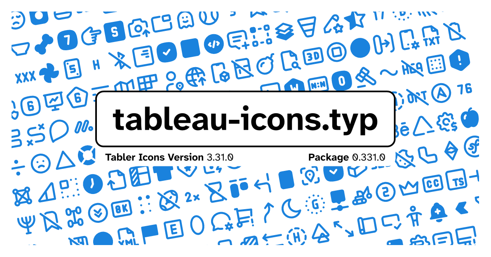

### The package documentation can be found at [/docs/tableau-icons-doc.pdf](./docs/tableau-icons-doc.pdf)

> [!warning]
> This package contains the symbols from Tabler Icons, but has no association with the Tabler.io team themselves.

Despite the bad naming (the name is translated Table icons, which is only one character away from Tabler icons), this package implements a couple of functions to allow the use of Tabler.io Icons (https://tabler.io/icons) in your documents.