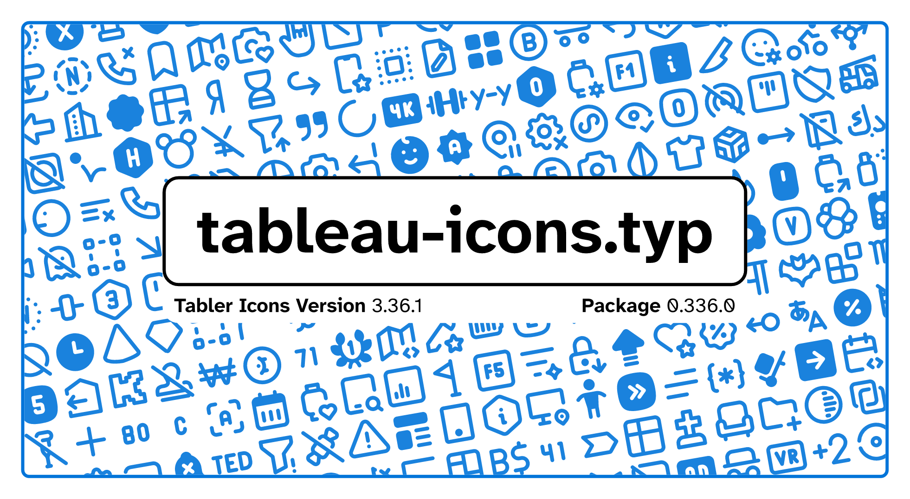

### The package documentation can be found at [/docs/tableau-icons-doc.pdf](./docs/tableau-icons-doc.pdf) and a list of all icons at [/docs/all-symbols.pdf](./docs/all-symbols.pdf)

Despite the bad naming (the name is translated Table icons, which is only one character away from Tabler icons), this package implements a couple of functions to allow the use of Tabler.io Icons (https://tabler.io/icons) in your documents.

> **NOTE** - This package contains the symbols from Tabler Icons, but has no association with the Tabler.io team themselves.

> **WARNING** - Updates will come out whenever I feel like it. Updating is somewhat automatic via the script `/tools/update_icons.py`.
> - requires `requests`, `os`, `shutil`, `subprocess`, `re`, `fontforge`, `urllib`, `typst`