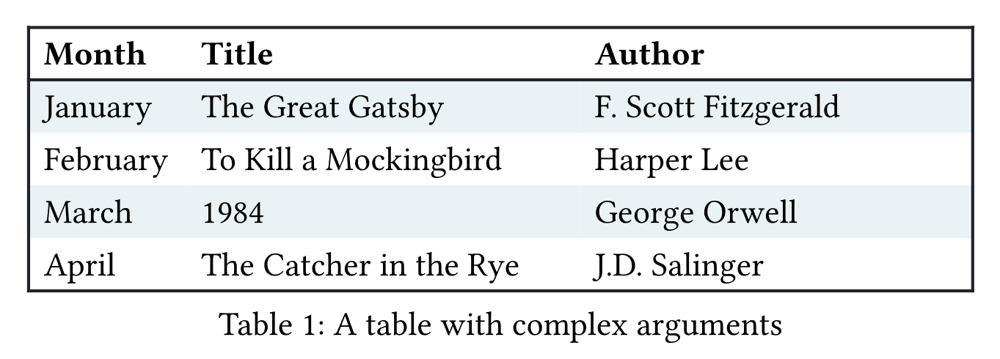

# Tablem

Write markdown-like tables easily in Typst.

## Example

Have a look at the source [here](./examples/example.typ).


## Usage

You can simply copy the markdown table and paste it in `tablem` function.

```typ
#import "@preview/tablem:0.3.0": tablem, three-line-table

#tablem[
  | *Name* | *Location* | *Height* | *Score* |
  | ------ | ---------- | -------- | ------- |
  | John   | Second St. | 180 cm   | 5       |
  | Wally  | Third Av.  | 160 cm   | 10      |
]

#three-line-table[
  | *Name* | *Location* | *Height* | *Score* |
  | :----: | :--------: | :------: | :-----: |
  | John   | Second St. | 180 cm   | 5       |
  | Wally  | Third Av.  | 160 cm   | 10      |
]
```

## Custom Rendering

You can define a custom render function for advanced styling, such as a three-line table:

```typ
#import "@preview/tablem:0.3.0": tablem, three-line-table

#let three-line-table = tablem.with(
  render: (columns: auto, align: auto, ..args) => {
    table(
      columns: columns,
      stroke: none,
      align: center + horizon,
      table.hline(y: 0),
      table.hline(y: 1, stroke: .5pt),
      ..args,
      table.hline(),
    )
  }
)

#three-line-table[
  | *Name* | *Location* | *Height* | *Score* |
  | :----: | :--------: | :------: | :-----: |
  | John   | Second St. | 180 cm   | 5       |
  | Wally  | Third Av.  | 160 cm   | 10      |
]
```


## Cell merging

Tablem supports both horizontal and vertical cell merging. You can merge cells using either `<` for horizontal merging, and `^` for vertical merging.

**Horizontal merging:**

```typ
#three-line-table[
  | Substance             | Subcritical °C | Supercritical °C |
  | --------------------- | -------------- | ---------------- |
  | Hydrochloric Acid     | 12.0           | 92.1             |
  | Sodium Myreth Sulfate | 16.6           | 104              |
  | Potassium Hydroxide   | 24.7           | <                |
]
```


**Vertical and combined merging:**

```typ
#tablem[
  | Soldier | Hero       | <        | Soldier |
  | Guard   | Horizontal | <        | Guard   |
  | ^       | Soldier    | Soldier  | ^       |
  | Soldier | Gate       | <        | Soldier |
]
```


## Advanced Usage

You can pass additional arguments same with builtin `table` function for advanced styling:

```typ
#let frame(stroke) = (x, y) => (
  left: if x > 0 { 0pt } else { stroke },
  right: stroke,
  top: if y < 2 { stroke } else { 0pt },
  bottom: stroke,
)

#tablem(
  columns: (0.4fr, 1fr, 1fr),
  align: left,
  fill: (_, y) => if calc.odd(y) { rgb("EAF2F5") },
  stroke: frame(rgb("21222C")),
)[
  | *Month*   | *Title*                  | *Author*             |
  | --------- | ------------------------ | -------------------- |
  | January   | The Great Gatsby         | F. Scott Fitzgerald  |
  | February  | To Kill a Mockingbird    | Harper Lee           |
  | March     | 1984                     | George Orwell        |
  | April     | The Catcher in the Rye   | J.D. Salinger        |
]
```



## API

```typ
#let tablem(
  render: table,
  columns: auto,
  align: auto,
  ..args,
)[
  ..
] = { .. }
```

**Arguments:**

- `render`: [`(columns: int, align: array, ..args) => { .. }`] &mdash; Custom render function, default to be `std.table`, receiving a integer-type columns, which is the count of first row. `..args` is the combination of `args` of `tablem` function and children genenerated from `body`.
- `columns`: [`auto` or `int` or `relative` or `fraction` or `array`] &mdash; The optional column sizes. Either specify a track size array or provide an integer to create a grid with that many auto-sized columns. Note that opposed to rows and gutters, providing a single track size will only ever create a single column.
- `align`: [`auto` or `array` or `alignment` or `function`] &mdash; The optional align. How to align the cells' content. This can either be a single alignment, an array of alignments (corresponding to each column) or a function that returns an alignment. The function receives the cells' column and row indices, starting from zero. If set to auto, the outer alignment is used.
- `args`: [`any`] &mdash; Some arguments you want to pass to `render` function.
- `body`: [`content`] &mdash; The markdown-like table. There should be no extra line breaks in it.


## Changelog

### 0.3.0

- **(Breaking Change)** Removed support for using empty spaces (` `) as cell merging markers.
- **(Breaking Change)** Removed `ignore-second-row` and `use-table-header` parameters.
- Table header detection and column alignment are now automatic:  
  - If the second row matches `---`, `:---`, or `:---:`, the first row is treated as a header row.
  - Alignment is determined by the syntax:
    - `| --- |` for **auto** (default)
    - `| :--- |` for **left-aligned**
    - `| :---: |` for **center-aligned**
    - `| ---: |` for **right-aligned**

### 0.2.0

- Added `^`, `<` and empty spaces (` `) as cell merging markers for vertical and horizontal merging.
- Added `use-table-header` parameter for table header support.

### 0.1.0

- Initial release with basic tablem functionality and markdown-style table parsing.
- `ignore-second-row` parameter for ignoring the second row.

## License

This project is licensed under the MIT License.
