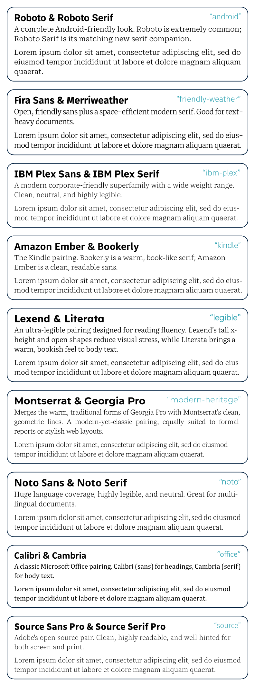

# Tasteful Pairings

A carefully curated collection of font pairings for [Typst](https://typst.app/),
focusing on readability and typographic harmony. Each pairing combines a
sans-serif heading font with a serif body font, following established
typographic principles for clear visual hierarchy and optimal reading
experience.

## Installation

```typ
#import "@preview/tasteful-pairings:0.1.0": *
```

## Usage

```typ
#let pairing = font-pairings.at("modern-heritage")

#show heading: set text(font: pairing.heading)
#set text(font: pairing.body)

= Your Document Title
Your content here...
```

## Available Pairings

- **`ibm-plex`** - Modern corporate-friendly superfamily
- **`noto`** - Extensive language support, highly legible
- **`source`** - Adobe's refined open-source pair
- **`friendly-weather`** - Open Fira Sans with space-efficient Merriweather
- **`android`** - Complete Roboto family look
- **`kindle`** - Amazon's reading-optimized fonts
- **`office`** - Classic Microsoft Office combination
- **`modern-heritage`** - Contemporary Montserrat with timeless Georgia Pro
- **`legible`** - Reading-focused Lexend and Literata

## Gallery



## Philosophy

The pairings in this collection follow these principles:

1. **Sans for Headlines, Serif for Body** - Following traditional typographic
   wisdom for clear hierarchy
2. **Readability First** - Each pairing is tested for optimal reading experience
3. **Complementary Characteristics** - Fonts are matched based on x-height,
   weight balance, and character width
4. **Practical Applications** - Selected for real-world use cases from corporate
   documents to digital reading

## License

[MIT License](LICENSE).
